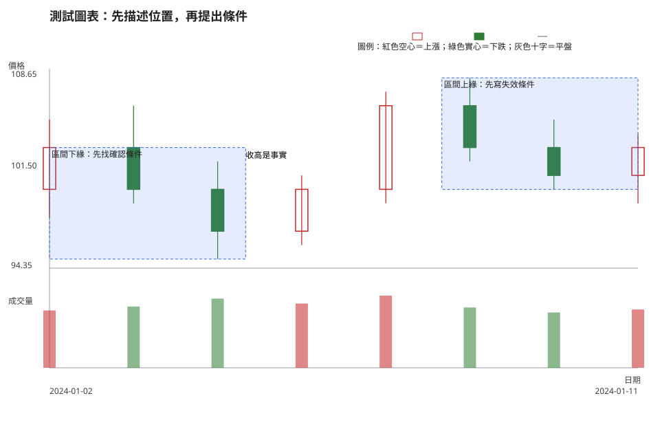
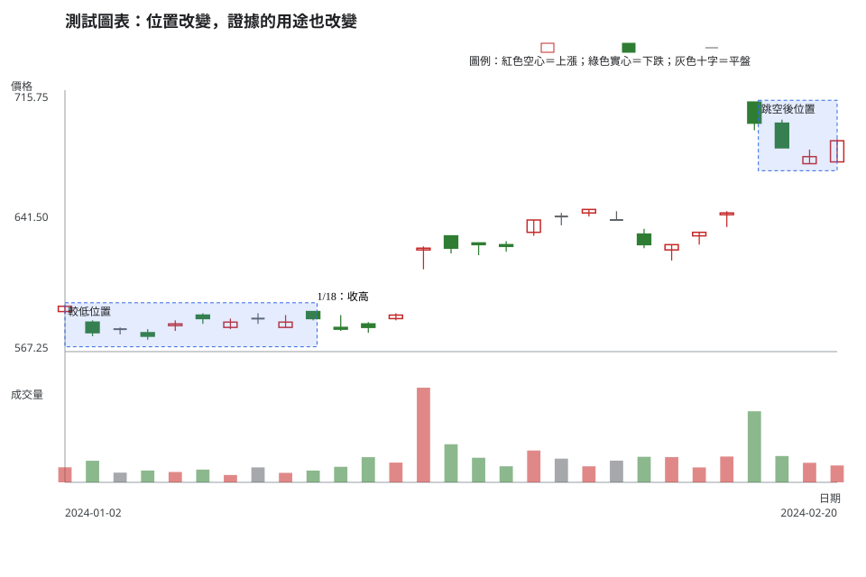

# 第 1 章：K 線能回答與不能回答的問題

## 學習目標

讀完本章，你能把一根 K 線拆成可核對的價格事實，分辨「圖上看見什麼」和「你猜它接下來會怎麼走」，並以條件、失效點和不交易選項取代保證式敘述。

## 先說結論

K 線能回答：在指定週期內，成交價格的開盤、最高、最低、收盤，以及它在一段結構中的位置。K 線不能單獨回答：明天一定漲或跌、主力意圖、合理價值、你應該買多少。

同一根收高 K 線出現在低檔整理、跳空後高檔或消息日，能支持的問題不同。把它當成「需要再驗證的證據」，比把它當作買賣指令更可靠。

## 精確定義與證據等級

一根日 K 線是某一交易日的 OHLC 摘要：開盤價、最高價、最低價、收盤價。它是一份已發生成交的紀錄，不是未來報酬的承諾。

### 三層語句

1. **觀察事實**：例如「本日收盤高於開盤」、「這根 K 線位於近十日區間上緣」。任何人用相同資料都應可重現。
2. **條件式解讀**：例如「若後續收盤站穩區間上緣，且量能沒有明顯萎縮，這次突破才值得繼續追蹤」。它必須寫出條件與反例。
3. **行動與風險決策**：例如「在未定義停損、部位上限與不成立條件前，不進場」。這是個人策略選擇，不能從單根 K 線自動推出。

技術分析適合整理可觀察的價格結構與可測試規則；它不提供因果證明，也不能消除倖存者偏誤、事後挑圖或資料探勘。回看圖表時，務必只使用當時已知的資料，不能把後來的走勢倒灌成當時的理由。

## 人工圖例

下面的人工資料故意畫出同一種「收盤高於開盤」的 K 線，分別放在區間下緣與區間上緣。它不是推薦標的，也不是歷史交易紀錄。

<!-- figure-spec
{
  "id": "ch01-observation-before-interpretation",
  "kind": "synthetic",
  "title": "先描述位置，再提出條件",
  "alt_text": "人工日 K 線圖，左側在區間下緣出現收高 K 線，右側在區間上緣出現收高 K 線，說明相同顏色不能直接代表相同結論。",
  "output": "assets/figures/ch01-concept.svg",
  "bars": [
    {"date": "2024-01-02", "open": 100, "high": 105, "low": 98, "close": 103, "volume": 580000},
    {"date": "2024-01-03", "open": 103, "high": 106, "low": 99, "close": 100, "volume": 620000},
    {"date": "2024-01-04", "open": 100, "high": 102, "low": 95, "close": 97, "volume": 700000},
    {"date": "2024-01-05", "open": 97, "high": 101, "low": 96, "close": 100, "volume": 650000},
    {"date": "2024-01-08", "open": 100, "high": 107, "low": 99, "close": 106, "volume": 730000},
    {"date": "2024-01-09", "open": 106, "high": 108, "low": 102, "close": 103, "volume": 610000},
    {"date": "2024-01-10", "open": 103, "high": 105, "low": 100, "close": 101, "volume": 560000},
    {"date": "2024-01-11", "open": 101, "high": 104, "low": 99, "close": 103, "volume": 590000}
  ],
  "annotations": [
    {"type": "zone", "start": "2024-01-02", "end": "2024-01-05", "low": 95, "high": 103, "label": "區間下緣：先找確認條件"},
    {"type": "zone", "start": "2024-01-08", "end": "2024-01-11", "low": 100, "high": 108, "label": "區間上緣：先寫失效條件"},
    {"type": "label", "date": "2024-01-05", "price": 102, "label": "收高是事實"}
  ]
}
-->

讀法是先說「哪一段時間、哪個位置、收盤相對開盤如何」，再問「若出現哪些後續證據，原本的假設才成立」。圖上沒有任何一個箭頭等於預測。

## 歷史案例

此圖使用臺灣證券交易所（TWSE）2330 的官方原始日資料，範圍為 2024-01-02 至練習決策日 2024-02-20。兩個標記日都收盤高於開盤；圖表不顯示決策日之後的價格，避免用未來資料替當時的判斷找理由。這個區間未列入已查得的公司行動；遇到疑似機械缺口時，仍應先查 [公開資訊觀測站除權息公告](https://mops.twse.com.tw/mops/web/t05st01)。

<!-- figure-spec
{
  "id": "ch01-location-changes-meaning",
  "kind": "historical",
  "title": "位置改變，證據的用途也改變",
  "alt_text": "台積電 2330 於 2024 年 1 月 2 日至練習決策日 2 月 20 日的官方原始日線，標示收高 K 線位於不同位置；圖表右端停在決策日，不顯示後續走勢。",
  "output": "assets/figures/ch01-cases.svg",
  "market": "TWSE",
  "symbol": "2330",
  "start": "2024-01-02",
  "end": "2024-02-20",
  "timeframe": "1d",
  "price_mode": "raw",
  "source_url": "https://www.twse.com.tw/rwd/zh/afterTrading/STOCK_DAY",
  "checked_on": "2026-08-10",
  "corporate_actions": [],
  "annotations": [
    {"type": "zone", "start": "2024-01-02", "end": "2024-01-18", "low": 570, "high": 595, "label": "較低位置"},
    {"type": "zone", "start": "2024-02-15", "end": "2024-02-20", "low": 670, "high": 710, "label": "跳空後位置"},
    {"type": "label", "date": "2024-01-18", "price": 594, "label": "1/18：收高"}
  ]
}
-->

這是一張原始價格圖，不是調整後價格圖；官方日資料的來源、期間與查核日已寫在圖表規格。讀者可以重跑資料取得流程，先確認同一根 K 線的 OHLC，再決定要不要提出假設。

## 八步判讀

1. **圖表與資料有效性**：確認代號、交易所、日期、原始／調整後價格與是否有缺漏。
2. **週期**：本圖是日線；不要用日線的一根 K 線回答週線趨勢。
3. **市場狀態**：先描述整理、趨勢或事件後波動，而非替市場貼上必漲必跌標籤。
4. **位置**：標出區間下緣、上緣、跳空後或前高附近等可重現的位置。
5. **K 線／結構**：描述收高、收低、實體與影線，並連同前後 K 線看結構。
6. **成交量／流動性**：比較量能、成交筆數與買賣價差等可取得資料；量大不自動等於看多。
7. **情境／觸發／失效**：把「若站穩」「若跌回區間」寫清楚，並列出什麼會推翻假設。
8. **風險／不交易**：若資料、觸發或部位風險尚不完整，選擇觀察也是合格決策。

## 練習

請只看上圖在 2024-02-20 當日以前可知的資料，寫下三層答案：

1. 觀察：至少列出兩個可由圖驗證的事實。
2. 條件式解讀：為「可能延續」與「可能回到區間」各寫一個需要後續驗證的條件。
3. 行動／風險：在沒有既定部位大小與失效規則時，你會做什麼？說明原因。

## 答案與評分

展開示範答案與評分

**示範答案。**觀察：2/20 收盤高於開盤；它位於 2/15 之後的較高價格區。條件式解讀：若後續收盤仍守在標示區域且量能／流動性沒有惡化，可把它列為待觀察的延續情境；若很快跌回區域下方，則「站穩」假設失效。行動／風險：先不以單根 K 線下單，等預先定義的觸發、失效點與部位風險都存在。

**10 分評分。**可核對觀察 3 分；兩個相反情境都有條件與失效資訊 3 分；風險或不交易理由具體 4 分。不得因後來價格上漲或下跌而加分。

## 重點、限制與來源

### 重點

K 線是已發生價格的壓縮紀錄。先寫事實，再寫條件，最後才決定是否有足夠風險資訊採取行動。

### 限制

單一圖形不含基本面、消息、委託簿、交易成本與個人風險承受度。歷史案例只能示範判讀流程，不能驗證一套規則在未來必然有效。

### 來源與證據類型

- **市場資料事實**：[TWSE 每日收盤行情](https://www.twse.com.tw/rwd/zh/afterTrading/STOCK_DAY)，圖表規格查核日期為 2026-08-10。
- **公司行動機制**：[公開資訊觀測站除權息公告](https://mops.twse.com.tw/mops/web/t05st01)，必要時先查公告再解讀缺口。
- **教材慣例**：本章的三層語句與八步流程是教學框架，不是交易所規則或獲利公式。
