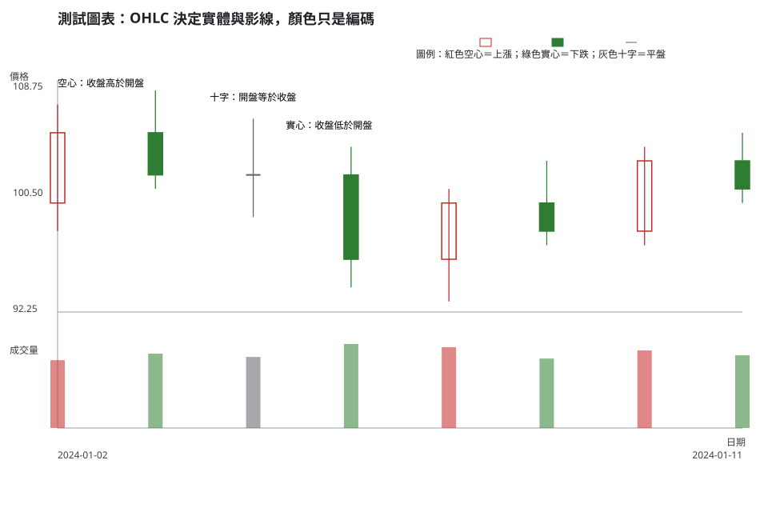
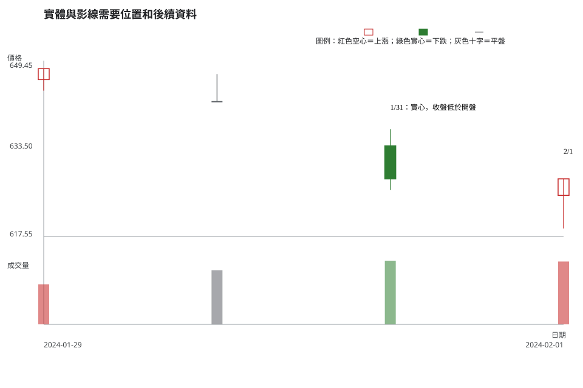

# 第 2 章：OHLC、實體、影線與顏色

## 學習目標

你會能從一根 K 線讀出開盤、最高、最低、收盤（OHLC），用價格關係描述實體與上下影線，並理解台灣常見的紅色空心／綠色實心慣例不是預測訊號。

## 先說結論

一根 K 線的全部資訊是「這段時間曾經以哪些極值成交，以及開頭與結尾落在哪裡」。實體大小、影線長度與顏色都只是在壓縮這四個價格。它們可以提示買賣拉鋸值得觀察，不能單獨證明多空強弱、主力意圖或下一根 K 線方向。

## 精確定義與證據等級

令開盤價為 (O)、最高價為 (H)、最低價為 (L)、收盤價為 (C)。基本關係為 H ≥ max(O, C)，且 L ≤ min(O, C)。

- 實體長度：$|C-O|$。
- 上影線：$H-\max(O,C)$。
- 下影線：$\min(O,C)-L$。

這些是**公式與定義**，可直接由 OHLC 驗證。若 (C>O)，台灣教材常以紅色空心表示；若 (C<O)，常以綠色實心表示；若 (C=O)，則以十字或中性記號表示。顏色是視覺編碼，不是市場因果。

### 不依賴顏色的判讀

閱讀或列印圖表時，先找圖例的「空心／實心」標記，再核對 (C) 與 (O)。這樣即使螢幕色彩設定、色覺差異或券商軟體配色不同，仍能從 OHLC 和填滿狀態得出同一個方向事實。

## 人工圖例

人工圖例刻意放入收高、收低與開收相等的情況。請先以 OHLC 驗算每一段，再看顏色是否只是重述同一件事。

<!-- figure-spec
{
  "id": "ch02-ohlc-body-wicks-colors",
  "kind": "synthetic",
  "title": "OHLC 決定實體與影線，顏色只是編碼",
  "alt_text": "人工日 K 線圖，標示紅色空心收高、綠色實心收低與十字線，並以文字說明實體、上影線及下影線都由 OHLC 算出。",
  "output": "assets/figures/ch02-concept.svg",
  "bars": [
    {"date": "2024-01-02", "open": 100, "high": 107, "low": 98, "close": 105, "volume": 420000},
    {"date": "2024-01-03", "open": 105, "high": 108, "low": 101, "close": 102, "volume": 460000},
    {"date": "2024-01-04", "open": 102, "high": 106, "low": 99, "close": 102, "volume": 440000},
    {"date": "2024-01-05", "open": 102, "high": 104, "low": 94, "close": 96, "volume": 520000},
    {"date": "2024-01-08", "open": 96, "high": 101, "low": 93, "close": 100, "volume": 500000},
    {"date": "2024-01-09", "open": 100, "high": 103, "low": 97, "close": 98, "volume": 430000},
    {"date": "2024-01-10", "open": 98, "high": 104, "low": 97, "close": 103, "volume": 480000},
    {"date": "2024-01-11", "open": 103, "high": 105, "low": 100, "close": 101, "volume": 450000}
  ],
  "annotations": [
    {"type": "label", "date": "2024-01-02", "price": 108, "label": "空心：收盤高於開盤"},
    {"type": "label", "date": "2024-01-05", "price": 105, "label": "實心：收盤低於開盤"},
    {"type": "label", "date": "2024-01-04", "price": 107, "label": "十字：開盤等於收盤"}
  ]
}
-->

例如，長下影線只能確定「盤中曾經更低，收盤離最低價較遠」；它不能自己證明買盤會在明天繼續接手。要提高證據等級，還要看它出現的位置、後續結構、量能與資料是否可交易。

## 歷史案例

此圖使用 TWSE 2330 於 2024-01-29 至練習決策日 2024-02-01 的官方原始日線。它放入收低實體、開收相等與帶下影線的日子，讓讀者以實際 OHLC 練習；圖表在決策日結束，不提供後續價格線索。

<!-- figure-spec
{
  "id": "ch02-ohlc-context-2330",
  "kind": "historical",
  "title": "實體與影線需要位置和後續資料",
  "alt_text": "台積電 2330 於 2024 年 1 月 29 日至練習決策日 2 月 1 日的官方原始日線，標示收低實體、開收相等與下影線；圖表右端停在決策日。",
  "output": "assets/figures/ch02-cases.svg",
  "market": "TWSE",
  "symbol": "2330",
  "start": "2024-01-29",
  "end": "2024-02-01",
  "timeframe": "1d",
  "price_mode": "raw",
  "source_url": "https://www.twse.com.tw/rwd/zh/afterTrading/STOCK_DAY",
  "checked_on": "2026-08-10",
  "corporate_actions": [],
  "annotations": [
    {"type": "label", "date": "2024-01-31", "price": 640, "label": "1/31：實心，收盤低於開盤"},
    {"type": "label", "date": "2024-02-01", "price": 632, "label": "2/1"}
  ]
}
-->

把 1/31 的資料寫成「收盤低於開盤」比說「一定轉弱」準確；把 2/1 寫成「盤中低點低於開盤與收盤」比替它取一個必漲名稱更可查核。若要討論強弱，至少還需比較它們在前一段結構中的位置和後續是否提供確認。

## 八步判讀

**八步前置核對。**核對圖中是否為官方原始日線、代號是否正確，並確認日 K 只摘要一個交易日，不能把盤中波動當成週線結論。

1. **大方向**：先判斷 K 線出現在整理、急跌、上行或事件後波動的哪一段。
2. **所在位置**：標出前低、區間邊緣、跳空處或均價帶附近，讓影線有可比較的背景。
3. **量價反應**：由 OHLC 計算實體與影線，再連續看數根 K 線，並比較成交量與可成交性；一根帶影線的 K 線不會自帶足夠流動性資訊。
4. **交易情境**：例如把「結構仍守住後的反彈」與「結構未守住的持續觀察」分開記錄。
5. **觸發條件**：只有下一段完成 K 線仍守住預定結構，才追蹤反彈情境。
6. **失效條件**：收盤跌回結構內，或資料顯示影線判讀的前提不成立時，必須重評情境。
7. **風險計算**：用觸發價到結構失效價的距離估每股風險，再檢查預計部位、買賣價差與可能滑價是否可承受。
8. **事後檢討**：保存 OHLC 計算、所選結構與未觸發原因，回顧時檢查是否曾用圖形名稱取代證據。

## 練習

以圖中 2024-02-01 為例，請分三層回答：

1. 觀察：用 OHLC 關係描述實體、上下影線各一件事。
2. 條件式解讀：寫出一個「可能止跌」情境及一個會否定它的條件。
3. 行動／風險：若你只能看這一根 K 線，是否下單？你還缺什麼風險資訊？

## 答案與評分

展開示範答案與評分

**示範答案。**觀察：2/1 收盤高於開盤，且最低價低於兩者，所以有下影線；最高價也高於收盤，所以仍有上影線。條件式解讀：若後續日線在可預先定義的結構上方收盤，才可把下影線列為待確認的承接證據；若再度跌破該結構，這個解讀失效。行動／風險：不只憑一根 K 線下單，還需停損距離、部位大小、成交量與可成交性資料。

**10 分評分。**OHLC 觀察正確 4 分；條件與失效點完整 3 分；能說明缺少的風險資訊或選擇不交易 3 分。不得以後來漲跌作為答案依據。

## 重點、限制與來源

### 重點

OHLC 是事實；實體、影線、空心與實心是由 OHLC 派生的可視化。名稱、顏色與直覺不應跳過位置、後續資料和風險規劃。

### 限制

K 線不呈現每筆成交順序、委託簿深度、未成交掛單或消息真偽。不同軟體也可能使用不同的上漲／下跌配色，故應以圖例與 OHLC 為主。

### 來源與證據類型

- **市場資料事實**：[TWSE 每日收盤行情](https://www.twse.com.tw/rwd/zh/afterTrading/STOCK_DAY)，圖表規格查核日期為 2026-08-10。
- **公式與定義**：本章的實體與影線公式由 OHLC 的數學關係推得，屬教材定義。
- **教材慣例**：紅色空心／綠色實心與非色彩備援是本教材的呈現方式，不等同交易所對走勢的保證。
