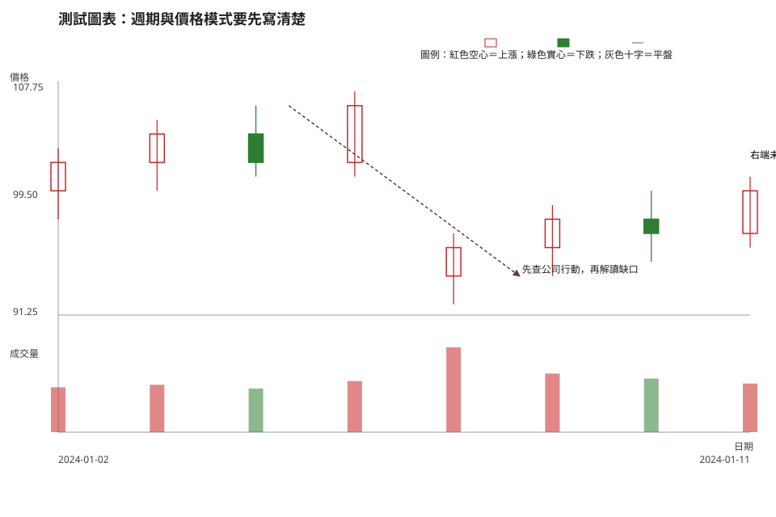
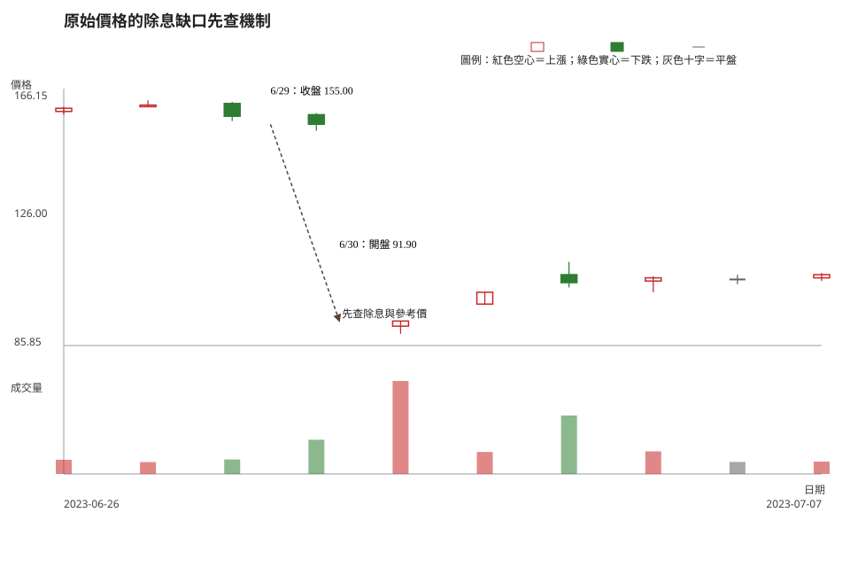

# 第 3 章：週期、原始價格與調整後價格

## 學習目標

你會能說明日線與週線各摘要什麼、辨識未完成 K 線的限制、區分原始價格與調整後價格，並在看到大缺口時先排除除權息、配股、減資與分割等公司行動。

## 先說結論

先問「這根 K 線是哪個週期、是否已收完、價格是否經調整」。同一段交易，用日線看得到每天的波動，用週線則把一週壓成一根 K 線；交易時間尚未結束時，該根 K 線的高、低、收都還會變。

原始價格保留當日實際成交價。調整後價格是為了跨越公司行動而重算的比較序列。兩者服務的問題不同，不能把原始圖上的除息缺口直接說成所有人都在同一天恐慌賣出。

## 精確定義與證據等級

### 週期與未完成 K 線

日線以一個交易日的 OHLC 構成；週線以一週內第一筆開盤、最高、最低與最後收盤構成。盤中日線、尚未收週的週線是**未完成資料**，只能描述當下，不能把它當成已確認收盤型態。

### 原始價格與調整後價格

- **原始價格（raw）**：直接保留交易日記錄的 OHLC。它最適合核對當天市場上實際成交的價格。
- **調整後價格（adjusted）**：依資料提供者的規則回推或前調，使現金股利、股票股利、減資、股票分割等事件前後較容易做報酬或長期趨勢比較。

調整方法會影響數值，必須記錄資料商、計算規則與是否含現金股利。它是**資料處理定義**，不應被誤稱為另一個實際成交價。

### 刻度與多週期

線性刻度比較絕對價差；對數刻度比較相對變動，適合觀察跨很大價格區間時的百分比感受。任何一種刻度都不替代多週期核對：可先用較長週期理解結構，再用較短週期規劃觸發與風險；兩者互相矛盾時，應降低結論強度，而不是挑一張支持自己的圖。

## 人工圖例

人工圖例展示一段資料在日線中有多根 K 線，壓成較長週期後則只剩一個區間摘要。它也提醒讀者：若最後一日尚未收盤，右端的 K 線不應被當成完成訊號。

<!-- figure-spec
{
  "id": "ch03-timeframe-and-price-mode",
  "kind": "synthetic",
  "title": "週期與價格模式要先寫清楚",
  "alt_text": "人工日 K 線圖，標示右端未完成 K 線與一段可能受公司行動影響的價格落差，說明先確認週期和價格模式。",
  "output": "assets/figures/ch03-concept.svg",
  "bars": [
    {"date": "2024-01-02", "open": 100, "high": 103, "low": 98, "close": 102, "volume": 360000},
    {"date": "2024-01-03", "open": 102, "high": 105, "low": 100, "close": 104, "volume": 380000},
    {"date": "2024-01-04", "open": 104, "high": 106, "low": 101, "close": 102, "volume": 350000},
    {"date": "2024-01-05", "open": 102, "high": 107, "low": 101, "close": 106, "volume": 410000},
    {"date": "2024-01-08", "open": 94, "high": 97, "low": 92, "close": 96, "volume": 680000},
    {"date": "2024-01-09", "open": 96, "high": 99, "low": 94, "close": 98, "volume": 470000},
    {"date": "2024-01-10", "open": 98, "high": 100, "low": 95, "close": 97, "volume": 430000},
    {"date": "2024-01-11", "open": 97, "high": 101, "low": 96, "close": 100, "volume": 390000}
  ],
  "annotations": [
    {"type": "arrow", "start": "2024-01-05", "end": "2024-01-08", "start_price": 106, "end_price": 94, "label": "先查公司行動，再解讀缺口"},
    {"type": "label", "date": "2024-01-11", "price": 102, "label": "右端未收完前不是完成 K 線"}
  ]
}
-->

人工圖上的落差沒有指定原因；正確流程不是替它命名，而是先查資料模式和公司行動，再決定是否值得研究市場供需。

## 歷史案例

此圖使用 TWSE 2603 於 2023-06-26 至 2023-07-07 的官方原始日線。2023-06-30 的價格落差發生在現金股利除息日；TWSE 的 [2603 個股資訊 PDF](https://www.twse.com.tw/pdf/ch/2603_ch.pdf)可核對 111 年度每股現金股利 70 元的記錄，除權息事實則應以 [公開資訊觀測站公告](https://mops.twse.com.tw/mops/web/t05st01) 和 [TWSE 除權息參考價資料](https://wwwc.twse.com.tw/zh/announcement/ex-right/twt49u.html)交叉查核。

這不是「缺口必定完全等於股利」的說法：原始價格當天仍會受到交易與其他資訊影響。教材的結論較窄：在量化賣壓前，先把已公告的公司行動及參考價機制列入解釋。

<!-- figure-spec
{
  "id": "ch03-mechanical-ex-dividend-gap",
  "kind": "historical",
  "title": "原始價格的除息缺口先查機制",
  "alt_text": "長榮 2603 於 2023 年 6 月 26 日至 7 月 7 日的官方原始日線，標示 6 月 29 日收盤與 6 月 30 日除息日開盤的價格落差，提醒讀者先查公司行動與參考價。",
  "output": "assets/figures/ch03-cases.svg",
  "market": "TWSE",
  "symbol": "2603",
  "start": "2023-06-26",
  "end": "2023-07-07",
  "timeframe": "1d",
  "price_mode": "raw",
  "source_url": "https://www.twse.com.tw/rwd/zh/afterTrading/STOCK_DAY",
  "checked_on": "2026-08-10",
  "corporate_actions": [
    "2023-06-30 現金股利除息；111 年現金股利每股 70 元，除權息事實與參考價應以 MOPS 公告及 TWSE 資料交叉查核。"
  ],
  "annotations": [
    {"type": "arrow", "start": "2023-06-29", "end": "2023-06-30", "start_price": 155, "end_price": 93.5, "label": "先查除息與參考價"},
    {"type": "label", "date": "2023-06-29", "price": 163, "label": "6/29：收盤 155.00"},
    {"type": "label", "date": "2023-06-30", "price": 115, "label": "6/30：開盤 91.90"}
  ]
}
-->

圖上的資料模式明確標為 `raw`。若改用調整後價格研究長期報酬，必須同時記錄調整來源和公式；若用原始價格評估當日可成交價格，則不能把除息造成的機械成分藏起來。股利、配股、減資與分割都可能要求同樣的查核順序。

## 八步判讀

1. **圖表與資料有效性**：確認代號、日期、原始／調整後欄位和公司行動紀錄；發現缺口先查資料血緣。
2. **週期**：標示日線或週線，並辨識右端 K 線是否尚未完成。
3. **市場狀態**：區分一般波動、公告日前後與跨週期結構，避免混用時間尺度。
4. **位置**：以同一種價格模式標出前高、前低、區間與缺口，不混用 raw 與 adjusted。
5. **K 線／結構**：描述 OHLC 的事實；若有公司行動，先把它從一般賣壓解讀中分開。
6. **成交量／流動性**：比較交易量與可成交性，但不要用量能替代公司行動查核。
7. **情境／觸發／失效**：例如「扣除已知機制後，若價格仍無法守住結構才重新評估」；寫明要驗證的資料。
8. **風險／不交易**：價格模式、事件日期或參考價不明時，不以缺口追價或猜底。

## 練習

以 2023-06-30 前後的案例，分三層寫答案：

1. 觀察：只描述 6/29 收盤與 6/30 開盤的原始價格關係，不解釋原因。
2. 條件式解讀：列出要把這個落差歸為一般賣壓前，還需要查到哪些資料；再寫一個會改變你看法的條件。
3. 行動／風險：在公司行動與調整規則尚未確認前，你會如何處理既有策略或新部位？

## 答案與評分

展開示範答案與評分

**示範答案。**觀察：6/29 收盤為 155.00，6/30 開盤為 91.90，原始日線可見價格落差。條件式解讀：先查 MOPS 除權息公告、TWSE 參考價資料及所用序列是否為 raw；若不存在已公告公司行動或參考價無法解釋主要落差，才把一般市場供需列為待研究情境。行動／風險：在事件與價格模式未確認前，暫停以缺口設計新倉位，並重新核對既有停損、保證金與部位風險。

**10 分評分。**原始價格事實正確 3 分；查核路徑與改變看法的條件 4 分；風險處理具體且不把缺口當保證 3 分。後來是否填息不列入評分。

## 重點、限制與來源

### 重點

週期、完成狀態與價格模式是 K 線判讀的前置條件。公司行動前後的原始價格落差先查公告與參考價，才能避免把機械調整誤讀成情緒。

### 限制

調整後價格不是單一全球標準；不同資料供應者可能採不同的調整時點與方法。公司行動也不會消除市場真實買賣，因此機制查核後仍要保留不確定性。

### 來源與證據類型

- **市場資料事實**：[TWSE 每日收盤行情](https://www.twse.com.tw/rwd/zh/afterTrading/STOCK_DAY)，圖表規格查核日期為 2026-08-10。
- **公司行動機制**：[MOPS 除權息公告](https://mops.twse.com.tw/mops/web/t05st01)、[TWSE 除權息參考價](https://wwwc.twse.com.tw/zh/announcement/ex-right/twt49u.html)與 [2603 個股資訊](https://www.twse.com.tw/pdf/ch/2603_ch.pdf)。
- **教材慣例**：日線／週線比較、線性／對數刻度和多週期流程是分析框架，不是任何交易結果的保證。
