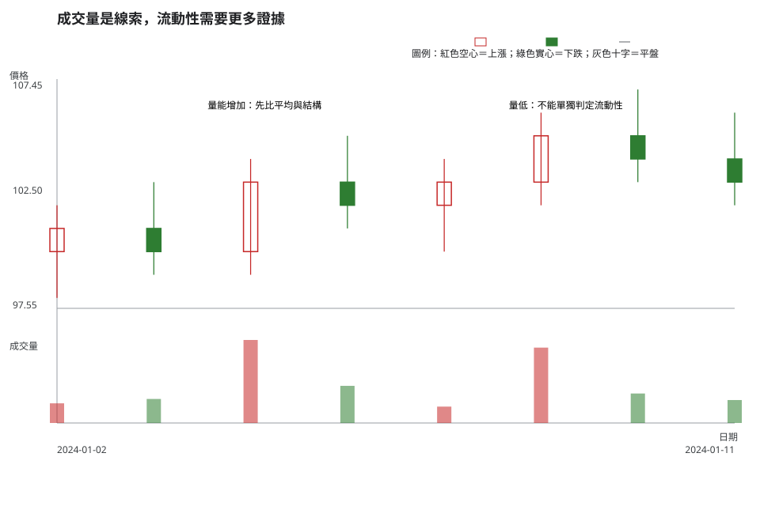
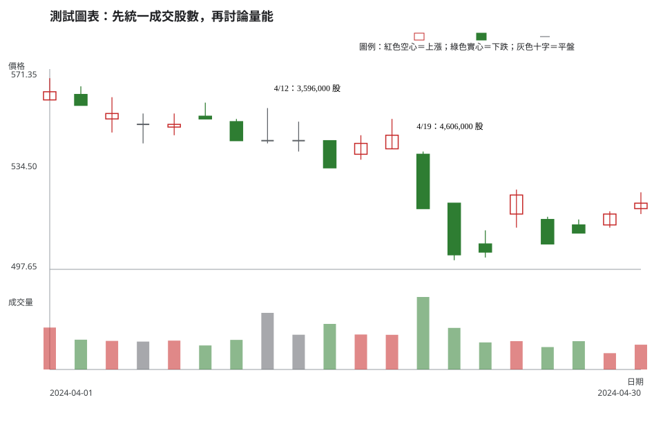

# 第 4 章：成交量、流動性與台股市場基礎

## 學習目標

你會能分開描述成交股數、成交量變化、周轉率與流動性，知道台股資料欄位的單位需要核對，並把買賣價差、滑價與缺漏資料納入風險，而不是把「量大」簡化成看多訊號。

## 先說結論

成交量回答的是「在這段時間內成交了多少」；流動性回答的是「能否以接近預期的價格、在合理時間內完成交易」。兩者相關但不是同義詞。一檔股票某日成交量增加，仍可能有寬買賣價差、排隊風險或大單滑價；成交量較低，也不能只靠一個數字就宣告它不可交易。

## 精確定義與證據等級

### 成交量、周轉率與平均量

- **成交量**：指定週期內的成交股數或資料來源所定義的成交單位。比較前先統一成股數。
- **平均成交量**：在固定回看窗內的成交量平均值。回看天數、是否排除異常日、使用算術或其他平均法都必須記錄。
- **周轉率**：常見寫法是「期間成交股數 ÷ 同一口徑的流通股數」。流通股數、庫藏股與資料商定義不同時，數值不可直接比較。

以上是**欄位與公式定義**。它們告訴我們資料如何計算，不直接告訴我們誰的意圖。

### 流動性與交易成本

流動性至少還涉及可見買賣價差、委託簿深度、成交頻率、下單後的滑價與是否有停牌／缺漏資料。成交量是必要線索之一，但不是完整代理變數。若沒有逐筆、最佳五檔或可執行報價，就應明說流動性判斷的證據不足。

## 人工圖例

人工資料把相近的價格變動配上不同成交量。正確讀法不是「最高柱必漲」，而是問：它相對於什麼平均值？是否伴隨更好的可成交性？資料是否涵蓋同一種交易單位？

<!-- figure-spec
{
  "id": "ch04-volume-and-liquidity",
  "kind": "synthetic",
  "title": "成交量是線索，流動性需要更多證據",
  "alt_text": "人工日 K 線與成交量圖，顯示價格相近的日子可有不同成交量，並標示量能增加不等於流動性或方向已被證明。",
  "output": "assets/figures/ch04-concept.svg",
  "bars": [
    {"date": "2024-01-02", "open": 100, "high": 102, "low": 98, "close": 101, "volume": 180000},
    {"date": "2024-01-03", "open": 101, "high": 103, "low": 99, "close": 100, "volume": 220000},
    {"date": "2024-01-04", "open": 100, "high": 104, "low": 99, "close": 103, "volume": 760000},
    {"date": "2024-01-05", "open": 103, "high": 105, "low": 101, "close": 102, "volume": 340000},
    {"date": "2024-01-08", "open": 102, "high": 104, "low": 100, "close": 103, "volume": 150000},
    {"date": "2024-01-09", "open": 103, "high": 106, "low": 102, "close": 105, "volume": 690000},
    {"date": "2024-01-10", "open": 105, "high": 107, "low": 103, "close": 104, "volume": 270000},
    {"date": "2024-01-11", "open": 104, "high": 106, "low": 102, "close": 103, "volume": 210000}
  ],
  "annotations": [
    {"type": "label", "date": "2024-01-04", "price": 106, "label": "量能增加：先比平均與結構"},
    {"type": "label", "date": "2024-01-08", "price": 106, "label": "量低：不能單獨判定流動性"}
  ]
}
-->

圖中只提供日 OHLC 與日成交量，沒有買賣價差、五檔深度或實際委託回報。因此任何「容易成交」的結論都必須降級為待查假設。

## 歷史案例

此圖使用 TPEx 6488 於 2024-04-01 至 2024-04-30 的官方原始日資料。TPEx 原始回應的成交量欄位為「成交仟股」；本教材資料介面依欄位單位換算，統一把 `volume` 表示為股數。圖中三個標記日只比較已成交股數，沒有將較低量的日期貼成「流動性差」標籤。

<!-- figure-spec
{
  "id": "ch04-volume-normalization-6488",
  "kind": "historical",
  "title": "先統一成交股數，再討論量能",
  "alt_text": "上櫃 6488 於 2024 年 4 月的官方原始日線與成交量，標示不同日的已標準化成交股數，提醒讀者成交量不足以單獨判定流動性。",
  "output": "assets/figures/ch04-cases.svg",
  "market": "TPEX",
  "symbol": "6488",
  "start": "2024-04-01",
  "end": "2024-04-30",
  "timeframe": "1d",
  "price_mode": "raw",
  "source_url": "https://www.tpex.org.tw/www/zh-tw/afterTrading/tradingStock",
  "checked_on": "2026-08-10",
  "corporate_actions": [],
  "annotations": [
    {"type": "label", "date": "2024-04-12", "price": 562, "label": "4/12：3,596,000 股"},
    {"type": "label", "date": "2024-04-19", "price": 548, "label": "4/19：4,606,000 股"}
  ]
}
-->

要從這張圖進一步討論「量能相對增加」，應先選定回看窗並計算平均量，再確認是否有同一市場、同一商品口徑的比較資料。要討論流動性，還應加入當時買賣價差、深度、成交頻率與預計下單量；若資料缺失，結論就是「無法判定」，不是自行補完故事。

## 八步判讀

**八步前置核對。**確認市場、代號、日期、成交量欄位與單位；上櫃資料先確認是否已由成交仟股標準化為股數，且日成交量只和日成交量比較。

1. **大方向**：描述量能在整理、突破嘗試、事件日或趨勢中的相對背景，不把相對高量直接等同方向。
2. **所在位置**：把價格放回可重現的區間、前高前低或缺口位置，再看量能是否有變化。
3. **量價反應**：先描述 OHLC 與連續結構，再記錄成交股數、平均量口徑、買賣價差、深度、滑價與缺漏；量柱不替代價格結構。
4. **交易情境**：例如把「價格突破且成交與可成交性資料符合條件」列為追蹤情境，並保留資料不足的觀察情境。
5. **觸發條件**：突破收盤、預先宣告的量能比較窗與必要報價資料都達標後，才觸發追蹤。
6. **失效條件**：量能或報價條件未達標、價格回到預定區域，或資料單位無法確認時，情境不成立。
7. **風險計算**：把預計下單量造成的滑價、停損距離與成本納入最大可能損失；超限時減少部位或不交易。
8. **事後檢討**：保存量能比較窗、報價缺口與實際成交結果，回顧時分開檢查量價敘述與可執行性判斷。

## 練習

只使用歷史圖和本章提供的資料，分三層回答：

1. 觀察：比較 4/12、4/19、4/29 三日已標準化的成交股數，寫出不帶方向詞的事實。
2. 條件式解讀：若想主張 4/19 的成交活躍度較高，還需要定義哪些比較基準與資料？什麼情況下不能下結論？
3. 行動／風險：若你的預計下單量很大，但看不到當時買賣價差與深度，你會採取什麼行動？

## 答案與評分

展開示範答案與評分

**示範答案。**觀察：圖示 4/19 的成交股數高於 4/12，4/29 低於前兩日；三者都已經過相同的單位標準化。條件式解讀：需先定義同市場、同週期的回看窗與平均量，並加入買賣價差、深度或成交頻率；若這些資料缺失，就不能把單日成交量說成流動性已改善。行動／風險：不以未知深度承擔大額市價單風險，先取得報價與可執行性資料，必要時降低部位或不交易。

**10 分評分。**成交股數和單位觀察正確 3 分；比較基準與證據不足的界線 4 分；行動有滑價／部位風險處理 3 分。不得用後續價格方向決定得分。

## 重點、限制與來源

### 重點

成交量要先統一單位、週期與比較口徑；流動性需要成交量以外的可執行性證據。資料不足時，最精確的答案就是不足以判定。

### 限制

日成交量不含完整的委託簿資訊，也不能保證任何下單量的成交品質。單一月份的歷史案例只能教資料處理與風險提問，不能用來概括所有上櫃股票。

### 來源與證據類型

- **市場資料事實**：[TPEx 個股日成交資訊](https://www.tpex.org.tw/www/zh-tw/afterTrading/tradingStock)，圖表規格查核日期為 2026-08-10；本教材將「成交仟股」轉為股數。
- **交易所規則**：零股、單位與其他可能變動的市場制度請集中查閱[附錄 C](appendix-c-taiwan-market-rules.md)。
- **公式與教材慣例**：平均量、周轉率與流動性檢核是資料口徑與教學框架，不是交易所對報酬的承諾。
