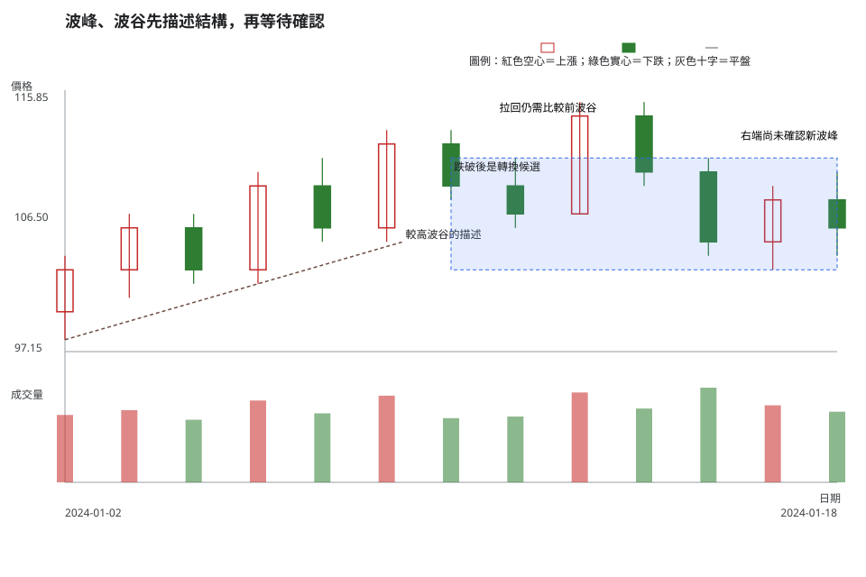
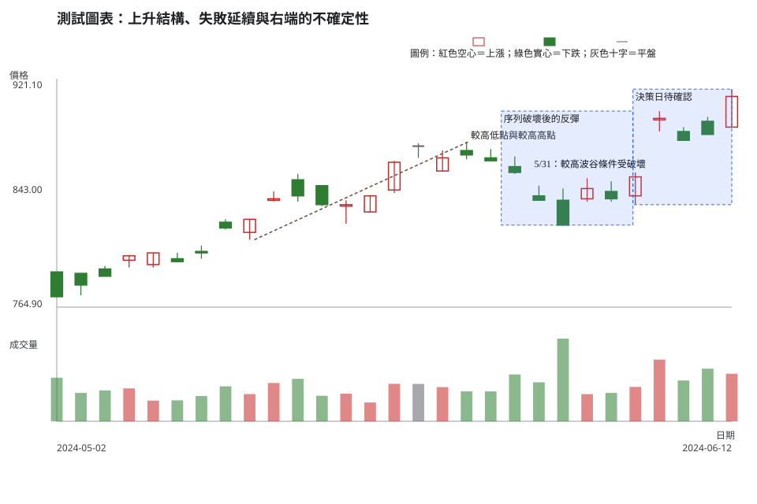

# 第 5 章：波峰、波谷與趨勢結構

## 學習目標

讀完本章，你將能：

1. 用可重現的相鄰交易日規則確認波峰與波谷，並說明回看範圍改變時，標記結果也會改變。
2. 從已確認的波峰、波谷描述上升、下降或區間結構，避免把結構描述寫成預測。
3. 區分一般拉回、結構轉換候選與資料不足的右端，並把等待或不交易列為有效決策。

## 先說結論

趨勢先是對已確認波峰、波谷序列的描述，後來才可能成為交易計畫的背景。較高波峰與較高波谷可描述上升結構；較低波谷與較低波峰可描述下降結構；若兩種序列都沒有持續成立，較精確的說法是區間或轉換中的結構。

一個波谷被跌破，代表原結構需要重評。它不會自動回答接下來一定下跌。相同地，一次反彈高於前波峰，也還需要新的波谷、收盤與風險條件來確認。

## 精確定義與證據等級

### 以相鄰交易日確認波峰與波谷

本章的圖例預設使用回看範圍 k=1。對第 i 根日 K：

- 已確認波峰：最高價嚴格高於前、後各一個有效交易日的最高價。
- 已確認波谷：最低價嚴格低於前、後各一個有效交易日的最低價。
- 右端尚未有下一個有效交易日，或高低價相同時，不能依這個規則確認波峰或波谷。

「有效交易日」指同一市場、同一價格模式的相鄰交易紀錄，休市日不另補一根 K 線。把 k 改成 2 或更大，會濾掉較小的來回波動，也會讓確認更晚。這是可重現的教材慣例，不是交易所定義；每次比較都要固定同一個 k。

### 從已確認的點描述結構

| 描述 | 可觀察條件 | 可以說的話 | 不能直接推出的話 |
| --- | --- | --- | --- |
| 上升結構 | 已確認波峰逐步墊高，且波谷也逐步墊高 | 「在選定 k 與週期下，波峰、波谷形成較高序列。」 | 「一定會繼續上漲。」 |
| 下降結構 | 已確認波谷逐步降低，且波峰也逐步降低 | 「在選定 k 與週期下，波峰、波谷形成較低序列。」 | 「任何反彈都不能參與。」 |
| 區間／轉換中 | 點位反覆交錯，或舊序列剛被破壞而新序列未完成 | 「尚無一致序列，先以區域與情境追蹤。」 | 「已經確定反轉。」 |

一般拉回仍停在原先較高波谷或較低波峰的可觀察範圍內，且沒有形成相反序列。結構轉換候選則是舊序列被破壞，但新序列還缺少下一個確認點。兩者都屬條件式判讀，必須與週期、位置、量能和失效條件一起檢查。

### 證據等級

- **市場資料事實**：指定日線的 OHLC、日期、成交量與公司行動紀錄可由官方資料重現。
- **教材／常用判讀法**：k 值、波峰波谷確認規則與上升或下降結構的描述方式。
- **條件式解讀與風險決策**：結構是否足以形成交易情境、何時觸發、何時失效、是否不交易，不能只由名稱決定。

## 人工圖例

人工圖例把「上升結構中的拉回」「較高波谷被跌破」與「右端尚未確認」放在同一段資料。圖中價格與成交量完全是教學資料，目的在於隔離結構，不代表任何標的。

<!-- figure-spec
{
  "id": "ch05-swing-structure-concept",
  "kind": "synthetic",
  "title": "波峰、波谷先描述結構，再等待確認",
  "alt_text": "人工日 K 線圖，前段呈現較高波峰和較高波谷，中段出現一般拉回，後段跌破較高波谷並停在尚未確認的右端，說明結構轉換仍需後續資料。",
  "output": "assets/figures/ch05-concept.svg",
  "bars": [
    {"date": "2024-01-02", "open": 100, "high": 104, "low": 98, "close": 103, "volume": 420000},
    {"date": "2024-01-03", "open": 103, "high": 107, "low": 101, "close": 106, "volume": 450000},
    {"date": "2024-01-04", "open": 106, "high": 107, "low": 102, "close": 103, "volume": 390000},
    {"date": "2024-01-05", "open": 103, "high": 110, "low": 102, "close": 109, "volume": 510000},
    {"date": "2024-01-08", "open": 109, "high": 111, "low": 105, "close": 106, "volume": 430000},
    {"date": "2024-01-09", "open": 106, "high": 113, "low": 105, "close": 112, "volume": 540000},
    {"date": "2024-01-10", "open": 112, "high": 113, "low": 108, "close": 109, "volume": 400000},
    {"date": "2024-01-11", "open": 109, "high": 111, "low": 106, "close": 107, "volume": 410000},
    {"date": "2024-01-12", "open": 107, "high": 115, "low": 107, "close": 114, "volume": 560000},
    {"date": "2024-01-15", "open": 114, "high": 115, "low": 109, "close": 110, "volume": 460000},
    {"date": "2024-01-16", "open": 110, "high": 111, "low": 104, "close": 105, "volume": 590000},
    {"date": "2024-01-17", "open": 105, "high": 109, "low": 103, "close": 108, "volume": 480000},
    {"date": "2024-01-18", "open": 108, "high": 110, "low": 104, "close": 106, "volume": 440000}
  ],
  "annotations": [
    {"type": "line", "start": "2024-01-02", "end": "2024-01-09", "start_price": 98, "end_price": 105, "label": "較高波谷的描述"},
    {"type": "zone", "start": "2024-01-10", "end": "2024-01-18", "low": 103, "high": 111, "label": "跌破後是轉換候選"},
    {"type": "label", "date": "2024-01-11", "price": 114, "label": "拉回仍需比較前波谷"},
    {"type": "label", "date": "2024-01-16", "price": 112, "label": "右端尚未確認新波峰"}
  ]
}
-->

前段的上升結構可用確認過的較高點描述。1/16 跌到前一段較高波谷下方後，圖上只多了一個轉換候選；它還缺少新的確認波峰、波谷，因此不需要急著替它貼上反轉標籤。

## 歷史案例

此圖使用 TWSE 2330 於 2024-05-02 至練習決策日 2024-06-12 的官方原始日資料，並以 k=1 標示局部波峰、波谷。5 月中旬的較高低點與較高高點可描述一段上升結構；5/31 的低點則破壞了此前較高波谷序列。6 月初的反彈讓結構出現相互矛盾的線索，6/12 位於圖表右端，尚不可確認成新的波峰。

公司行動檢查使用 TWSE 除權息計算結果表：可視期間內沒有 2330 的除權息紀錄，因此 metadata 記為空陣列。該表在 2024-06-13 才列出 2330 現金除息，已在本圖決策日之外。這個檢查只排除已知機械調整，沒有替任何價格變化編造原因。

<!-- figure-spec
{
  "id": "ch05-swing-structure-2330",
  "kind": "historical",
  "title": "上升結構、失敗延續與右端的不確定性",
  "alt_text": "台積電 2330 於 2024 年 5 月 2 日至練習決策日 6 月 12 日的官方原始日線。圖中標示較高波峰與較高波谷序列、5 月底的結構破壞，以及右端尚不能確認的新波峰；圖表不含決策日後資料。",
  "output": "assets/figures/ch05-cases.svg",
  "market": "TWSE",
  "symbol": "2330",
  "start": "2024-05-02",
  "end": "2024-06-12",
  "timeframe": "1d",
  "price_mode": "raw",
  "source_url": "https://www.twse.com.tw/rwd/zh/afterTrading/STOCK_DAY",
  "checked_on": "2026-08-10",
  "corporate_actions": [],
  "annotations": [
    {"type": "line", "start": "2024-05-14", "end": "2024-05-27", "start_price": 811, "end_price": 878, "label": "較高低點與較高高點"},
    {"type": "zone", "start": "2024-05-29", "end": "2024-06-06", "low": 821, "high": 899, "label": "序列破壞後的反彈"},
    {"type": "label", "date": "2024-05-31", "price": 858, "label": "5/31：較高波谷條件受破壞"},
    {"type": "zone", "start": "2024-06-06", "end": "2024-06-12", "low": 835, "high": 914, "label": "決策日待確認"}
  ]
}
-->

這張圖包含三種證據。有效部分是 5 月中旬一連串可以按相同 k 值重現的較高波峰與較高波谷。失敗部分是 5/31 低點使原本的較高波谷條件不再成立。模稜兩可部分是 6 月初的反彈，它提供新的高點線索，卻還沒有足夠右側資料形成一致的新序列。歷史圖只保存 6/12 當日以前可得的資料。

## 八步判讀

1. **圖表與資料有效性**：確認 TWSE、2330、日線、raw 價格、日期排序與公司行動紀錄；本例先確認可視期間無除權息紀錄。
2. **週期**：本例是日線。若要描述較長週期背景，另以完整週線聚合，而不是把一根日 K 當週線。
3. **市場狀態**：5 月中旬可描述為上升結構；5 月底到 6 月初則應降級為結構受破壞後的轉換候選。
4. **位置**：把 5/31 放回前一個較高波谷與最近反彈區，而非只看單日跌幅。
5. **K 線／結構**：固定 k=1，確認局部波峰、波谷，再比較序列是否仍較高或較低。
6. **成交量／流動性**：日成交量可作為相對比較線索；缺少買賣價差、深度或預計下單量時，不能把量能當成可執行性的證明。
7. **情境／觸發／失效**：情境一是反彈後形成新的較高波谷；情境二是回到結構破壞區下方。各情境都要先寫出收盤與區域條件。
8. **風險／不交易**：若新的波谷未確認、失效範圍過寬或流動性資料不足，維持觀察比猜測反轉方向更符合流程。

## 練習

只使用圖中到 2024-06-12 為止的資料，依三層作答：

第一層：辨識

列出一個可按 k=1 重現的較高序列，以及一個讓該序列失效的事實。

第二層：條件式解讀

分別寫出「反彈形成新上升結構」與「仍在轉換或區間中」各需要哪些後續證據。

第三層：行動與風險

若你沒有可接受的失效範圍與流動性資料，會怎麼處理？不要引用 6/12 之後的走勢。

## 答案與評分

展開示範答案與評分

**示範答案。**觀察：依 k=1，5 月中旬可找到較高波谷與其後較高波峰；5/31 的低點破壞了先前較高波谷序列。條件式解讀：若後續先形成可確認的較高波谷，再以收盤守住相同結構，才可追蹤新的上升情境；若價格持續落在結構破壞區，則保留區間或下降結構的情境。行動／風險：未定義部位、失效條件與可成交性時，不因右端反彈就下單。

**10 分評分。**可重現的波峰／波谷觀察 4 分；兩種情境都有觸發與失效條件 3 分；風險或不交易理由具體 3 分。後續漲跌不影響分數。

## 重點、限制與來源

### 重點

波峰、波谷的價值在於讓結構敘述可以被重做。先固定週期與 k 值，再比較序列；結構破壞後等待新的確認，比把一次拉回或反彈直接命名為反轉更可檢驗。

### 限制

不同 k 值會得到不同的局部波峰、波谷。波峰、波谷沒有包含基本面、消息、委託簿或個人可承擔的損失；歷史結構也不能保證未來報酬。

### 來源與證據類型

- **市場資料事實**：[TWSE 每日收盤行情](https://www.twse.com.tw/rwd/zh/afterTrading/STOCK_DAY)，圖表 metadata 查核日期為 2026-08-10。
- **公司行動查核**：[TWSE 除權息計算結果表](https://www.twse.com.tw/zh/announcement/ex-right/twt49u.html) 與 [MOPS 除權息公告](https://mops.twse.com.tw/mops/)；可視期間無 2330 記錄，6/13 的現金除息在決策日後。
- **教材慣例**：相鄰交易日的 k 值規則、結構描述與八步流程是可重現判讀框架，不是交易所對後續走勢的保證。
