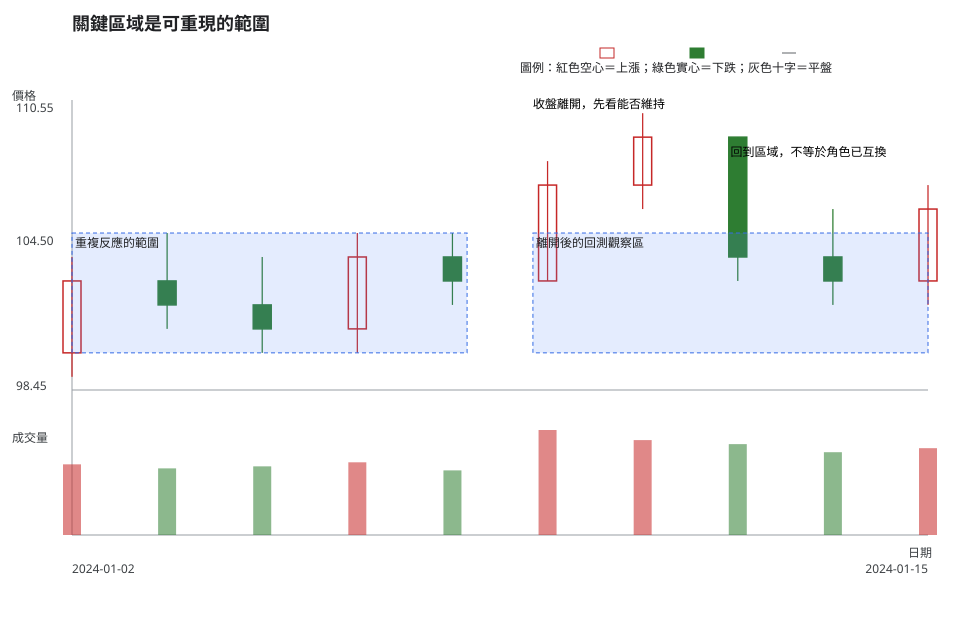
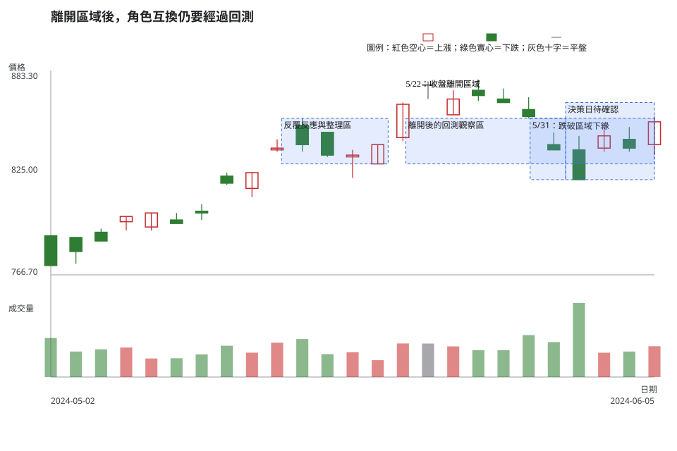

# 第 6 章：關鍵區域、支撐區與壓力區

## 學習目標

讀完本章，你將能：

1. 把重複反應、前次整理與角色互換畫成價格範圍，而非沒有市場依據的單一精確線。
2. 說明區域寬度如何受到波動、價格升降單位與觀察週期影響。
3. 用收盤、反應次數、結構、成交量與可成交性分開評估區域的證據，並在證據衝突時保留不交易選項。

## 先說結論

支撐區與壓力區是值得觀察反應的價格範圍，不是保證反彈或保證無法突破的牆。價格在一段區間反覆停頓、轉向或大量換手，才有可檢查的市場基礎。精確到單一價格卻無法指出反應、整理、成交或制度依據的畫線，不足以形成交易規則。

價格穿越區域後，舊壓力有機會成為新的支撐觀察區，舊支撐也有機會成為壓力觀察區。角色互換需要後續收盤和回測證據；一次盤中穿越或一次碰觸都不夠。

## 精確定義與證據等級

### 區域從哪些可觀察證據建立

本章以「至少兩次可辨識反應或一段明顯整理」作為畫出候選區域的教材門檻。區域的上下緣應包住反應帶，而非挑選某根 K 線的一個漂亮數字。

- **重複反應**：同一價格帶附近多次出現停止下跌、停止上漲、收盤拉回或穿越失敗。
- **前次整理**：多根 K 線的高低點互相重疊，價格在一定範圍內來回。
- **角色互換**：價格離開舊區域後，再次回到該範圍時，收盤與結構出現不同於原角色的反應。
- **區域寬度**：要容納資料週期的自然波動與市場可用升降單位。波動較大、週期較長或價格級距較大時，狹窄線通常不如範圍可重現。

臺股普通股的升降單位會隨價格區間變化，最新值請查[附錄 C](appendix-c-taiwan-market-rules.md)。本章不把一個價格刻度當成所有市場或所有時段都適用的區域寬度。

### 證據會增強或減弱區域

| 證據 | 可觀察事實 | 合理的條件式解讀 |
| --- | --- | --- |
| 多次反應且收盤靠近區外 | 日期、OHLC 與反應帶可重現 | 該範圍值得列入下一次情境與失效判斷。 |
| 前次整理後以收盤離開 | 數根 K 線重疊，後續收盤在區外 | 可追蹤突破是否保有空間與回測證據。 |
| 經常來回穿越 | 多個收盤在區域內外切換 | 單一支撐或壓力標籤變弱，區域可能只是整理中心。 |
| 公司行動、異常資料或缺少流動性證據 | 公告、價格模式或報價資料不足 | 先降低判讀強度，不能把機械價格落差當一般供需。 |

區域本身屬**常用判讀法與教材慣例**。官方日資料只證明價格與成交量曾出現；「買方較強」「賣方較強」和是否行動，仍屬條件式解讀與風險決策。

## 人工圖例

人工圖例把反覆反應、收盤離開、回到區域與角色互換未確認放在同一段資料。每個區塊都是範圍，圖中沒有任何一條神奇單價線。

<!-- figure-spec
{
  "id": "ch06-key-zones-concept",
  "kind": "synthetic",
  "title": "關鍵區域是可重現的範圍",
  "alt_text": "人工日 K 線圖，標示一段有重複反應的價格區域、收盤離開區域、回測時重新進入區域的情況，說明角色互換仍需後續證據。",
  "output": "assets/figures/ch06-concept.svg",
  "bars": [
    {"date": "2024-01-02", "open": 100, "high": 104, "low": 99, "close": 103, "volume": 350000},
    {"date": "2024-01-03", "open": 103, "high": 105, "low": 101, "close": 102, "volume": 330000},
    {"date": "2024-01-04", "open": 102, "high": 104, "low": 100, "close": 101, "volume": 340000},
    {"date": "2024-01-05", "open": 101, "high": 105, "low": 100, "close": 104, "volume": 360000},
    {"date": "2024-01-08", "open": 104, "high": 105, "low": 102, "close": 103, "volume": 320000},
    {"date": "2024-01-09", "open": 103, "high": 108, "low": 103, "close": 107, "volume": 520000},
    {"date": "2024-01-10", "open": 107, "high": 110, "low": 106, "close": 109, "volume": 470000},
    {"date": "2024-01-11", "open": 109, "high": 109, "low": 103, "close": 104, "volume": 450000},
    {"date": "2024-01-12", "open": 104, "high": 106, "low": 102, "close": 103, "volume": 410000},
    {"date": "2024-01-15", "open": 103, "high": 107, "low": 102, "close": 106, "volume": 430000}
  ],
  "annotations": [
    {"type": "zone", "start": "2024-01-02", "end": "2024-01-08", "low": 100, "high": 105, "label": "重複反應的範圍"},
    {"type": "zone", "start": "2024-01-09", "end": "2024-01-15", "low": 100, "high": 105, "label": "離開後的回測觀察區"},
    {"type": "label", "date": "2024-01-09", "price": 110, "label": "收盤離開，先看能否維持"},
    {"type": "label", "date": "2024-01-12", "price": 108, "label": "回到區域，不等於角色已互換"}
  ]
}
-->

右半段重新進入區域，代表讀者要重新問三件事：收盤停在哪裡、結構是否仍有空間、風險能否事先界定。它沒有自帶「必守」或「必破」的答案。

## 歷史案例

此圖使用 TWSE 2330 於 2024-05-02 至練習決策日 2024-06-05 的官方原始日資料。5 月中旬多個高低點和收盤集中在同一個寬範圍，5/22 收盤離開該帶；5 月底又回到範圍內外。這組資料適合比較「有效離開」「角色互換失敗」與「重新站回後仍待確認」三種狀態。

公司行動以 TWSE 除權息計算結果表篩查可視期間，沒有 2330 的除權息紀錄，故 metadata 使用空陣列。下一次表列的 2330 現金除息日是 2024-06-13，不在本圖範圍內。這只說明圖中價格沒有已查得的除權息機械調整，沒有為區域反應指定原因。

<!-- figure-spec
{
  "id": "ch06-key-zones-2330",
  "kind": "historical",
  "title": "離開區域後，角色互換仍要經過回測",
  "alt_text": "台積電 2330 於 2024 年 5 月 2 日至練習決策日 6 月 5 日的官方原始日線。圖中標示 5 月中旬的重複反應區、收盤離開區域、月底跌回與 6 月初重新站回的模稜兩可狀態；圖表不含決策日後資料。",
  "output": "assets/figures/ch06-cases.svg",
  "market": "TWSE",
  "symbol": "2330",
  "start": "2024-05-02",
  "end": "2024-06-05",
  "timeframe": "1d",
  "price_mode": "raw",
  "source_url": "https://www.twse.com.tw/rwd/zh/afterTrading/STOCK_DAY",
  "checked_on": "2026-08-10",
  "corporate_actions": [],
  "annotations": [
    {"type": "zone", "start": "2024-05-15", "end": "2024-05-21", "low": 830, "high": 856, "label": "反覆反應與整理區"},
    {"type": "zone", "start": "2024-05-22", "end": "2024-06-05", "low": 830, "high": 856, "label": "離開後的回測觀察區"},
    {"type": "label", "date": "2024-05-22", "price": 872, "label": "5/22：收盤離開區域"},
    {"type": "zone", "start": "2024-05-29", "end": "2024-05-31", "low": 821, "high": 856, "label": "5/31：跌破區域下緣"},
    {"type": "zone", "start": "2024-05-31", "end": "2024-06-05", "low": 821, "high": 865, "label": "決策日待確認"}
  ]
}
-->

區域的有效證據是 5 月中旬的重複反應和 5/22 的收盤離開。5 月底跌回同一範圍使「舊壓力已完全變成新支撐」這個說法失敗；6 月初重新回到區域附近，卻還不足以重建強度。決策日停在 6/5，讀者不能使用右側資料替任何一種解讀加分。

## 八步判讀

**八步前置核對。**確認市場、代號、日線、raw 價格、日期與公司行動篩查結果；日線區域不能直接套成週線區域，較長週期必須用同週期資料重建。

1. **大方向**：先分辨價格是在趨勢中拉回、整理中來回，或結構受破壞後的轉換。
2. **所在位置**：用反覆反應與整理帶畫成範圍，記錄價格在區內、區外或穿越中的哪一種位置。
3. **量價反應**：比較收盤是否留在區外、是否出現拒絕或重新穿越，並在同一回看窗比較量能；沒有價差、深度與預計下單量時，流動性結論保留。
4. **交易情境**：把守住區域、跌回區內與再度穿越分成可並存情境，不用一條精確線預設方向。
5. **觸發條件**：每個情境都以預先指定的收盤或結構條件作為觸發，而非只看盤中最高或最低。
6. **失效條件**：收盤重新穿越對應邊界、區域證據不足或可成交性惡化時，該情境失效。
7. **風險計算**：以觸發價到區域另一側的失效價計算每股風險，加入成本與可能滑價；距離過遠時不硬湊部位。
8. **事後檢討**：保存區域錨點、比較窗與觸發結果，回顧時檢查是否把盤中碰線誤當成收盤確認。

## 練習

只看圖中到 2024-06-05 為止的資料，依三層作答：

第一層：辨識

畫出一個可由圖中反覆反應支持的價格範圍，說明哪些日期使它成為範圍。

第二層：條件式解讀

寫出「區域重新成為支撐觀察區」與「區域仍只是整理中心」各自需要的收盤或結構證據。

第三層：行動與風險

若你只能把失效點放在區域另一側，距離超過可承受風險時會怎麼做？

## 答案與評分

展開示範答案與評分

**示範答案。**觀察：5 月中旬可用多日高低點與收盤形成一個寬的反應範圍；5/22 收盤離開，5 月底又回到範圍內外。條件式解讀：若後續收盤能留在範圍上方，並在回測時不再穿越回區內，可追蹤支撐角色；若收盤反覆穿越，較合理的是把它保留為整理帶。行動／風險：若區域寬度讓失效距離和部位風險無法接受，等待更清楚的收盤結構或不交易。

**10 分評分。**區域有可重現觀察依據 4 分；兩種情境都有觸發與失效條件 3 分；風險、不交易或部位界線具體 3 分。不得因決策日後走勢改變分數。

## 重點、限制與來源

### 重點

關鍵區域由可重現的價格反應建立，應用範圍表達。區域離開、回測與角色互換都是需要後續收盤和結構確認的情境，不能由一條精確線替代。

### 限制

區域寬度沒有一個全市場固定值。不同週期、波動、升降單位與資料模式會改變合理範圍；日 OHLC 和日成交量也無法單獨證明下單時的深度與滑價。

### 來源與證據類型

- **市場資料事實**：[TWSE 每日收盤行情](https://www.twse.com.tw/rwd/zh/afterTrading/STOCK_DAY)，圖表 metadata 查核日期為 2026-08-10。
- **公司行動查核**：[TWSE 除權息計算結果表](https://www.twse.com.tw/zh/announcement/ex-right/twt49u.html) 與 [公開資訊觀測站「公告快易查」](https://mopsov.twse.com.tw/mops/web/ezsearch)。
- **交易制度**：價格升降單位與其他會變動的規則請查[附錄 C](appendix-c-taiwan-market-rules.md)。
- **教材慣例**：反覆反應、整理、角色互換與八步流程用來建立條件式情境，不保證任何區域的未來效果。
