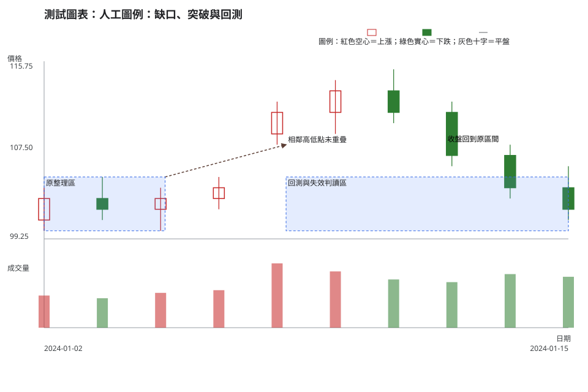
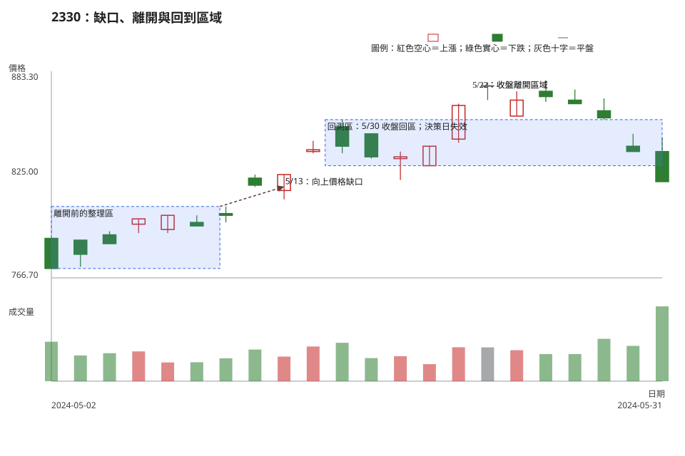

# 第 7 章：缺口、突破、回測與假突破

## 學習目標

完成本章後，你能把「缺口」與「突破」拆成可檢查的價格條件、收盤位置與失效條件；也能分辨尚在等待回測的情境，和已經回到原區間的失敗情境。這些名稱用於描述市場行為，不用來預告後續一定上漲或下跌。

## 先說結論

- 缺口先以相鄰兩根 K 線的高低點判定，再查核原始或還原價格、除權息與資料完整性。
- 突破的可用證據包含收盤離開區域、後續沒有立刻收回、回測後仍守住；單根盤中刺穿的證據較弱。
- 回測是重新檢查原有區域是否換手的過程。若收盤回到原區間，原先的突破論點就需要降級，甚至視為失效。
- 未進場時，仍可先寫好觸發、失效與不交易條件；缺少其中任一項，通常不急著採取行動。

## 精確定義與證據等級

以下以日線為例。向上價格缺口可觀察為當日最低價高於前一日最高價；向下價格缺口則為當日最高價低於前一日最低價。這是價格資料上的描述，不能單靠它推論消息原因或日後是否必然回補。

突破指價格離開一個事先寫明上下界的區域。盤中越界、收盤越界、連續收盤越界、帶量越界，以及回測後仍守住，證據強度不同。判讀時要同時記錄採用哪一種口徑，避免事後更換規則。

|觀察名稱|可直接看到的條件|尚不能直接推論的事|
|---|---|---|
|常規缺口|相鄰兩日高低點沒有重疊|一定會回補|
|離開型缺口|缺口伴隨離開既有整理區|一定代表新趨勢起點|
|延續型缺口|既有方向中再次出現缺口|一定會加速到特定目標|
|竭盡型缺口|延伸後出現缺口與反轉跡象|一定是最高點或最低點|

這些分類是整理觀察的語言，不能替代停損、部位大小或成交成本。遇到除權息、拆併股、配息或資料供應商調整時，先確認價格模式與公司行動，再決定缺口是否可以比較。

## 人工圖例

<!-- figure-spec {"id":"ch07-gap-breakout-concept","kind":"synthetic","title":"人工圖例：缺口、突破與回測","alt_text":"人工日 K 線圖，顯示原整理區後出現向上價格缺口，價格離開後再收盤回到原區間，說明突破需要回測與收盤確認。","output":"assets/figures/ch07-concept.svg","bars":[{"date":"2024-01-02","open":101,"high":104,"low":100,"close":103,"volume":1200},{"date":"2024-01-03","open":103,"high":105,"low":101,"close":102,"volume":1100},{"date":"2024-01-04","open":102,"high":104,"low":100,"close":103,"volume":1300},{"date":"2024-01-05","open":103,"high":105,"low":102,"close":104,"volume":1400},{"date":"2024-01-08","open":109,"high":112,"low":108,"close":111,"volume":2400},{"date":"2024-01-09","open":111,"high":114,"low":109,"close":113,"volume":2100},{"date":"2024-01-10","open":113,"high":115,"low":110,"close":111,"volume":1800},{"date":"2024-01-11","open":111,"high":112,"low":106,"close":107,"volume":1700},{"date":"2024-01-12","open":107,"high":108,"low":103,"close":104,"volume":2000},{"date":"2024-01-15","open":104,"high":106,"low":101,"close":102,"volume":1900}],"annotations":[{"type":"zone","start":"2024-01-02","end":"2024-01-05","low":100,"high":105,"label":"原整理區"},{"type":"arrow","start":"2024-01-05","end":"2024-01-08","start_price":105,"end_price":108,"label":"相鄰高低點未重疊"},{"type":"zone","start":"2024-01-08","end":"2024-01-15","low":100,"high":105,"label":"回測與失效判讀區"},{"type":"label","date":"2024-01-12","price":108,"label":"收盤回到原區間"}]} -->

圖中的 1/8 最低價高於 1/5 最高價，因而符合向上價格缺口的資料條件。之後價格曾離開原整理區，卻在右側收盤回到該區，這時「突破已被確認」的說法缺乏支持。人工資料只用來練習語言與規則，不對應真實市場事件。

## 歷史案例

<!-- figure-spec {"id":"ch07-gap-breakout-2330","kind":"historical","title":"2330：缺口、離開與回到區域","alt_text":"台積電 2330 於 2024 年 5 月 2 日至練習決策日 5 月 31 日的官方原始日線。圖中標示向上價格缺口、離開整理區、收盤回到區域及失敗突破；圖表不含決策日後資料。","output":"assets/figures/ch07-cases.svg","market":"TWSE","symbol":"2330","start":"2024-05-02","end":"2024-05-31","timeframe":"1d","price_mode":"raw","source_url":"https://www.twse.com.tw/exchangeReport/STOCK_DAY?response=json&date=20240501&stockNo=2330","checked_on":"2026-08-10","corporate_actions":[],"annotations":[{"type":"zone","start":"2024-05-02","end":"2024-05-10","low":772,"high":807,"label":"離開前的整理區"},{"type":"arrow","start":"2024-05-10","end":"2024-05-13","start_price":807,"end_price":818,"label":"5/13：向上價格缺口"},{"type":"zone","start":"2024-05-15","end":"2024-05-31","low":830,"high":856,"label":"回測區：5/30 收盤回區；決策日失效"},{"type":"label","date":"2024-05-22","price":872,"label":"5/22：收盤離開區域"}]} -->

本例使用臺灣證券交易所 2330 的原始日資料。2024-05-13 的最低價高於前一交易日最高價，形成可觀察的向上價格缺口。5/22 收盤離開 830–856 的觀察區，但 5/30 收盤回到區內，5/31 又落到區域下方；截至決策日，前述突破已缺少延續與守住的證據。

公司行動以臺灣證券交易所除權息公告查核。此可視區間內沒有 2330 的除權息紀錄；2024-06-13 的現金除息在圖表終點之後，因此未混入本例的缺口判讀。資料與公司行動來源見本章末的官方連結。

## 八步判讀

**八步前置核對。**確認交易日順序、缺值、停牌與原始／還原價格模式，並寫下本次以日線判讀；附近有公司行動時先核對公告，週線背景另列為較長週期假設。

1. **大方向**：描述目前是整理、擴張、趨勢延伸或方向不明，不把標籤當成預測。
2. **所在位置**：先畫出有重複反應的區域，再定義價格從哪一側離開與回測。
3. **量價反應**：比較缺口兩側高低點、收盤是否越界與回到區域時的收盤位置，再檢查成交量是否符合自己的比較窗；日成交量不能單獨證明流動性充足。
4. **交易情境**：分開記錄重新離開區域的延續情境、回測後守住的情境與回到區間內的假突破情境。
5. **觸發條件**：只有重新離開且收盤守住預定區域時，才觸發對應的追蹤計畫。
6. **失效條件**：收盤回到區間內、缺口與區域定義不同步，或公司行動查核推翻一般供需解讀時，情境失效。
7. **風險計算**：用觸發價到區間內的失效價估每股風險，加入跳空、滑價與下單限制；距離無法接受時不交易。
8. **事後檢討**：保存缺口、區域、公司行動與收盤確認的證據，回顧時檢查是否曾把盤中突破當作已確認突破。

## 練習

請只使用上圖截至 2024-05-31 的資料回答。不要查看 6 月以後資料。

第一層：辨識

寫出 5/13 符合向上價格缺口的比較欄位，並標出 5/30 收盤相對於 830–856 區域的位置。

第二層：解釋

用兩句話說明：為何 5/22 的離開不足以單獨確認突破，而 5/30 的收盤會改變證據等級？

第三層：決策

寫出一個等待重新離開區域的觸發條件、一個失效條件，以及一個不交易條件。條件要能由收盤與區域位置檢查。

## 答案與評分

參考答案與配分

- 第一層（3 分）：指出 5/13 最低價與前一交易日最高價的關係（2 分），並判定 5/30 收盤回到 830–856 區域內（1 分）。
- 第二層（3 分）：指出單日離開仍欠缺後續守住或回測證據（1 分），說明收盤回區使突破論點降級（2 分）。
- 第三層（4 分）：觸發條件須是重新離開後的可檢查收盤（2 分）；失效條件須是收盤回區（1 分）；不交易條件可為公司行動未核對、風險距離過大或流動性不足（1 分）。

滿分答案不需要預測價格方向。若把盤中碰觸直接寫成已確認突破，或省略失效條件，應扣分。

## 重點、限制與來源

缺口與突破是可觀察的價格關係，回測與假突破則需要事前區域、收盤口徑與決策日來約束。它們不能獨立提供報酬保證，也無法取代風險控制。

- [臺灣證券交易所：2330 2024 年 5 月日成交資訊](https://www.twse.com.tw/exchangeReport/STOCK_DAY?response=json&date=20240501&stockNo=2330)
- [臺灣證券交易所：除權息公告查詢](https://www.twse.com.tw/rwd/zh/exRight/TWT49U?response=json&startDate=20240501&endDate=20240531)
- [公開資訊觀測站「公告快易查」](https://mopsov.twse.com.tw/mops/web/ezsearch)
- [附錄 C：資料、公司行動與比較限制](appendix-c-taiwan-market-rules.md)
