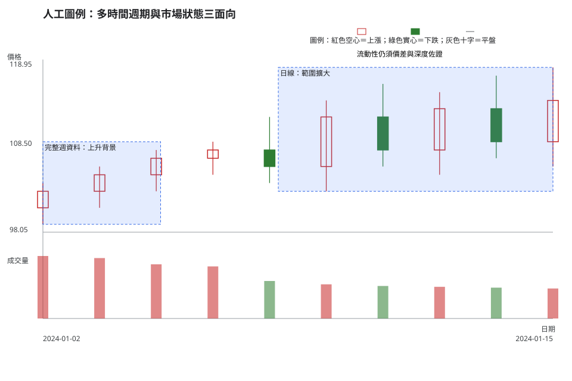
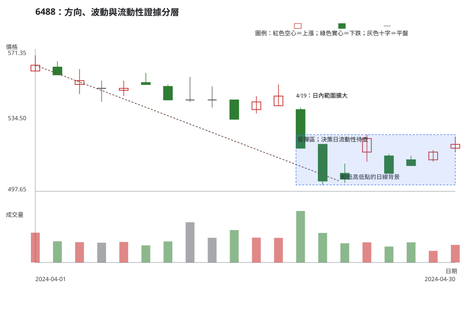

# 第 8 章：多時間框架與市場狀態

## 學習目標

完成本章後，你能把較高時間框架當成背景、把較低時間框架當成執行資訊，並用三個可分開檢查的維度描述市場狀態：方向、波動與流動性。你也能辨認資訊不足時應保留為不交易，而非硬替市場貼標籤。

## 先說結論

- 多時間框架的重點在於先後順序：先看較高時間框架的結構背景，再用較低時間框架定義位置、觸發與失效。
- 方向、波動與流動性是三個不同維度，可以同時存在，也可能給出不同訊號。
- 週線由日線聚合時，須固定使用首筆開盤、最高、最低、末筆收盤與成交量加總；未完成的一週不能與完整週直接比較。
- 日成交量只是流動性線索之一。若沒有價差、委買委賣深度與實際成交成本，就不應把量能直接等同於可交易性。

## 精確定義與證據等級

「方向」可由較高高點／較高低點、較低高點／較低低點，或明確區間來描述；「波動」可比較同一窗口的日內範圍、真實波幅或區間寬度；「流動性」則需要成交量之外的價差、深度與成交衝擊資料。三者沒有必然的因果順序。

當以日線聚合週線時，對每一個已完成交易週取第一筆有效開盤價、週內最高價、週內最低價、最後一筆有效收盤價，並加總成交量。若資料中有休市、缺漏、公司行動或半週，應在結論旁明示處理方式，避免把資料缺口當成市場型態。

|維度|可觀察證據|應保留的限制|
|---|---|---|
|方向|波峰、波谷或區間相對位置|不同時間框架可暫時不一致|
|波動|同一比較窗的日內範圍、區間寬度|需要先寫出比較窗與門檻|
|流動性|成交量、價差、委買委賣深度、成交衝擊|只有日成交量時，證據有限|

## 人工圖例

<!-- figure-spec {"id":"ch08-market-state-concept","kind":"synthetic","title":"人工圖例：時間框架與三個市場狀態維度","alt_text":"人工日 K 線圖，前段建立較高時間框架的上升背景，後段日內範圍擴大且成交量遞減，說明方向、波動與流動性需分開檢查。","output":"assets/figures/ch08-concept.svg","bars":[{"date":"2024-01-02","open":101,"high":104,"low":99,"close":103,"volume":1500},{"date":"2024-01-03","open":103,"high":106,"low":101,"close":105,"volume":1450},{"date":"2024-01-04","open":105,"high":108,"low":103,"close":107,"volume":1300},{"date":"2024-01-05","open":107,"high":109,"low":105,"close":108,"volume":1250},{"date":"2024-01-08","open":108,"high":112,"low":104,"close":106,"volume":900},{"date":"2024-01-09","open":106,"high":114,"low":103,"close":112,"volume":820},{"date":"2024-01-10","open":112,"high":116,"low":106,"close":108,"volume":780},{"date":"2024-01-11","open":108,"high":115,"low":105,"close":113,"volume":760},{"date":"2024-01-12","open":113,"high":117,"low":107,"close":109,"volume":740},{"date":"2024-01-15","open":109,"high":118,"low":106,"close":114,"volume":720}],"annotations":[{"type":"zone","start":"2024-01-02","end":"2024-01-05","low":99,"high":109,"label":"週線背景：上升結構"},{"type":"zone","start":"2024-01-08","end":"2024-01-15","low":103,"high":118,"label":"日線執行：範圍擴大"},{"type":"label","date":"2024-01-10","price":118,"label":"人工情境：低流動性須由價差與深度佐證"},{"type":"label","date":"2024-01-12","price":120,"label":"三維度分開檢查"}]} -->

人工圖例以 1/2–1/5 的完整週線摘要作為背景標記，後段保留日線來觀察日內範圍變大。若另有寬價差、有限深度或高成交衝擊的證據，上升週線背景、日線高波動與低流動性可以同時成立。圖中成交量遞減只是刻意安排的練習資料；沒有價差與委買委賣深度時，無法據此宣告流動性良好或不良。

## 歷史案例

<!-- figure-spec {"id":"ch08-market-state-6488","kind":"historical","title":"6488：方向、波動與流動性證據分層","alt_text":"中美晶 6488 於 2024 年 4 月 1 日至練習決策日 4 月 30 日的官方原始日線。圖中標示較低高低點背景、4 月 19 日範圍擴大與反彈區；圖表不含決策日後資料。","output":"assets/figures/ch08-cases.svg","market":"TPEX","symbol":"6488","start":"2024-04-01","end":"2024-04-30","timeframe":"1d","price_mode":"raw","source_url":"https://www.tpex.org.tw/www/zh-tw/afterTrading/tradingStock?code=6488&date=2024/04/01&response=json","checked_on":"2026-08-10","corporate_actions":[],"annotations":[{"type":"line","start":"2024-04-01","end":"2024-04-22","start_price":563,"end_price":503,"label":"較低高低點的日線背景"},{"type":"zone","start":"2024-04-19","end":"2024-04-30","low":501,"high":527,"label":"反彈區；決策日流動性待查"},{"type":"label","date":"2024-04-19","price":545,"label":"4/19：日內範圍擴大"}]} -->

本例使用證券櫃檯買賣中心 6488 的原始日資料。4/1 至 4/22 的日線可描述為較低高點與較低低點背景；4/19 的日內範圍明顯大於前一日，之後落入 501–527 的反彈區。這些描述只涵蓋圖中決策日 2024-04-30，不能延伸為後續走勢預測。

同一份日資料只有成交量，沒有買賣價差、委買委賣深度或實際成交衝擊。因此，本例把流動性結論保留為「證據不足」，並示範如何把方向與波動判讀同流動性判讀分開記錄。公司行動則以櫃買中心除權息公告查核，該月份沒有 6488 紀錄。

## 八步判讀

1. **資料有效性：**確認日線資料完整、價格模式為原始價格，並查核決策日附近的公司行動與休市日。
2. **時間框架：**先指定較高時間框架的背景，再寫明日線用於執行或等待；未完成週不與完整週混比。
3. **市場狀態：**將方向、波動、流動性拆開寫，各自標註證據和未知項。
4. **位置：**標出目前價格位於趨勢中的波段、整理區、突破邊緣或反彈區，而不是只說「高」或「低」。
5. **K 線／結構：**比較相鄰波峰波谷與當日範圍，確認描述是否在同一時間框架內成立。
6. **量能／流動性：**用既定比較窗檢查成交量；若缺乏價差、深度與衝擊資料，就在紀錄中保留限制。
7. **情境、觸發與失效：**讓較低時間框架的觸發與失效服從較高時間框架的風險界線，並寫成可檢查條件。
8. **風險／不交易：**若三個維度互相矛盾、時間框架混用，或流動性證據不足，就選擇等待或不交易。

## 練習

請只使用上圖截至 2024-04-30 的資料回答。不要查看 5 月以後資料。

第一層：辨識

分別寫出本例對方向、波動與流動性各有哪一項可見證據，以及哪一項資訊缺少。

第二層：解釋

說明為何 4/19 的較大日內範圍可以支持「波動改變」的候選說法，卻不能單憑當日成交量判定流動性。

第三層：決策

以 501–527 反彈區為背景，寫下一個等待條件、一個失效條件，以及一個因流動性資訊不足而不交易的條件。

## 答案與評分

參考答案與配分

- 第一層（3 分）：方向能指出 4/1 至 4/22 的較低高低點背景（1 分）；波動能指出 4/19 的日內範圍擴大（1 分）；流動性要指出缺乏價差、深度或衝擊資料（1 分）。
- 第二層（3 分）：先寫出比較窗或與前一日比較的口徑（1 分），再說明成交量無法涵蓋價差、深度與成交衝擊（2 分）。
- 第三層（4 分）：等待與失效條件須可由區域位置或收盤檢查（各 1 分）；不交易條件要明確連結流動性資訊不足（2 分）。

若把方向、波動、流動性合併成單一標籤，或把日量直接當成流動性結論，應扣分。

## 重點、限制與來源

多時間框架提供的是判讀順序，三個市場狀態維度提供的是分層紀錄方式。兩者都需要固定比較窗、資料口徑與明確限制，才不會把不同證據混成一個過度確定的結論。

- [證券櫃檯買賣中心：6488 2024 年 4 月日成交資訊](https://www.tpex.org.tw/www/zh-tw/afterTrading/tradingStock?code=6488&date=2024/04/01&response=json)
- [證券櫃檯買賣中心：除權息公告查詢](https://www.tpex.org.tw/www/zh-tw/bulletin/exDailyQ)
- [公開資訊觀測站：除權除息公告](https://mops.twse.com.tw/mops/web/t05st09_2)
- [附錄 C：資料、公司行動與比較限制](appendix-c-taiwan-market-rules.md)
