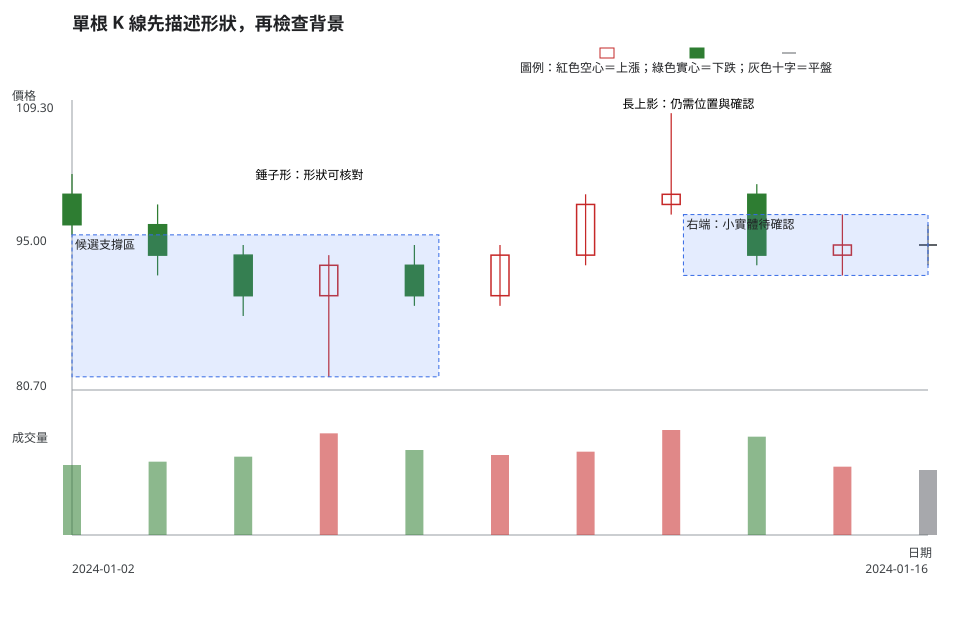
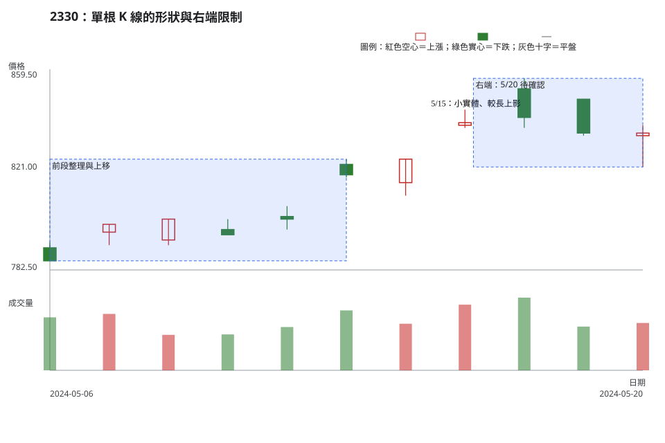

# 第 9 章：單根 K 線：強弱、拒絕與猶豫

## 學習目標

讀完本章，你能先用 OHLC 描述一根 K 線的實體、影線與收盤位置，再以相同時間週期的市場狀態、關鍵區域、量價關係與確認條件決定它是否值得追蹤。你也能把「錘子形」或「射擊之星形」保留為查找標籤，不把形狀直接寫成方向預言。

## 先說結論

單根 K 線只能濃縮一個時間週期內的價格路徑。長實體、十字線、長下影線或近似光頭光腳，都先是可核對的 OHLC 關係；它們的解釋會隨前段方向、所在關鍵區域、量價關係、流動性與後續收盤而改變。

在台灣常見的顯示中，收盤高於開盤的 K 線為紅色空心，收盤低於開盤的 K 線為綠色實心。這是呈現慣例。OHLC、空心／實心與圖例才是可跨軟體核對的資訊。

## 精確定義與證據等級

### 先固定比較窗與容忍值

本章的「長實體」與「小實體」一律先比較同一標的、同一時間週期、同一價格模式的**前 20 根已完成 K 線**。資料不足 20 根時，要明示實際根數，不能自行套用固定百分比。

- 實體長度為 \(|C-O|\)。在該比較窗中，位於非零實體長度上四分位的，稱為「相對長實體」；位於下四分位的，稱為「相對小實體」。這是本書的比較慣例，沒有跨市場的固定門檻。
- 開盤與收盤差距不超過當時適用的一個價格升降單位，或不超過來源明示的四捨五入單位時，記為「開收近似相等」。升降單位請依 [附錄 C](appendix-c-taiwan-market-rules.md) 的市場與價格區間核對。
- 當 \(H>L\) 時，收盤位置可記為 \((C-L)/(H-L)\)。它只描述收盤落在當日範圍的何處，不證明買方、賣方或任何參與者的意圖。

### 形狀先於名稱

下表採本書用於練習的觀察慣例。市場或書籍可能有不同門檻；遇到差異時，先列出採用的 OHLC 關係，再談名稱。

| 查找標籤 | 可重現的 OHLC／形狀定義 | 在解釋前仍需補足的背景 |
| --- | --- | --- |
| 十字線 | 開收近似相等；上下影線可長可短。 | 前段方向、關鍵區域、量價關係與後續收盤。 |
| 錘子形 | 實體靠近當日範圍上三分之一；下影線至少為 \(2\times\max(|C-O|, 一個升降單位)\)；上影線不大於該基準。 | 前段是否下行、是否靠近支撐區、是否有可接受的觸發與失效條件。 |
| 射擊之星形 | 實體靠近當日範圍下三分之一；上影線至少為 \(2\times\max(|C-O|, 一個升降單位)\)；下影線不大於該基準。 | 前段是否上行、是否靠近壓力區、是否有確認或回落證據。 |
| 近似光頭光腳 | 上下影線都不超過一個升降單位或資料的四捨五入單位。 | 相對實體大小、位置、量能、跳空與資料品質。 |
| 收盤位置、拒絕、猶豫 | 收盤位置是公式；較長影線可描述盤中曾離開後又回到較近的位置；小實體或十字線可描述當日開收接近。 | 「拒絕」與「猶豫」是常用判讀語言，不是成交者心理或下一根 K 線的證明。 |

**證據等級。**OHLC、價格升降單位、時間週期與成交量是市場資料事實。上述形狀定義和比較窗是教材／常用判讀法。是否形成交易情境、觸發條件、失效條件或不交易條件，屬個別風險決策。

## 人工圖例

人工圖例在同一段資料放入形狀有效、背景不足與右端待確認的例子。它不代表真實交易，也不把後續價格方向當成答案。

<!-- figure-spec
{
  "id": "ch09-single-candle-context",
  "kind": "synthetic",
  "title": "單根 K 線先描述形狀，再檢查背景",
  "alt_text": "人工日 K 線圖。左側下行後出現實體靠近上方且有長下影線的錘子形，中段出現長實體與不符合錘子形條件的 K 線，右端以小實體保留為待確認；紅色空心、綠色實心與圖例之外，同時用標籤說明 OHLC 關係。",
  "output": "assets/figures/ch09-concept.svg",
  "bars": [
    {"date": "2024-01-02", "open": 100, "high": 102, "low": 96, "close": 97, "volume": 420000},
    {"date": "2024-01-03", "open": 97, "high": 99, "low": 92, "close": 94, "volume": 440000},
    {"date": "2024-01-04", "open": 94, "high": 95, "low": 88, "close": 90, "volume": 470000},
    {"date": "2024-01-05", "open": 90, "high": 94, "low": 82, "close": 93, "volume": 610000},
    {"date": "2024-01-08", "open": 93, "high": 95, "low": 89, "close": 90, "volume": 510000},
    {"date": "2024-01-09", "open": 90, "high": 95, "low": 89, "close": 94, "volume": 480000},
    {"date": "2024-01-10", "open": 94, "high": 100, "low": 93, "close": 99, "volume": 500000},
    {"date": "2024-01-11", "open": 99, "high": 108, "low": 98, "close": 100, "volume": 630000},
    {"date": "2024-01-12", "open": 100, "high": 101, "low": 93, "close": 94, "volume": 590000},
    {"date": "2024-01-15", "open": 94, "high": 98, "low": 92, "close": 95, "volume": 410000},
    {"date": "2024-01-16", "open": 95, "high": 97, "low": 93, "close": 95, "volume": 390000}
  ],
  "annotations": [
    {"type": "zone", "start": "2024-01-02", "end": "2024-01-08", "low": 82, "high": 96, "label": "候選支撐區"},
    {"type": "label", "date": "2024-01-05", "price": 101, "label": "錘子形：形狀可核對"},
    {"type": "label", "date": "2024-01-11", "price": 108, "label": "長上影：仍需位置與確認"},
    {"type": "zone", "start": "2024-01-12", "end": "2024-01-16", "low": 92, "high": 98, "label": "右端：小實體待確認"}
  ]
}
-->

1/5 的形狀符合本書錘子形慣例，僅表示它有可核對的下影線與實體位置。1/11 的長上影線和 1/16 的小實體分別提醒讀者：未列出關鍵區域、比較窗、觸發與失效時，最完整的行動答案可以是等待。

## 歷史案例

本例使用 [TWSE 2330 2024 年 5 月日成交資訊](https://www.twse.com.tw/rwd/zh/afterTrading/STOCK_DAY?response=json&date=20240501&stockNo=2330) 的官方原始日資料，範圍為 2024-05-06 至**決策日** 2024-05-20。圖表右端就是決策日，沒有繪入 5/20 後的 K 線、標籤或結果。

公司行動以 TWSE [除權息計算結果資料](https://www.twse.com.tw/rwd/zh/exRight/TWT49U?response=json&startDate=20240501&endDate=20240531) 查核；該期間查詢結果沒有 2330 記錄，所以 metadata 的 `corporate_actions` 為空陣列。MOPS 的 [除權息公告入口](https://mops.twse.com.tw/mops/web/t05st01)是公司公告的交叉查核入口。沒有已查得的除權息資料，只能排除已知機械調整，不能替影線或實體指定原因。

<!-- figure-spec
{
  "id": "ch09-single-candle-2330",
  "kind": "historical",
  "title": "2330：單根 K 線的形狀與右端限制",
  "alt_text": "台積電 2330 於 2024 年 5 月 6 日至決策日 5 月 20 日的官方原始日 K 線與成交量。圖中標示 5 月 15 日的小實體與長上影線，以及右端 5 月 20 日的錘子形候選；圖表停在決策日，沒有後續走勢。",
  "output": "assets/figures/ch09-cases.svg",
  "market": "TWSE",
  "symbol": "2330",
  "start": "2024-05-06",
  "end": "2024-05-20",
  "timeframe": "1d",
  "price_mode": "raw",
  "source_url": "https://www.twse.com.tw/rwd/zh/afterTrading/STOCK_DAY?response=json&date=20240501&stockNo=2330",
  "checked_on": "2026-08-10",
  "corporate_actions": [],
  "annotations": [
    {"type": "zone", "start": "2024-05-06", "end": "2024-05-13", "low": 772, "high": 825, "label": "前段整理與上移"},
    {"type": "label", "date": "2024-05-15", "price": 844, "label": "5/15：小實體、較長上影"},
    {"type": "zone", "start": "2024-05-16", "end": "2024-05-20", "low": 822, "high": 856, "label": "右端：5/20 待確認"}
  ]
}
-->

### 有效、失敗與模稜兩可

- **可用的形狀觀察**：5/15 的開收差距相對小，最高價高於實體；5/20 的實體靠近當日範圍上方且有較長下影線。這些句子可以由圖中 OHLC 重做。
- **不成立的跳躍**：把 5/17 的長實體或 5/20 的錘子形直接改寫成「隔日必然轉向」，缺少觸發、失效與可交易性資料，不是可驗證的結論。
- **右端模稜兩可**：練習只到 5/20。讀者可提出守住區域或跌回區域兩種情境，不能以未顯示的右側價格替其中一種加分。

把相同處理方式套用到本章所有查找標籤時，可用下面這張表。這裡的「有效」只表示形狀可納入情境，不表示後續方向已被證明。

| 查找標籤 | 有效／可用前提 | 失敗或削弱的觀察 | 模稜兩可時怎麼做 |
| --- | --- | --- | --- |
| 相對長實體／相對小實體 | 同標的、同時間週期與同價格模式有足夠的前 20 根完成 K 線，而且實體確實落在指定四分位。 | 改變比較窗、混入還原價格，或把實體大小直接當成方向訊號。 | 未滿 20 根或四分位邊界相同時，只記錄實體數值，不貼長、小標籤。 |
| 十字線 | 開收差在本書容忍值內，並已寫出所在區域、前段結構與後續確認條件。 | 資料精度不明，或後續沒有出現預先寫好的離開／守住條件。 | 只記「開收近似相等」與等待條件，不先判反轉。 |
| 錘子形 | 幾何比例成立，且出現在下行背景或支撐區候選；另有觸發與失效條件。 | 前段並非下行、影線比例不符，或收盤後很快跌破事前失效區。 | 若只有形狀而位置或流動性未知，保留為錘子「形」，不升級為多頭訊號。 |
| 射擊之星形 | 幾何比例成立，且出現在上行背景或壓力區候選；另有觸發與失效條件。 | 前段並非上行、影線比例不符，或價格未觸發轉弱條件。 | 若位置、量價或右側確認不足，只描述長上影與收盤位置。 |
| 近似光頭光腳 | 上下影線都在容忍值內，且實體大小、位置、跳空與量價已有同口徑比較。 | 升降單位／四捨五入未核對，或短實體被誤當成強力推進。 | 保留 OHLC 與影線數值；沒有背景時不使用「強勢」或「弱勢」結論。 |
| 收盤位置／拒絕／猶豫 | 收盤位置與影線、實體都能由 OHLC 計算，描述詞只用於可見形狀。 | 把「拒絕」或「猶豫」寫成特定參與者意圖，或當成下一根方向原因。 | 改寫成「價格曾到達哪裡、最後收在哪裡」，等待可觀察的觸發。 |

這是單一標的、單一期間的教材案例，只示範資料查核與判讀流程；它不支持型態在其他標的、其他市場或未來期間的有效性主張。

## 八步判讀

1. **資料有效性**：核對 TWSE、2330、日 K、原始價格、日期排序與公司行動查核結果；若改用還原價格，實體比較、區域與容忍值都要以同一價格模式重算。
2. **時間週期**：本例是日 K；較長時間週期的市場狀態要以完整週 K 或其他預先指定週期另行檢查。
3. **市場狀態**：描述前段整理、上移或回落，不把一根 K 線當成完整趨勢結論。
4. **位置**：把 5/15、5/20 放回前段整理帶、可能的支撐區或壓力區，而非只看影線比例。
5. **K 線／結構**：用前 20 根完成 K 線的比較窗、開收容忍值、實體與影線關係判定形狀。
6. **量價關係／流動性**：比較同一標的、同一週期的量能；沒有買賣價差、深度與預計下單量時，流動性保持證據不足。
7. **情境／觸發條件／失效條件**：例如等收盤守住區域才追蹤反彈情境；收盤跌回預先定義的區域下方時，該情境失效。
8. **風險／不交易條件**：停損距離、部位大小、滑價或資料品質無法事先界定時，記為不交易條件。

## 練習

只使用圖中截至 2024-05-20 的資料，依三層作答：

1. **觀察**：用 OHLC 關係描述 5/20 的實體、上影線、下影線與收盤位置；列出比較窗還缺少哪一項資料。
2. **條件式解釋**：各寫一個「支撐區附近獲得確認」和「只是短暫停頓」的條件，兩者都要包含觸發條件與失效條件。
3. **行動／風險**：若看不到買賣價差、深度與你的預計部位，寫出一個不交易條件。

## 答案與評分

展開示範答案與評分

**示範答案。**觀察：5/20 的收盤略高於開盤，最低價明顯低於實體，最高價只略高於實體；它可列為錘子形候選。要稱為相對小或相對長實體，仍須取得同一口徑的前 20 根完成 K 線與適用升降單位。條件式解釋：若後續收盤仍留在先定義的關鍵區域上方，且量價關係沒有惡化，才追蹤反彈情境；若收盤跌回區域下方，該情境失效。另一情境是價格只短暫停頓，需以後續無法守住區域確認。行動／風險：沒有價差、深度、失效距離與部位大小時，不因形狀單獨下單。

**10 分評分。**OHLC 與比較窗觀察可重現 4 分；兩種情境各有觸發條件與失效條件 3 分；不交易或風險界線具體 3 分。決策日後的價格方向不列入評分。

## 重點、限制與來源

### 重點

單根 K 線先以 OHLC、比較窗與價格升降單位描述。錘子形、射擊之星形、近似光頭光腳、拒絕與猶豫都需要市場狀態、位置、量價關係、觸發條件與失效條件，才可能進入交易計畫。

### 限制

形狀門檻會隨比較窗、價格升降單位、資料四捨五入與平台顯示而變動。2330 的單一期間案例不能推論跨標的、跨市場或未來有效性；日成交量也無法證明委託簿深度或實際成交品質。

### 來源

- **市場資料與公司行動查核**：[TWSE 每日收盤行情](https://www.twse.com.tw/rwd/zh/afterTrading/STOCK_DAY)、[TWSE 除權息計算結果](https://www.twse.com.tw/rwd/zh/exRight/TWT49U)與 [MOPS 除權息公告入口](https://mops.twse.com.tw/mops/web/t05st01)，查核日期為 2026-08-10。
- **研究限制的參考**：[Lo、Mamaysky、Wang〈Foundations of Technical Analysis〉](https://doi.org/10.1111/0022-1082.00265)以美國股票與其研究設計檢驗特定技術型態；本章未把該樣本結果移植成台股或單根 K 線的績效數字。
- **教材／常用判讀法**：本章的形狀門檻、比較窗、八步判讀與評分規準用於可重現的學習，不是交易所規則或報酬承諾。
