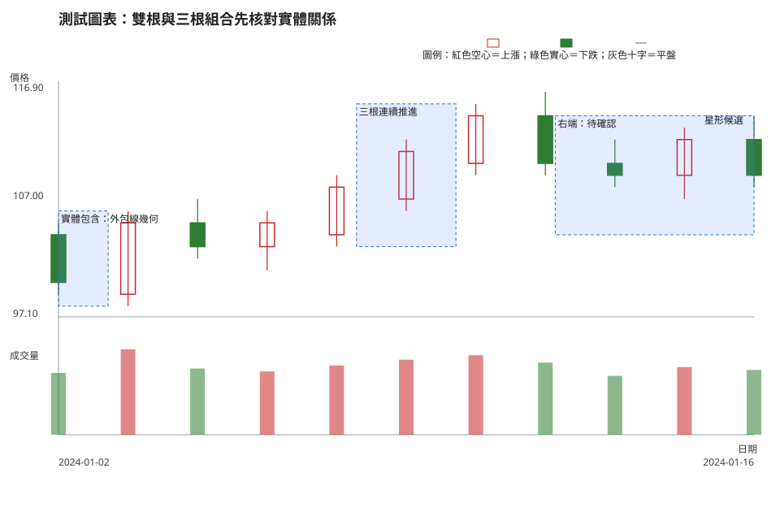
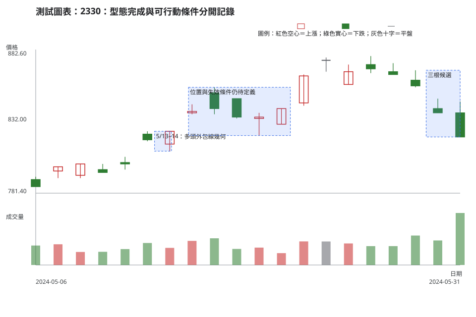

# 第 10 章：雙根與三根 K 線組合

## 學習目標

讀完本章，你能把外包線、母子線、穿透形、烏雲形、晨星形、暮星形與連續三根推進／下跌拆成相鄰 K 線的 OHLC 關係。你也能分開記錄「型態完成」與可行動的觸發條件、失效條件、可用價格空間、流動性與部位風險。

## 先說結論

雙根與三根組合增加了相鄰 K 線的資訊，仍不足以自行產生買賣指令。先固定採用的實體、缺口和比較窗定義，再放回趨勢、關鍵區域、量價關係與市場狀態。平台即使把紅綠色互換，OHLC 與實體包含關係不會改變；本書沿用台灣常見的紅色空心上漲、綠色實心下跌呈現。

## 精確定義與證據等級

### 本書採用的 OHLC 慣例

下列定義以兩個前提為準：每根 K 線都在同一時間週期、同一原始價格序列中，且「實體」不含影線。令前一根為 \(t-1\)，當前根為 \(t\)，實體區間為 \([\min(O,C),\max(O,C)]\)。嚴格不等式可依價格升降單位放寬一個單位，放寬時必須在紀錄中寫出。

| 查找標籤 | 本書的可觀察定義 | 常見差異與本書處理 |
| --- | --- | --- |
| 多頭外包線／空頭外包線 | 前根為相反方向的非零實體；當前實體完整包含前根實體。多頭例為 \(C_{t-1}<O_{t-1}\)、\(C_t>O_t\)、\(O_t\le C_{t-1}\)、\(C_t\ge O_{t-1}\)；空頭例反向。 | 有些資料源要求嚴格穿越，有些允許一個升降單位。本書先記錄容忍值，不用影線替代實體包含。 |
| 多頭母子線／空頭母子線 | 前根為相對長實體；當前相反方向或小實體完整落在前根實體內。 | 有些定義只看實體，有些要求高低點也包含。本書使用實體，並另外記錄影線。 |
| 穿透形 | 前根為下跌實體；當前開盤低於前根最低價或低於前根收盤，收盤高於前根實體中點且仍低於前根開盤。 | 開盤必須低於「最低價」或只低於「前收」是常見差異。本書接受任一缺口條件，須明寫採用哪一個。 |
| 烏雲形 | 前根為上漲實體；當前開盤高於前根最高價或高於前根收盤，收盤低於前根實體中點且仍高於前根開盤。 | 與穿透形同樣，嚴格缺口在不同市場較少出現；本書不因缺少缺口而把其他兩根組合硬命名。 |
| 晨星形／暮星形 | 三根中，第一根為相對長實體，第二根為小實體或十字，第三根為反向實體且收盤穿越第一根實體中點。晨星以第一根下跌、第三根上漲；暮星反向。 | 有些版本要求第二根與第一根、第三根有實體缺口。本書把「實體分離」列為加強證據，沒有分離時保留為三根反轉候選。 |
| 連續三根推進／連續三根下跌 | 三根皆為同方向非零實體，收盤依序墊高或降低；第二、三根開盤落在前一根實體範圍內或相距不超過一個升降單位。 | 本書不用顏色名稱取代 OHLC，也不把三根同向直接視為過度延伸或必然延續。 |

「型態完成」只表示上表的幾何條件已在收盤後可核對。可行動的觸發條件還要另寫，例如收盤留在關鍵區域外、回測沒有失守、量價關係符合預先比較窗，且觸發到失效條件的距離與部位風險可承受。

**證據等級。**OHLC、日期與成交量是市場資料事實；上表是教材／常用判讀法的定義；確認、失效、可用價格空間與不交易條件是條件式解釋及風險決策。

## 人工圖例

人工圖例以同一條日線示範一組外包線、三根組合與不符合嚴格星形條件的區段。圖形用來練習關係，沒有提供市場原因或報酬承諾。

<!-- figure-spec
{
  "id": "ch10-multi-candle-relationships",
  "kind": "synthetic",
  "title": "雙根與三根組合先核對實體關係",
  "alt_text": "人工日 K 線圖。前段先有下跌實體，接著出現實體完整包含它的上漲外包線；中段出現三根連續推進；右端三根實體缺少本書要求的完整星形分離，因此保留為候選。紅色空心與綠色實心以圖例和 OHLC 關係輔助判讀。",
  "output": "assets/figures/ch10-concept.svg",
  "bars": [
    {"date": "2024-01-02", "open": 104, "high": 105, "low": 99, "close": 100, "volume": 420000},
    {"date": "2024-01-03", "open": 99, "high": 106, "low": 98, "close": 105, "volume": 580000},
    {"date": "2024-01-04", "open": 105, "high": 107, "low": 102, "close": 103, "volume": 450000},
    {"date": "2024-01-05", "open": 103, "high": 106, "low": 101, "close": 105, "volume": 430000},
    {"date": "2024-01-08", "open": 104, "high": 109, "low": 103, "close": 108, "volume": 470000},
    {"date": "2024-01-09", "open": 107, "high": 112, "low": 106, "close": 111, "volume": 510000},
    {"date": "2024-01-10", "open": 110, "high": 115, "low": 109, "close": 114, "volume": 540000},
    {"date": "2024-01-11", "open": 114, "high": 116, "low": 109, "close": 110, "volume": 490000},
    {"date": "2024-01-12", "open": 110, "high": 112, "low": 108, "close": 109, "volume": 400000},
    {"date": "2024-01-15", "open": 109, "high": 113, "low": 107, "close": 112, "volume": 460000},
    {"date": "2024-01-16", "open": 112, "high": 114, "low": 108, "close": 109, "volume": 440000}
  ],
  "annotations": [
    {"type": "zone", "start": "2024-01-02", "end": "2024-01-03", "low": 98, "high": 106, "label": "實體包含：外包線幾何"},
    {"type": "zone", "start": "2024-01-08", "end": "2024-01-10", "low": 103, "high": 115, "label": "三根連續推進"},
    {"type": "label", "date": "2024-01-15", "price": 113, "label": "星形候選"},
    {"type": "zone", "start": "2024-01-12", "end": "2024-01-16", "low": 104, "high": 114, "label": "右端：待確認"}
  ]
}
-->

外包線的關鍵是兩個實體的包含，不是顏色。星形與三根組合的重點是每根的角色、實體中點和分離規則。任一名稱成立後，仍要另行判讀位置、量價關係、流動性與風險。

## 歷史案例

本例使用 [TWSE 2330 2024 年 5 月日成交資訊](https://www.twse.com.tw/rwd/zh/afterTrading/STOCK_DAY?response=json&date=20240501&stockNo=2330) 的官方原始日資料，範圍為 2024-05-06 至**決策日** 2024-05-31。圖表的最右端固定在 5/31，沒有洩漏 6 月 K 線或任何後續結果。

TWSE [除權息計算結果資料](https://www.twse.com.tw/rwd/zh/exRight/TWT49U?response=json&startDate=20240501&endDate=20240531) 在此期間沒有 2330 記錄；`corporate_actions` 因而記為空陣列。讀者遇到跳空或機械性落差時，仍應以 [MOPS 除權息公告入口](https://mops.twse.com.tw/mops/web/t05st01) 和當期交易所資料再次核對。

<!-- figure-spec
{
  "id": "ch10-multi-candle-2330",
  "kind": "historical",
  "title": "2330：型態完成與可行動條件分開記錄",
  "alt_text": "台積電 2330 於 2024 年 5 月 6 日至決策日 5 月 31 日的官方原始日 K 線與成交量。圖中標示 5 月 13 日與 14 日的多頭外包線幾何、5 月底連續下跌的三根候選，以及決策日右端；沒有顯示 6 月後資料。",
  "output": "assets/figures/ch10-cases.svg",
  "market": "TWSE",
  "symbol": "2330",
  "start": "2024-05-06",
  "end": "2024-05-31",
  "timeframe": "1d",
  "price_mode": "raw",
  "source_url": "https://www.twse.com.tw/rwd/zh/afterTrading/STOCK_DAY?response=json&date=20240501&stockNo=2330",
  "checked_on": "2026-08-10",
  "corporate_actions": [],
  "annotations": [
    {"type": "zone", "start": "2024-05-13", "end": "2024-05-14", "low": 811, "high": 825, "label": "5/13–14：多頭外包線幾何"},
    {"type": "zone", "start": "2024-05-15", "end": "2024-05-21", "low": 822, "high": 856, "label": "位置與失效條件仍待定義"},
    {"type": "zone", "start": "2024-05-29", "end": "2024-05-31", "low": 821, "high": 868, "label": "三根候選"}
  ]
}
-->

### 有效、失敗與模稜兩可

- **可用的幾何觀察**：5/13 為下跌實體，5/14 為上漲實體，且 5/14 的實體完整包含前一根。這符合本書多頭外包線的完成定義。
- **不應硬套的名稱**：若三根資料沒有滿足星形的實體中點、第一根相對長實體與採用的分離規則，就記為三根組合，不把它改稱晨星形或暮星形。
- **右端模稜兩可**：5/29 至 5/31 可以描述為連續下跌三根候選；它距離關鍵區域、流動性、下一個觸發條件與失效條件仍須在決策日當下另行定義。

把相同處理方式套用到本章所有查找標籤時，可用下面這張表。型態幾何成立，只是完成辨識；是否能用於決策仍取決於背景、觸發、失效與風險。

| 查找標籤 | 有效／可用前提 | 失敗或削弱的觀察 | 模稜兩可時怎麼做 |
| --- | --- | --- | --- |
| 多頭外包線／空頭外包線 | 兩根實體方向相反，後根實體完整包含前根，且位置、關鍵區域與確認條件已寫明。 | 只看顏色或影線、實體沒有完整包含，或觸發後又碰到事前失效條件。 | 容忍值或背景不足時，只列四個開收比較關係，不先寫多頭／空頭結論。 |
| 多頭母子線／空頭母子線 | 前根是依固定比較窗得到的相對長實體，後根實體完整位於前根實體內。 | 前根不相對長、後根實體越界，或把影線位於前根內當成必要定義。 | 若後根貼近邊界或資料精度不足，記為內含候選並等待下一個觸發。 |
| 穿透形 | 前根下跌，後根符合已宣告的開盤缺口慣例，且收過前根實體中點但未越過前根開盤。 | 中點未穿越、缺口慣例事後改寫，或公司行動／價格模式未排除。 | 台股缺口條件因漲跌停或撮合情境不清楚時，拆開記錄開盤與中點關係。 |
| 烏雲形 | 前根上漲，後根符合已宣告的開盤缺口慣例，且收破前根實體中點但仍高於前根開盤。 | 中點未跌破、缺口條件未先寫，或後續沒有符合轉弱觸發。 | 只符合部分條件時稱兩根反向組合，不硬套烏雲形。 |
| 晨星形 | 第一根為相對長下跌實體、第二根為小實體／十字、第三根上漲並收過第一根實體中點；分離慣例已寫明。 | 第一根不相對長、第三根未過中點，或重疊情形與採用慣例衝突。 | 第二根是否充分分離有爭議時，保留三根轉折候選並列出等待條件。 |
| 暮星形 | 第一根為相對長上漲實體、第二根為小實體／十字、第三根下跌並收破第一根實體中點；分離慣例已寫明。 | 第一根不相對長、第三根未破中點，或位置不是上行／壓力背景。 | 邊界剛好落在容忍值附近時，不命名；直接記三根 OHLC 關係。 |
| 連續三根推進 | 三根同向非零實體、收盤依序墊高，後兩根開盤符合本書的實體內／一個升降單位慣例。 | 任一收盤未墊高、開盤關係不符，或完成後觸發離失效區太遠。 | 右端剛完成且量價、可用空間未知時，記為推進候選，不追價。 |
| 連續三根下跌 | 三根同向非零實體、收盤依序降低，後兩根開盤符合本書的實體內／一個升降單位慣例。 | 任一收盤未降低、開盤關係不符，或資料尚有未完成 K 線。 | 只有三根同色但幾何未全數成立時，描述連跌，不把後續續跌當成定論。 |

2330 的單一期間案例只示範型態定義與八步判讀，沒有比較多個標的或市場，也不支持跨標的、跨市場或未來有效性的結論。

## 八步判讀

1. **資料有效性**：核對 TWSE、2330、原始日 K、日期與公司行動資料；若改用還原價格，不要把不同價格模式的實體放在同一組合中比較。
2. **時間週期**：本圖是日 K；週 K 的組合要用週 K OHLC 重新定義，不能直接把五根日 K 當成一根週 K。
3. **市場狀態**：先描述趨勢、區間或轉換候選，確認外包線或星形處在什麼背景。
4. **位置**：標出支撐區、壓力區、整理邊界或跳空後區域，再判讀組合有沒有可用價格空間。
5. **K 線／結構**：逐一核對實體方向、包含、中點、分離與連續收盤；保留不符合條件的證據。
6. **量價關係／流動性**：在事先宣告的同標的、同週期回看窗中比較量能；日成交量無法取代價差、深度與衝擊資料。
7. **情境／觸發條件／失效條件**：型態完成後，另寫收盤、回測或量價條件；收盤回到預先定義區域、價格空間不足或資料惡化都可使情境失效。
8. **風險／不交易條件**：若觸發點離失效條件太遠、部位大小無法符合風險限制，或流動性證據不足，維持不交易。

## 練習

只使用圖中截至 2024-05-31 的資料，完成三層判讀：

1. **觀察**：以 5/13、5/14 的 OHLC 寫出多頭外包線成立的四個比較關係；說明影線是否參與本書定義。
2. **條件式解釋**：各寫一個「外包線後重新守住關鍵區域」與「外包線只屬短期波動」情境，並各列觸發條件與失效條件。
3. **行動／風險**：用 5/31 可見資料說明一個因價格空間、流動性或失效距離而不交易的條件。

## 答案與評分

展開示範答案與評分

**示範答案。**觀察：5/13 的收盤低於開盤，5/14 的收盤高於開盤；5/14 開盤不高於 5/13 收盤，5/14 收盤不低於 5/13 開盤，因此兩個實體符合本書多頭外包線。影線不參與這個包含判定。條件式解釋：若後續收盤保留在預先畫出的關鍵區域外，且回測沒有收回，可追蹤守住情境；若收盤回到該區或可用空間不足，該情境失效。另一情境保留為短期波動，等新的收盤結構再判讀。行動／風險：若無法取得流動性資料，或觸發到失效的距離超過可承受風險，就不交易。

**10 分評分。**四項 OHLC／實體關係正確 4 分；兩種情境都含觸發條件與失效條件 3 分；價格空間、流動性或部位風險的界線具體 3 分。決策日後走勢不影響分數。

## 重點、限制與來源

### 重點

外包線、母子線、穿透形、烏雲形、晨星形、暮星形與連續三根組合都先是相鄰 OHLC 的關係。型態完成後仍需市場狀態、關鍵區域、量價關係、觸發條件、失效條件與不交易條件。

### 限制

不同市場與研究會採用不同的缺口、實體包含和容忍值規則。本章的日 K 2330 單一期間案例不代表跨標的、跨市場或未來表現；成交量也不能單獨證明下單可執行性。

### 來源

- **市場資料與公司行動查核**：[TWSE 每日收盤行情](https://www.twse.com.tw/rwd/zh/afterTrading/STOCK_DAY)、[TWSE 除權息計算結果](https://www.twse.com.tw/rwd/zh/exRight/TWT49U)與 [MOPS 除權息公告入口](https://mops.twse.com.tw/mops/web/t05st01)，查核日期為 2026-08-10。
- **研究限制的參考**：[Lo、Mamaysky、Wang〈Foundations of Technical Analysis〉](https://doi.org/10.1111/0022-1082.00265)以特定美國樣本和特定辨識方法研究技術型態；它不提供本章各名稱在台股或所有市場的通用績效保證。
- **教材／常用判讀法**：本書選定的實體關係、容忍值與評分規準只服務可重現的學習流程。
