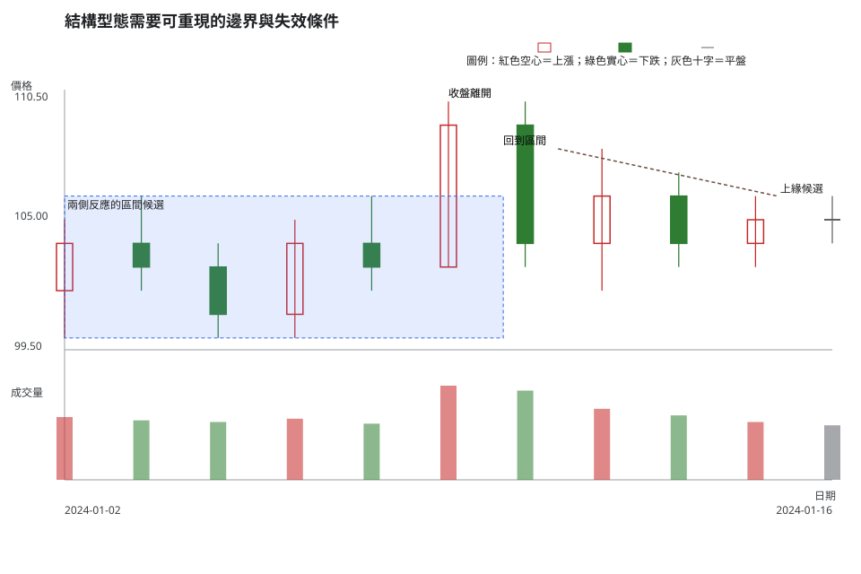
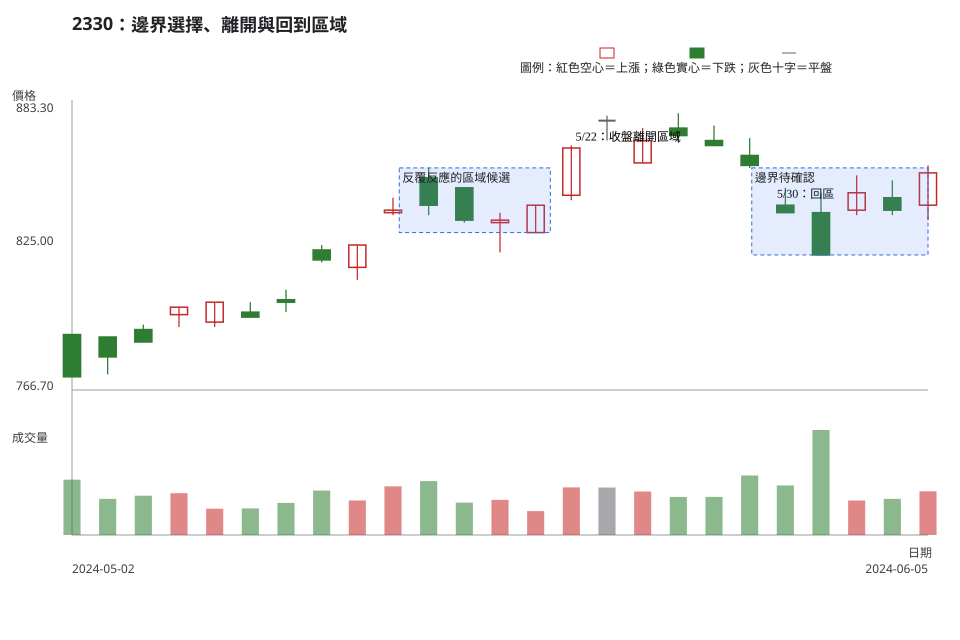

# 第 11 章：整理、反轉與延續型態

## 學習目標

讀完本章，你能以可重現的波峰、波谷與關鍵區域描述區間、三角形、旗形、雙重頂／底與頭肩形。你也能把邊界選擇、確認、假突破、量度幅度、觸發條件、失效條件與不交易條件分開記錄。

## 先說結論

整理、反轉與延續是對價格結構的框架，不是市場承諾。同一段資料可以因為選用不同的波峰、波谷錨點而畫出不同邊界；先公開錨點與區域，再描述型態名稱，才能讓別人重做判讀。

任何量度幅度都是情境規劃用的距離參考。市場沒有義務走到該距離；價格在確認前回到結構內、成交量或流動性資料衝突、失效距離過大時，都可以讓不交易成為完整答案。

## 精確定義與證據等級

### 先確定錨點與邊界

本章使用第 5 章的同週期、固定 `k=1` 波峰／波谷慣例做候選錨點；邊界則以包住多次反應的**區域**呈現。使用其他 `k` 值、週期、原始價格或還原價格時，要重新畫圖，不能把不同口徑的點混成一條線。

| 查找標籤 | 本書的可觀察定義 | 完成或減弱條件 |
| --- | --- | --- |
| 區間 | 上、下兩個反應區各至少有兩次可辨識的高低點、收盤或整理重疊；邊界為範圍。 | 收盤離開區域是候選突破；回到區域、反覆穿越或錨點不足會減弱單一方向解讀。 |
| 三角形整理 | 用相同規則選出的上、下邊界逐步收斂，且兩邊各至少有兩個反應錨點。 | 只有一邊有兩點、另一邊由任意延伸線補出時，保留為邊界候選；收盤離開後仍需確認與失效條件。 |
| 旗形整理 | 先有相對清楚的方向性移動，再出現重疊較多、振幅較小且與前段方向不同或近乎橫向的短整理。 | 本書不設固定根數或固定百分比；若前段與整理幅度沒有按同一比較窗說明，不能強命名為旗形。 |
| 雙重頂／雙重底 | 兩個局部高點／低點落在同一關鍵區域，兩者之間有可辨識的中間波谷／波峰。 | 名稱只描述候選結構；雙重頂須以收盤跌離中間波谷區，雙重底須以收盤升離中間波峰區，才可說已出現結構確認。 |
| 頭肩形 | 三個局部高點或低點中，中間「頭」高於兩側肩部或低於兩側肩部；兩肩是區域，頸線也是依錨點畫出的區域。 | 兩肩高度不必相等；頸線、肩部或頭部需要靠任意點才成立時，名稱應降級為候選。 |
| 假突破 | 在事前寫明邊界與離開口徑後，價格一度離開，卻以收盤回到原區域或無法符合預先寫好的守住條件。 | 沒有事前邊界與回收條件，就只能描述「曾穿越又返回」，不能事後把每個回落都稱為假突破。 |

### 量度幅度是情境距離，不是目標價

若一段區間的上緣與下緣為 \(U\)、\(L\)，其高度可寫成 \(U-L\)。教材可把這個距離列為「若確認離開後，仍需評估的價格空間」；它不等於市場必達目標，也不能取代停損、成本、滑價、量價關係或部位大小。

**證據等級。**OHLC、日期、成交量和公司行動是市場資料事實；上表是教材／常用判讀法；型態是延續或反轉、是否交易與如何承擔風險，都是條件式解釋及風險決策。

## 人工圖例

人工圖例先畫出有兩側反應的區間，再示範收盤離開後回到原區域，以及右端尚未完成的收斂邊界。圖中不提供未來結果。

<!-- figure-spec
{
  "id": "ch11-structure-boundaries",
  "kind": "synthetic",
  "title": "結構型態需要可重現的邊界與失效條件",
  "alt_text": "人工日 K 線圖。左側以多次反應標出 100 到 106 的區間，接著價格短暫收盤離開後返回區間，右側的高低點逐步收斂但停在決策右端，說明假突破與三角形候選都需預先定義邊界。紅色空心、綠色實心與文字共同表示方向。",
  "output": "assets/figures/ch11-concept.svg",
  "bars": [
    {"date": "2024-01-02", "open": 102, "high": 105, "low": 100, "close": 104, "volume": 380000},
    {"date": "2024-01-03", "open": 104, "high": 106, "low": 102, "close": 103, "volume": 360000},
    {"date": "2024-01-04", "open": 103, "high": 104, "low": 100, "close": 101, "volume": 350000},
    {"date": "2024-01-05", "open": 101, "high": 105, "low": 100, "close": 104, "volume": 370000},
    {"date": "2024-01-08", "open": 104, "high": 106, "low": 102, "close": 103, "volume": 340000},
    {"date": "2024-01-09", "open": 103, "high": 110, "low": 103, "close": 109, "volume": 570000},
    {"date": "2024-01-10", "open": 109, "high": 110, "low": 103, "close": 104, "volume": 540000},
    {"date": "2024-01-11", "open": 104, "high": 108, "low": 102, "close": 106, "volume": 430000},
    {"date": "2024-01-12", "open": 106, "high": 107, "low": 103, "close": 104, "volume": 390000},
    {"date": "2024-01-15", "open": 104, "high": 106, "low": 103, "close": 105, "volume": 350000},
    {"date": "2024-01-16", "open": 105, "high": 106, "low": 104, "close": 105, "volume": 330000}
  ],
  "annotations": [
    {"type": "zone", "start": "2024-01-02", "end": "2024-01-10", "low": 100, "high": 106, "label": "兩側反應的區間候選"},
    {"type": "label", "date": "2024-01-09", "price": 110, "label": "收盤離開"},
    {"type": "label", "date": "2024-01-10", "price": 108, "label": "回到區間"},
    {"type": "line", "start": "2024-01-11", "end": "2024-01-15", "start_price": 108, "end_price": 106, "label": "上緣候選"}
  ]
}
-->

同一段收斂資料可以被讀成小型區間、三角形候選或旗形候選。答案取決於前段是否存在方向性移動、兩側錨點是否足夠，以及是否預先寫下離開與回收的判定方式。

## 歷史案例

本例使用 [TWSE 2330 2024 年 5 月與 6 月日成交資訊](https://www.twse.com.tw/rwd/zh/afterTrading/STOCK_DAY?response=json&date=20240501&stockNo=2330) 的官方原始日資料，範圍為 2024-05-02 至**決策日** 2024-06-05。資料視窗停在 6/5；6/6 以後的 K 線、標籤和走勢都不在圖中。

公司行動以 TWSE [除權息計算結果資料](https://www.twse.com.tw/rwd/zh/exRight/TWT49U?response=json&startDate=20240501&endDate=20240612) 查核。該查詢在圖表期間內沒有 2330 記錄，因此 metadata 使用空陣列；MOPS 的 [除權息公告入口](https://mops.twse.com.tw/mops/web/t05st01)保留為公司公告交叉查核來源。這個檢查不為區間或突破指定成交者的原因。

<!-- figure-spec
{
  "id": "ch11-structure-2330",
  "kind": "historical",
  "title": "2330：邊界選擇、離開與回到區域",
  "alt_text": "台積電 2330 於 2024 年 5 月 2 日至決策日 6 月 5 日的官方原始日 K 線與成交量。圖中標示 5 月中旬的反覆反應區、5 月 22 日收盤離開、5 月 30 日回到區域，以及 6 月 5 日右端的邊界選擇不確定性；沒有顯示決策日後走勢。",
  "output": "assets/figures/ch11-cases.svg",
  "market": "TWSE",
  "symbol": "2330",
  "start": "2024-05-02",
  "end": "2024-06-05",
  "timeframe": "1d",
  "price_mode": "raw",
  "source_url": "https://www.twse.com.tw/rwd/zh/afterTrading/STOCK_DAY?response=json&date=20240501&stockNo=2330",
  "checked_on": "2026-08-10",
  "corporate_actions": [],
  "annotations": [
    {"type": "zone", "start": "2024-05-15", "end": "2024-05-21", "low": 830, "high": 856, "label": "反覆反應的區域候選"},
    {"type": "label", "date": "2024-05-22", "price": 865, "label": "5/22：收盤離開區域"},
    {"type": "zone", "start": "2024-05-29", "end": "2024-06-05", "low": 821, "high": 856, "label": "邊界待確認"},
    {"type": "label", "date": "2024-05-30", "price": 842, "label": "5/30：回區"}
  ]
}
-->

### 有效、失敗與模稜兩可

- **可重現的區域觀察**：5/15 至 5/21 的高低點與收盤可支持 830–856 的反應區候選。它是範圍，沒有假裝成精確一條線。
- **事前條件被削弱的證據**：若把 5/22 的收盤離開列為待追蹤情境，5/30 收盤回到原區域就是應重新評估的資料，不需要用右側走勢為它辯護。
- **真正的邊界歧義**：5/31 至 6/5 可以從不同 `k=1` 錨點畫出不同的反彈區或收斂區；資料不足以讓其中一條畫法自動成為旗形、三角形或反轉的唯一答案。

把相同處理方式套用到本章所有查找標籤時，可用下面這張表。結構名稱是否可用，先由事前錨點與區域決定，而不是由右側結果倒推。

| 查找標籤 | 有效／可用前提 | 失敗或削弱的觀察 | 模稜兩可時怎麼做 |
| --- | --- | --- | --- |
| 區間 | 上、下反應區都有至少兩個依固定規則選出的錨點，且區域寬度事前寫明。 | 只有單側反應、價格反覆穿越，或更換週期／`k` 值才看得出邊界。 | 把上下界標為候選區，等待另一個可重現錨點，不畫成精確單線。 |
| 三角形整理 | 兩側各至少兩個同規則錨點，邊界確實收斂，前段結構與確認口徑已記錄。 | 其中一側靠任意延伸、邊界不再收斂，或離開後立即回到區內。 | 可同時保留小型區間與收斂候選，直到收盤條件區分情境。 |
| 旗形整理 | 前段有可量化的方向性移動，後段整理較短、振幅較小且反向或橫向。 | 前段不清楚、整理幅度沒有縮小，或靠改選錨點才像旗形。 | 缺少一致比較窗時只稱短期整理，不預設延續。 |
| 雙重頂 | 兩個局部高點落在同一區域，中間波谷可辨識，並以收盤跌離波谷區作確認。 | 第二高點不在同區、波谷任意，或價格未跌離波谷區。 | 在確認前只稱兩次高點測試，同時保留區間情境。 |
| 雙重底 | 兩個局部低點落在同一區域，中間波峰可辨識，並以收盤升離波峰區作確認。 | 第二低點不在同區、波峰任意，或價格未升離波峰區。 | 在確認前只稱兩次低點測試，不把反彈視為已完成反轉。 |
| 頭肩頂／頭肩底 | 頭、兩肩與頸線都能由固定錨點及區域重畫，且收盤離開頸線區的口徑已先寫好。 | 任一部位需要事後挑點、頸線只有精確單線，或收盤仍在頸線區。 | 外觀近似但錨點不足時，降級為三個波峰／波谷候選。 |
| 假突破 | 邊界、離開方式與守住／回收條件都在離開前定義，之後才觀察到回到原區。 | 事後才移動邊界、只憑盤中穿越，或回收條件從未寫明。 | 若只有穿越又返回的事實，就照實描述，不判定誰被「誘多／誘空」。 |
| 量度幅度 | 區域上下緣明確，確認離開後只把高度當成情境距離，並另列失效、成本與部位風險。 | 把距離當成必達目標，或在結構尚未確認前就用它合理化交易。 | 價格空間接近但流動性／失效距離未知時，不以量度幅度作決策。 |

2330 的單一標的、單一期間只用來示範邊界與決策日限制。它不比較其他標的或市場，不能支持任何型態跨標的、跨市場或未來有效性的主張。

## 八步判讀

1. **資料有效性**：確認 TWSE、2330、原始日 K、日期排序、缺值與公司行動查核。
2. **時間週期**：固定日 K 與 `k=1` 錨點；較長時間週期的邊界必須以其自身資料重畫。
3. **市場狀態**：分開描述方向、波動與流動性，確認此處是整理、趨勢拉回還是轉換候選。
4. **位置**：以反覆反應畫出關鍵區域，寫明每一側邊界由哪些日期與 OHLC 支持。
5. **K 線／結構**：檢查區域是否兩側都有足夠錨點、收盤有沒有離開或回收、型態名稱是否依賴任意延伸。
6. **量價關係／流動性**：依同標的、同週期比較窗檢視離開與回收時的量能；沒有價差和深度資料時，流動性不下定論。
7. **情境／觸發條件／失效條件**：至少列出守住區域與回到區域兩種情境；每種都用可重做的收盤、區域或結構條件寫出觸發和失效。
8. **風險／不交易條件**：邊界太寬、型態錨點任意、量度幅度被誤當目標、流動性未知或失效距離過大時，不交易。

## 練習

只使用圖中到 2024-06-05 的資料，完成下列三層答案：

1. **觀察**：寫出支持 830–856 區域的至少兩項日期／OHLC 證據，以及 5/30 相對區域的位置。
2. **條件式解釋**：各寫一個「重新離開區域後維持」和「仍屬整理中心」的情境，包含觸發條件與失效條件。若使用量度幅度，說明它只是什麼用途。
3. **行動／風險**：指出一個因邊界寬度、流動性或失效距離而不交易的條件。

## 答案與評分

展開示範答案與評分

**示範答案。**觀察：5/15 至 5/21 的多日高低點與收盤可支持 830–856 的反應區；5/30 收盤為 838，位於該區域內。條件式解釋：若後續收盤再次離開區域並在回測時不收回，可追蹤維持情境；收盤回到區域即為失效。另一情境是價格仍以區域為整理中心，需等待兩側邊界更明確。若計算區域高度，僅用來估算可用價格空間，不能作為必達目標。行動／風險：若區域另一側作為失效條件的距離超出計畫風險，或流動性資料不足，選擇不交易。

**10 分評分。**區域有可重現的日期與 OHLC 依據 4 分；兩種情境各含觸發條件與失效條件 3 分；量度幅度限制或不交易理由具體 3 分。決策日後價格不影響分數。

## 重點、限制與來源

### 重點

區間、三角形、旗形、雙重頂／底與頭肩形都依賴明示的錨點與區域。收盤離開、回測、回收與失效必須在事前寫下；量度幅度只輔助情境規劃。

### 限制

不同錨點、時間週期、價格模式與區域寬度會改變型態命名。2330 的單一期間案例不能證明跨標的、跨市場或未來有效性；歷史日成交量也沒有提供完整的價差、深度或成交衝擊。

### 來源

- **市場資料與公司行動查核**：[TWSE 每日收盤行情](https://www.twse.com.tw/rwd/zh/afterTrading/STOCK_DAY)、[TWSE 除權息計算結果](https://www.twse.com.tw/rwd/zh/exRight/TWT49U)與 [MOPS 除權息公告入口](https://mops.twse.com.tw/mops/web/t05st01)，查核日期為 2026-08-10。
- **研究限制的參考**：[Lo、Mamaysky、Wang〈Foundations of Technical Analysis〉](https://doi.org/10.1111/0022-1082.00265)以固定的辨識方法與特定美國樣本研究技術型態；本章未把其結果外推為台股結構型態的保證。
- **教材／常用判讀法**：錨點、區域、確認、量度幅度與八步流程是可檢查的教學框架。
