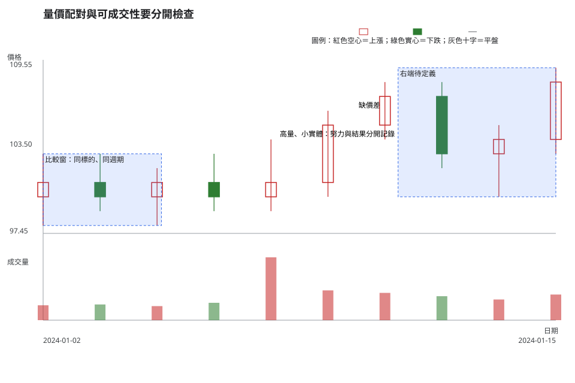
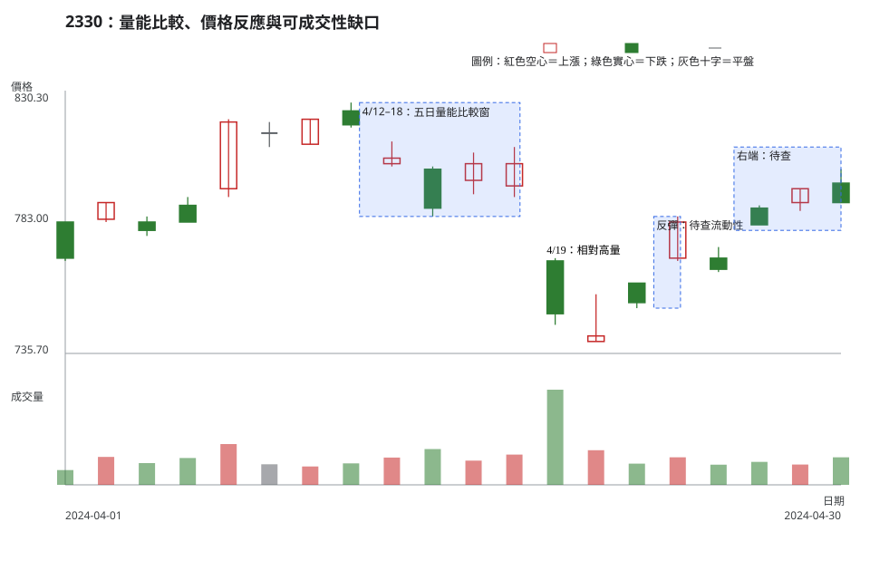

# 第 12 章：量價關係、低流動性與失敗訊號

## 學習目標

讀完本章，你能把成交量擴張或收縮放進明示的同標的、同時間週期比較窗，分開記錄價格結果、努力與結果、量能高潮風險、流動性未知與失敗訊號。你也能把一個看似完整的價格型態因量價或可成交性證據衝突而降級，並寫出不交易條件。

## 先說結論

成交量是已成交的數量，流動性還需要買賣價差、委託簿深度、成交頻率、預計下單量與成交衝擊。單日成交量大，不能證明價格一定延續，也不能證明你能以計畫價格進出。

量價關係最有用的寫法是比較，而不是貼標籤：指定同一標的、同一時間週期、同一原始價格序列與事前選定的回看窗，再描述價格範圍、實體、收盤位置與成交量的組合。資料缺少時，保留「證據不足」比補一段心理故事可靠。

## 精確定義與證據等級

### 量能比較必須有同一口徑

令目標日成交量為 \(V_t\)。任何「量增」或「量縮」的敘述都要先寫出參考窗 \(W\)：它只包含目標日前、同一標的、同一時間週期、已完成且資料模式相同的 K 線。目標日不能同時放進自己的比較窗。

- **量能擴張**：\(V_t\) 高於已宣告的 \(W\) 中位數、平均數或其他已固定統計量。必須寫出窗長和統計量。
- **量能收縮**：\(V_t\) 低於同一統計量。它不自動表示惜售、賣壓消失或低流動性。
- **努力與結果**：把成交量這個「努力」和實體、日內範圍、收盤位置、是否穿越區域這些「結果」並列。它是觀察配對，沒有因果結論。
- **量能高潮風險**：相對高量與相對大範圍同時出現時，可列為需要額外驗證的假設。它不等於最高點、最低點或反轉已被證明。

沒有一個通用成交量門檻可跨公司、跨市場或跨週期使用。拆併股、資料單位、停牌、事件日與不同商品都可能改變比較結果。

### 流動性、失敗訊號與缺少的資料

| 查找標籤 | 可直接觀察的內容 | 不能直接補上的內容 |
| --- | --- | --- |
| 量價關係 | 同口徑成交量、OHLC、關鍵區域、時間週期與回看窗。 | 成交者意圖、下一段方向或可交易性。 |
| 低流動性扭曲 | 寬價差、有限深度、成交稀疏、跳價、估計下單量相對可見深度過大，或這些資料缺失。 | 只靠日成交量就判定「流動性好」或「流動性差」。 |
| 失敗訊號 | 事前寫好的觸發條件沒有出現，或價格在事前寫好的失效條件發生後回到原情境外。 | 事後把每一次不如預期都改稱為假訊號。 |
| 證據不足 | 沒有相同口徑比較窗、缺少公司行動查核、缺乏價差／深度／衝擊資料。 | 用猜測填補缺失欄位。 |

**證據等級。**日 OHLC、日成交量、交易日與公司行動是市場資料事實；量價比較窗與上述命名是教材／常用判讀法；量能高潮、延續、反轉、觸發、失效及不交易則是條件式解釋與風險決策。

## 人工圖例

人工圖例把高成交量配小結果、價格離開區域但可成交性未知，以及右端資料不足放在一起。它展示如何降級情境，不提供方向預測。

<!-- figure-spec
{
  "id": "ch12-volume-liquidity-context",
  "kind": "synthetic",
  "title": "量價配對與可成交性要分開檢查",
  "alt_text": "人工日 K 線與成交量圖。前段有成交量明顯增加但實體較小的日子，中段價格收盤離開區域但沒有價差與深度資料，右端價格反應與成交量都需要同口徑比較。方向同時以紅色空心、綠色實心、圖例與文字呈現。",
  "output": "assets/figures/ch12-concept.svg",
  "bars": [
    {"date": "2024-01-02", "open": 100, "high": 103, "low": 98, "close": 101, "volume": 180000},
    {"date": "2024-01-03", "open": 101, "high": 103, "low": 99, "close": 100, "volume": 190000},
    {"date": "2024-01-04", "open": 100, "high": 102, "low": 98, "close": 101, "volume": 170000},
    {"date": "2024-01-05", "open": 101, "high": 103, "low": 99, "close": 100, "volume": 210000},
    {"date": "2024-01-08", "open": 100, "high": 104, "low": 99, "close": 101, "volume": 760000},
    {"date": "2024-01-09", "open": 101, "high": 106, "low": 100, "close": 105, "volume": 360000},
    {"date": "2024-01-10", "open": 105, "high": 108, "low": 104, "close": 107, "volume": 330000},
    {"date": "2024-01-11", "open": 107, "high": 108, "low": 102, "close": 103, "volume": 290000},
    {"date": "2024-01-12", "open": 103, "high": 105, "low": 100, "close": 104, "volume": 250000},
    {"date": "2024-01-15", "open": 104, "high": 109, "low": 103, "close": 108, "volume": 310000}
  ],
  "annotations": [
    {"type": "zone", "start": "2024-01-02", "end": "2024-01-05", "low": 98, "high": 103, "label": "比較窗：同標的、同週期"},
    {"type": "label", "date": "2024-01-08", "price": 104, "label": "高量、小實體：努力與結果分開記錄"},
    {"type": "label", "date": "2024-01-10", "price": 106, "label": "缺價差"},
    {"type": "zone", "start": "2024-01-11", "end": "2024-01-15", "low": 100, "high": 109, "label": "右端待定義"}
  ]
}
-->

1/8 的量柱高於此前幾根，收盤與開盤的差距卻不大。它可以被記為「相對高量與小實體同時出現」，不能直接被翻譯成吸收、出貨或下一日方向。1/10 即使收盤離開區域，未提供價差和深度時仍不能把日成交量寫成可執行性的保證。

## 歷史案例

本例使用 [TWSE 2330 2024 年 4 月日成交資訊](https://www.twse.com.tw/rwd/zh/afterTrading/STOCK_DAY?response=json&date=20240401&stockNo=2330) 的官方原始日資料，範圍為 2024-04-01 至**決策日** 2024-04-30。4/19 的 143,868,560 股，與其前五個完整交易日 4/12、4/15、4/16、4/17、4/18 的平均 42,045,415.4 股比較。這個五日窗是本例已宣告的同標的、同週期比較口徑，不是通用門檻。

TWSE [除權息計算結果資料](https://www.twse.com.tw/rwd/zh/exRight/TWT49U?response=json&startDate=20240401&endDate=20240430) 在可視期間內沒有 2330 記錄，故 metadata 的 `corporate_actions` 為空陣列。公司公告仍應由 [MOPS 除權息公告入口](https://mops.twse.com.tw/mops/)交叉核對；沒有已查得的公司行動，不表示量能或價格一定由單一原因造成。

<!-- figure-spec
{
  "id": "ch12-volume-liquidity-2330",
  "kind": "historical",
  "title": "2330：量能比較、價格反應與可成交性缺口",
  "alt_text": "台積電 2330 於 2024 年 4 月 1 日至決策日 4 月 30 日的官方原始日 K 線與成交量。圖中標示 4 月 12 日至 18 日的五日比較窗、4 月 19 日相對高量與較大價格範圍、4 月 23 日至 24 日的反彈，以及日資料缺乏買賣價差和深度；沒有決策日後資料。",
  "output": "assets/figures/ch12-cases.svg",
  "market": "TWSE",
  "symbol": "2330",
  "start": "2024-04-01",
  "end": "2024-04-30",
  "timeframe": "1d",
  "price_mode": "raw",
  "source_url": "https://www.twse.com.tw/rwd/zh/afterTrading/STOCK_DAY?response=json&date=20240401&stockNo=2330",
  "checked_on": "2026-08-10",
  "corporate_actions": [],
  "annotations": [
    {"type": "zone", "start": "2024-04-12", "end": "2024-04-18", "low": 785, "high": 826, "label": "4/12–18：五日量能比較窗"},
    {"type": "label", "date": "2024-04-19", "price": 770, "label": "4/19：相對高量"},
    {"type": "zone", "start": "2024-04-23", "end": "2024-04-24", "low": 752, "high": 785, "label": "反彈：待查流動性"},
    {"type": "zone", "start": "2024-04-26", "end": "2024-04-30", "low": 780, "high": 810, "label": "右端：待查"}
  ]
}
-->

### 有效、失敗與模稜兩可

- **可重現的量價觀察**：4/19 的成交量高於前述五日平均，且日內範圍和實體都較大。這是努力與結果的資料配對，沒有替它指定主力、消息或反轉原因。
- **觸發未達成的例子**：若交易計畫事前要求反彈日成交量高於同一比較窗的某個統計量，4/23 的 32,067,682 股並不自動通過該條件。計畫可因條件未達成而不觸發，無須把反彈命名為失敗或成功。
- **看似完整卻需降級的價格形狀**：4/23、4/24 的兩根反彈 K 線可形成「價格正在回彈」的觀察；日資料未提供當時買賣價差、深度、預計下單量或成交衝擊，因此它不能升級為可執行的流動性結論。

把相同處理方式套用到本章所有查找標籤時，可用下面這張表。成交量與價格只能提供條件式證據；缺少可成交性資料時，不能把「看得到成交量」等同「下得了計畫部位」。

| 查找標籤 | 有效／可用前提 | 失敗或削弱的觀察 | 模稜兩可時怎麼做 |
| --- | --- | --- | --- |
| 量能擴張／量能收縮 | 同標的、同時間週期、同單位的事前回看窗與統計量固定，目標日不在自己的比較窗內。 | 改變窗長／統計量、混用資料單位，或把高量／低量單獨解讀成方向。 | 比較窗不足或事件日未排除時，只列成交量數值，不貼量增／量縮標籤。 |
| 努力與結果 | 成交量和實體、範圍、收盤位置、區域穿越使用同一口徑並分開記錄。 | 用高量小實體直接推論吸收／出貨，或用低量推論沒有人參與。 | 可以列出多種相容情境，但不指定參與者心理；等待下一個觸發或失效。 |
| 量能高潮風險 | 相對高量與相對大範圍都依固定比較窗成立，且公司行動／資料異常已查核。 | 只因單日量柱醒目就命名，或把高潮當成最高點、最低點保證。 | 記為需驗證的風險假設；沒有後續條件前，不判延續或反轉。 |
| 低流動性扭曲 | 已取得並核對價差、深度、成交頻率、預計下單量與衝擊等可成交性資料。 | 只有日成交量，卻據此宣稱能以收盤價完成整筆交易。 | 任一關鍵欄位缺失時，把流動性標為未知並降低部位或不交易。 |
| 失敗訊號 | 觸發、守住與失效條件事前寫明，之後觀察到未觸發或碰到失效條件。 | 看完右側結果才改規則、挑掉失敗樣本，或把未觸發說成交易虧損。 | 尚未觸發也未失效時維持等待，不強迫歸類為成功或失敗。 |
| 證據不足 | 明確列出缺少的比較窗、公司行動、價差、深度、衝擊或資料品質欄位。 | 用猜測、新聞敘事或其他標的資料補洞，並給出確定方向。 | 將「資料缺口補齊」寫成下一步；在此之前，不交易是完整答案。 |

這是 2330 單一標的、單一期間的資料處理例。它不支持量價規則在其他標的、其他市場或未來期間的有效性，也不證明成交量造成價格變化。

## 八步判讀

1. **資料有效性**：確認 TWSE、2330、原始日 K、成交量單位、日期排序、缺漏與公司行動查核；若改用還原價格，價格結果與比較窗也要保持同一口徑。
2. **時間週期**：日成交量只和日成交量比較；不要用盤中柱、週量或不同標的的量柱替代本例的參考窗。
3. **市場狀態**：分開描述方向、波動與流動性；相對高量可能出現在趨勢、整理、事件或高波動背景。
4. **位置**：先標記關鍵區域、缺口或反彈區，再比較同一位置的價格結果和量能。
5. **K 線／結構**：記錄實體、日內範圍、收盤位置與是否離開區域；價格形狀不因量柱而自動完成。
6. **量價關係／流動性**：宣告 \(W\) 的日期與統計量，排除目標日；另列價差、深度、成交頻率、滑價和未知欄位。
7. **情境／觸發條件／失效條件**：若計畫要求量能或可成交性門檻，觸發前要實際取得它；收盤回區、量價條件未達或報價資料缺失都可使情境無效。
8. **風險／不交易條件**：預計部位可能造成滑價、無法按失效條件執行、比較窗不可重現或關鍵流動性資訊缺失時，不交易。

## 練習

只使用圖中到 2024-04-30 的資料，依三層回答：

1. **觀察**：寫出 4/19 成交量與五日比較窗的關係，再用 OHLC 描述它的價格結果。
2. **條件式解釋**：各寫一個「量價條件支持繼續追蹤」與「量價或流動性證據不足」情境，兩者都要有觸發條件與失效條件。
3. **行動／風險**：說明 4/23、4/24 的反彈為何仍可能不交易，並列出至少兩項缺少的可成交性資料。

## 答案與評分

展開示範答案與評分

**示範答案。**觀察：4/19 的成交量為 143,868,560 股，高於 4/12–4/18 五日平均 42,045,415.4 股；它的最低價 746、最高價 770，收盤 750 低於開盤 769，具有較大日內範圍與下跌實體。條件式解釋：若後續收盤、量能比較窗與可成交性資料都符合事前條件，才繼續追蹤；若收盤回到失效區、量能條件未達或資料缺失，該情境不觸發。行動／風險：4/23、4/24 的反彈仍沒有買賣價差、委託簿深度、成交衝擊與預計部位相對深度資料，因此不把它當成可直接下單的結論。

**10 分評分。**比較窗、成交量和 OHLC 事實正確 4 分；兩種情境各含觸發條件與失效條件 3 分；能指出可成交性缺口與不交易理由 3 分。後續價格不影響分數。

## 重點、限制與來源

### 重點

量價關係需要同標的、同週期、已宣告的比較窗。努力與結果、量能高潮風險、流動性與失敗訊號要分開寫；一個看似完整的價格形狀可以因量價條件未達或可成交性未知而降級。

### 限制

日成交量沒有完整揭露買賣價差、深度、成交頻率或成交衝擊。2330 單一期間案例不代表跨標的、跨市場或未來有效性；它也不提供成交量與價格的因果證明。

### 來源

- **市場資料與公司行動查核**：[TWSE 每日收盤行情](https://www.twse.com.tw/rwd/zh/afterTrading/STOCK_DAY)、[TWSE 除權息計算結果](https://www.twse.com.tw/rwd/zh/exRight/TWT49U)與 [MOPS 除權息公告入口](https://mops.twse.com.tw/mops/)，查核日期為 2026-08-10。
- **研究限制的參考**：[Lo、Mamaysky、Wang〈Foundations of Technical Analysis〉](https://doi.org/10.1111/0022-1082.00265)的樣本、市場與辨識方法有明確邊界；本章不由該研究導出任何單一量價規則的通用績效數字。
- **教材／常用判讀法**：比較窗、努力與結果、可成交性檢查及八步流程用於條件式決策與風險紀錄。
