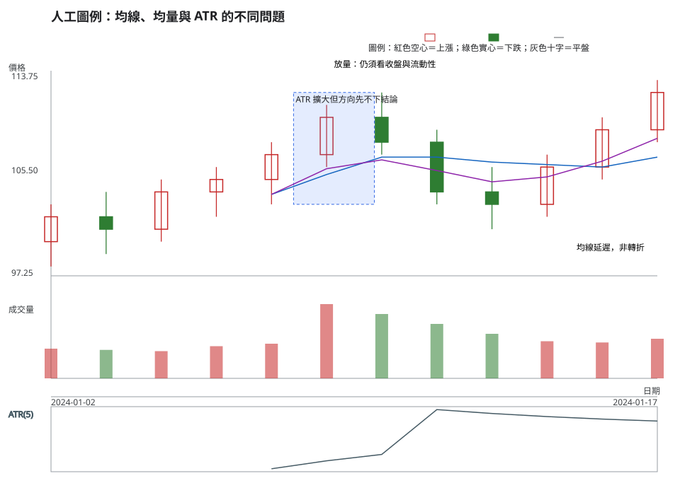
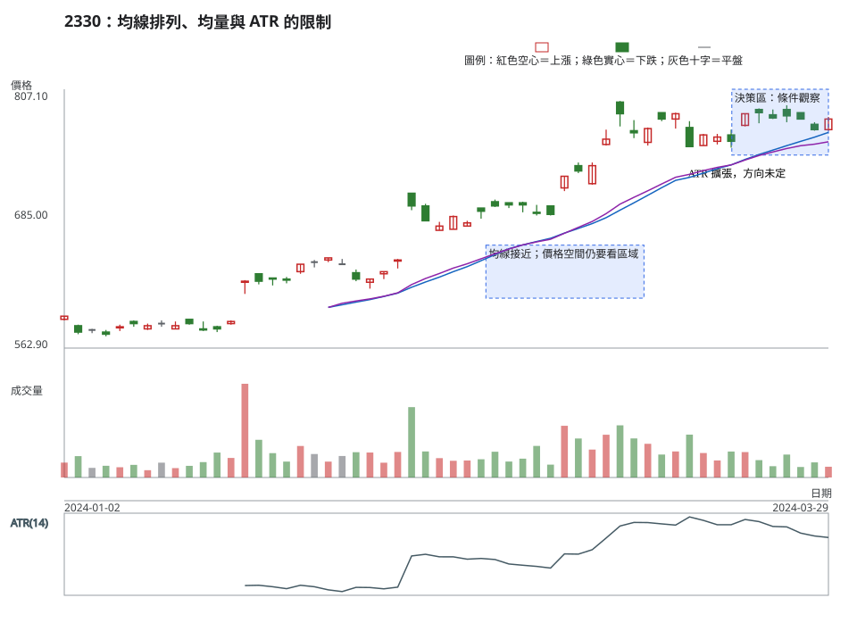

# 第 13 章：移動平均、成交量均量與 ATR

## 學習目標

這一章回答新手常問的問題：「均線上彎、成交量放大，或 ATR 變大，是否就代表可以買進？」答案是不一定。移動平均、成交量均量與平均真實波幅（Average True Range，ATR）都是從既有價格與成交量摘要出的證據；它們不會替你預測下一根 K 線，也不是獨立的市場投票。讀完後，你能說出計算輸入、暖機長度、延遲與不能回答的問題。

## 先說結論

- 移動平均把一段價格壓縮成一條平滑線，適合描述方向與距離，不適合當成即時轉折鐘。
- 簡單移動平均（SMA）與指數移動平均（EMA）若使用同一收盤序列，資訊高度重疊；金叉、均線排列不能算成多份獨立確認。
- 成交量均量必須用同一標的、同一週期、已完成 K 線的固定窗口；沒有跨市場通用的「幾倍就是高量」門檻。
- 真實波幅（TR）是當日高低與前收缺口的最大值；ATR 用 Wilder 平滑描述波動幅度，沒有方向。
- ATR 放大可能發生在上漲、下跌或來回掃動；停損應由情境失效點與可執行價格推導，不能把 ATR 倍數當成單獨理由。

## 精確定義與證據等級

### SMA、EMA 與延遲

對收盤價 (C_t)，期間 (n) 的 SMA 為：

$$
SMA_t=\frac{1}{n}\sum_{i=0}^{n-1}C_{t-i}
$$

本專案在前 (n-1) 根輸出 `None`，第 (n) 根才有第一個值。EMA 的遞迴式為：

$$
EMA_t=EMA_{t-1}+\alpha(C_t-EMA_{t-1}),\quad \alpha=\frac{2}{n+1}
$$

實作以第一個完整 SMA 作為 EMA 種子，之後才遞迴；這不是把第一根價格直接當種子。兩者都會落後，期間越長越平滑。均線斜率、價格在均線上方或下方，是描述性的相對位置，不是買賣保證。

### 成交量均量

以已完成 K 線的成交量 (V_t) 計算：

$$
VolAvg_t=\frac{1}{n}\sum_{i=0}^{n-1}V_{t-i}
$$

若要說「放量」，先寫明比較窗口，例如「今日量與前 5 根已完成 K 線均量比較」。不同代號、交易板、零股與整股不可直接混成一個基準；成交量大也不能單獨證明突破有效，還要核對價差、成交分布與可成交深度。

### TR 與 ATR

第一根可用的真實波幅先用 (H_t-L_t)，其後：

$$
TR_t=max(H_t-L_t,|H_t-C_{t-1}|,|L_t-C_{t-1}|)
$$

ATR 的第一個值是前 (n) 根 TR 的算術平均，後續依 Wilder 平滑：

$$
ATR_t=\frac{(n-1)ATR_{t-1}+TR_t}{n}
$$

因此本專案 ATR 在第 (n) 根才有第一個值。ATR 保留價格單位，不是百分比；比較不同股價時，需另以價格或報酬標準化。跳空會讓 TR 大於當日高低差，這是波動資料，不是方向資料。

### 暖機與資料品質

先確認日期遞增、OHLC 不違反高低界線、成交量非負，並排除未完成的當日 K 線。若研究 ATR 或均線交叉，視窗至少要包含暖機區；只截取第一個訊號附近的幾根 K 線，會把 `None` 或種子效應誤當成訊號。

## 人工圖例

<!-- figure-spec
{
  "id":"ch13-indicator-concept",
  "kind":"synthetic",
  "title":"人工圖例：均線、均量與 ATR 的不同問題",
  "alt_text":"人工日 K 線圖以五期 SMA、五期 EMA 與五期 ATR 標示平滑與波動；下方成交量先放大後回落，說明均線有延遲、ATR 沒有方向，均量也不能單獨證明突破。",
  "output":"assets/figures/ch13-concept.svg",
  "indicators":[{"type":"sma","period":5},{"type":"ema","period":5},{"type":"atr","period":5}],
  "bars":[
    {"date":"2024-01-02","open":100,"high":103,"low":98,"close":102,"volume":1200},
    {"date":"2024-01-03","open":102,"high":104,"low":99,"close":101,"volume":1150},
    {"date":"2024-01-04","open":101,"high":105,"low":100,"close":104,"volume":1100},
    {"date":"2024-01-05","open":104,"high":106,"low":102,"close":105,"volume":1300},
    {"date":"2024-01-08","open":105,"high":108,"low":103,"close":107,"volume":1400},
    {"date":"2024-01-09","open":107,"high":111,"low":106,"close":110,"volume":3000},
    {"date":"2024-01-10","open":110,"high":112,"low":107,"close":108,"volume":2600},
    {"date":"2024-01-11","open":108,"high":109,"low":103,"close":104,"volume":2200},
    {"date":"2024-01-12","open":104,"high":106,"low":101,"close":103,"volume":1800},
    {"date":"2024-01-15","open":103,"high":107,"low":102,"close":106,"volume":1500},
    {"date":"2024-01-16","open":106,"high":110,"low":105,"close":109,"volume":1450},
    {"date":"2024-01-17","open":109,"high":113,"low":108,"close":112,"volume":1600}
  ],
  "annotations":[
    {"type":"zone","start":"2024-01-08","end":"2024-01-10","low":103,"high":112,"label":"ATR 擴大但方向先不下結論"},
    {"type":"label","date":"2024-01-09","price":114,"label":"放量：仍須看收盤與流動性"},
    {"type":"label","date":"2024-01-15","price":99,"label":"均線延遲，非轉折"}
  ]
}
-->

## 歷史案例

案例使用 TWSE 2330 的官方原始日資料，決策日為 2024-03-29；資料窗口從 2024-01-02 開始，保留足夠的均線與 ATR 暖機。OHLCV 分別取自 TWSE [2024 年 1 月](https://www.twse.com.tw/rwd/zh/afterTrading/STOCK_DAY?response=json&date=20240101&stockNo=2330)、[2 月](https://www.twse.com.tw/rwd/zh/afterTrading/STOCK_DAY?response=json&date=20240201&stockNo=2330)與[3 月](https://www.twse.com.tw/rwd/zh/afterTrading/STOCK_DAY?response=json&date=20240301&stockNo=2330)的每日收盤行情。再查 [TWSE 除權除息資料](https://www.twse.com.tw/rwd/zh/exRight/TWT49U?response=json&startDate=20240101&endDate=20240329)與 [MOPS 公告](https://mops.twse.com.tw/mops/web/t05st01)，確認 2024-03-18 為現金股利除息日：除息前收盤 753.00 元、參考價 749.50 元、息值 3.499789 元。圖與指標使用原始價格，跨越事件時必須把參考價的機械調整與一般供需波動分開。

<!-- figure-spec
{
  "id":"ch13-indicator-2330",
  "kind":"historical",
  "title":"2330：均線排列、均量與 ATR 的限制",
  "alt_text":"台積電 2330 於 2024 年 1 月 2 日至 3 月 29 日的官方原始日線，顯示均線暖機、成交量窗口與 ATR 擴大；圖表只到決策日，不含其後資料。",
  "output":"assets/figures/ch13-cases.svg",
  "market":"TWSE",
  "symbol":"2330",
  "start":"2024-01-02",
  "end":"2024-03-29",
  "timeframe":"1d",
  "price_mode":"raw",
  "source_url":"https://www.twse.com.tw/rwd/zh/afterTrading/STOCK_DAY",
  "checked_on":"2026-08-10",
  "corporate_actions":["2024-03-18 現金股利除息；TWSE 除權息計算結果列示除息前收盤 753.00 元、參考價 749.50 元、息值 3.499789 元。"],
  "indicators":[{"type":"sma","period":20},{"type":"ema","period":20},{"type":"atr","period":14}],
  "annotations":[
    {"type":"zone","start":"2024-02-19","end":"2024-03-08","low":610,"high":660,"label":"均線接近；價格空間仍要看區域"},
    {"type":"label","date":"2024-03-13","price":720,"label":"ATR 擴張，方向未定"},
    {"type":"zone","start":"2024-03-18","end":"2024-03-29","low":745,"high":810,"label":"決策區：條件觀察"}
  ]
}
-->

### 有效、失敗與模稜兩可

- **可用證據**：均線斜率一致、收盤維持在均線同側，且成交量以同一窗口增加；這只表示描述相容，還要有位置與風險空間。
- **弱化案例**：均線排列看似乾淨，但價格已貼近前高，停損若放在結構失效點會讓每股風險過大；計畫可因此降級或放棄。
- **模稜兩可**：ATR 從低檔擴大，同時一根上影線與一根下影線交替；這是波動增加，不能挑選其中一個方向當成答案。

## 八步判讀

1. **資料有效性**：確認 1d、原始價格、日期連續與公司行動查核完成。
2. **時間週期**：標記均線與 ATR 的期間，說明暖機是否足夠。
3. **市場狀態**：分開描述方向、波動、流動性，不把 ATR 當方向。
4. **位置**：找前高、前低、區域與可用價格空間。
5. **K 線／結構**：說明收盤位置、影線與均線距離，不只說「站上」。
6. **量價關係／流動性**：用同標的同期間均量，並說明價差與成交深度是否未知。
7. **情境、觸發、失效**：例如收盤突破區域才觸發；回到區域內則失效。
8. **風險／不交易條件**：由失效點推導風險，若空間不足或資料缺失就不交易。

## 練習

以 2024-03-29 為決策日，先遮住後續資料，回答：

1. 觀察層：均線斜率、價格位置、ATR 與成交量各自顯示什麼？請寫出至少兩個可驗證數字或區域。
2. 條件層：寫一個多方與一個不交易情境，各自列觸發與失效；不要用「均線上彎所以買」。
3. 風險層：若結構失效點距離太遠，說明哪個資料或成本會讓計畫放棄。

## 答案與評分

展開參考答案與評分

2024-03-29 收盤為 779 元，SMA(20) 約 766.40 元、EMA(20) 約 757.54 元；ATR(14) 由 3 月 28 日約 15.59 元降至約 15.41 元，只能說波動幅度略收斂。當日成交量 20,212,820 股，低於前 5 個交易日均量 29,016,412.8 股，不能寫成放量確認。多方分支可寫「日線收盤突破決策區上緣，且量能與可成交性補齊後才觸發；收盤回到區內失效」；若失效距離過大、價差／深度未知或扣除成本後空間不足，維持不交易。3 月 18 日另有現金股利除息，原始價格讀值要保留事件註記。

滿分 10 分：資料與公式 3 分、八步觀察 3 分、條件分支 2 分、風險與不交易理由 2 分。若把均線交叉或 ATR 倍數寫成保證訊號，該項不給分；答案只以決策日前證據評分，不看後續漲跌。

## 重點、限制與來源

### 重點

SMA、EMA 與均量是窗口摘要；ATR 是含缺口的波動摘要。它們可協助比較，但彼此常由同一組 K 線推導，不能重複計票。

### 限制

暖機不足、未完成 K 線、公司行動、低流動性與成本都可能改變解讀。任何期間與倍數都是教學參數，不是適合所有人的設定。

### 來源

- J. Welles Wilder Jr., *New Concepts in Technical Trading Systems*（1978；RSI、ATR 的原始著作，[Google Books 書目](https://books.google.com/books/about/New_Concepts_in_Technical_Trading_System.html?id=WesJAQAAMAAJ)）。
- SMA、EMA、成交量均量與本章數值例為本專案的可重現數學慣例；實作見 `tools/indicators.py` 與 `tests/test_indicators.py`。
- 歷史資料與公司行動：TWSE [每日收盤行情](https://www.twse.com.tw/rwd/zh/afterTrading/STOCK_DAY)、[除權除息](https://www.twse.com.tw/rwd/zh/exRight/TWT49U)、[MOPS](https://mops.twse.com.tw/mops/web/t05st01)。
