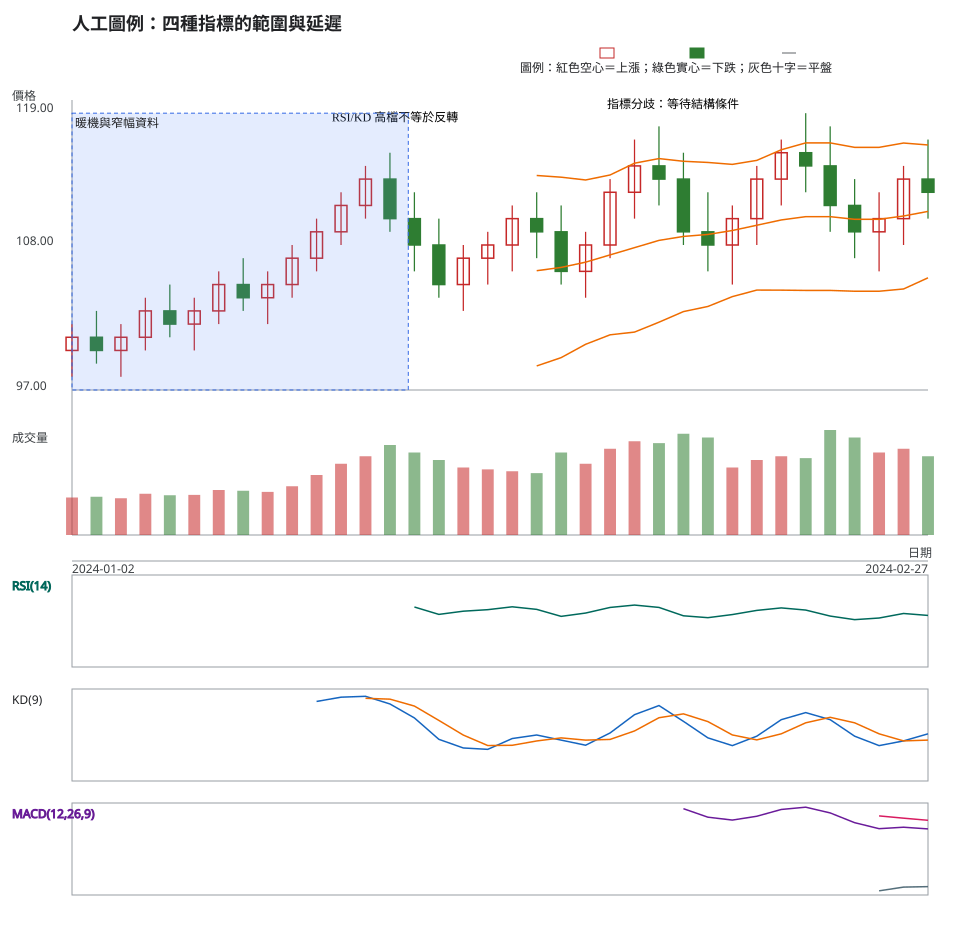
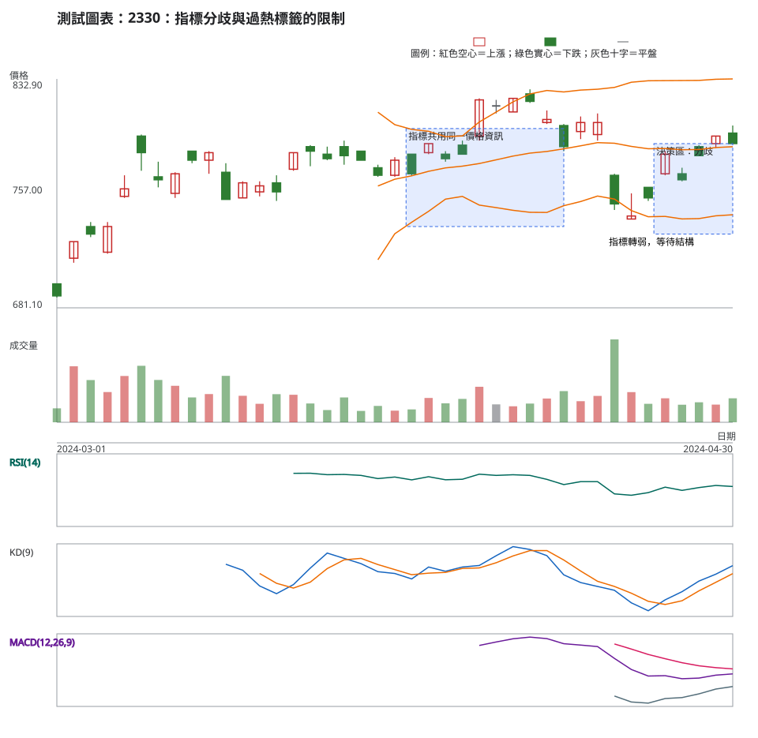

# 第 14 章：RSI、KD、MACD 與布林通道

## 學習目標

本章回答：「RSI 超買、KD 黃金交叉、MACD 翻正或價格碰到布林上緣，能不能直接下單？」這些指標都把價格序列壓縮成不同視角的摘要；它們不是四個互不相關的裁判。你會學到各自回答的問題、計算與暖機、延遲與飽和，並練習在趨勢、區間與證據互相矛盾時保留不確定性。

## 先說結論

- RSI 是 Wilder 平滑後的漲跌力量比例，位於 0 到 100；強趨勢中高檔可持續，超買不是賣出指令。
- 隨機指標 KD 以近期高低區間中的收盤位置計算 %K，再以 SMA 平滑 %K 與 %D；區間改變會改變讀值。
- MACD 是快 EMA 減慢 EMA，並以訊號 EMA 與柱狀圖描述差距；暖機最長，且與均線共享資訊。
- 布林通道是 SMA 加減人口標準差倍數；上緣表示相對位置，不表示必然回落。
- 多個價格指標同向不會自動成為獨立確認；先判斷市場狀態，再把指標當作條件證據。

## 精確定義與證據等級

### RSI：漲跌力量的有界摘要

本專案 RSI 期間為 (n)，先把每次變化拆成 gain 與 loss，再以 Wilder 平滑得到平均漲幅 (AG) 和平均跌幅 (AL)：

$$
RS=AG/AL,\qquad RSI=100-\frac{100}{1+RS}
$$

前 (n) 個變化後才有第一值，也就是輸入長度的索引 (n)。若平均跌幅為 0 且平均漲幅大於 0，實作回傳 100；若兩者皆為 0，回傳中性 50；若平均漲幅為 0，回傳 0。這些邊界是程式契約，不是市場預言。

### KD：收盤在區間中的位置

以期間 $n$ 的最高 $H_n$、最低 $L_n$ 和收盤 $C_t$：

$$
K_{raw}=100\times\frac{C_t-L_n}{H_n-L_n}
$$

區間為 0 時本專案採 50。接著用 `smooth_k` 期 SMA 平滑 raw %K，再用 `smooth_d` 期 SMA 平滑 %K 得 %D；預設教學例用 `n=9`、`smooth_k=3`、`smooth_d=3`，第一個 %K 在第 `n+smooth_k-1` 根、第一個 %D 再多 `smooth_d-1` 根才出現。KD 落在 0 到 100，於高檔可以長時間鈍化。

### MACD：兩條 EMA 的差

本專案採快期 (12)、慢期 (26)、訊號期 (9)：

$$
MACD=EMA_{12}-EMA_{26},\quad Signal=EMA_9(MACD),\quad Histogram=MACD-Signal
$$

快、慢 EMA 都以各自第一個完整 SMA 為種子；第一個 MACD 在第 26 根，第一個訊號值在第 (26+9-1=34) 根。MACD 無固定上下界，零軸位置與斜率要放回價格趨勢與區間判讀。

### 布林通道：相對波動帶

本專案以 (n=20)、偏差倍數 (d=2) 為例，中心線是 SMA，標準差是人口標準差：

$$
Middle=SMA_n,\quad Upper=Middle+d\sigma_{population},\quad Lower=Middle-d\sigma_{population}
$$

第一個值在第 20 根。帶寬變窄只代表窗口內的離散程度變小；擴張可伴隨任何方向。不要把碰上緣、下緣寫成必然反轉。

### 暖機、參數與不能回答的事

四種指標都會因期間、平滑與輸入價格（收盤或高低收）改變。暖機前的 `None` 不是零；參數敏感度也不等於最佳化。它們都不能直接回答消息原因、委託是否成交、未來報酬或適合的風險比例。

## 人工圖例

<!-- figure-spec
{
  "id":"ch14-indicator-concept",
  "kind":"synthetic",
  "title":"人工圖例：四種指標的範圍與延遲",
  "alt_text":"人工日 K 線圖同時標出 RSI、KD、MACD 與布林通道；價格先窄幅再快速來回，說明有界指標可鈍化、MACD 會暖機、布林帶寬度是相對波動而非方向。",
  "output":"assets/figures/ch14-concept.svg",
  "indicators":[{"type":"rsi","period":14},{"type":"kd","period":9,"smooth_k":3,"smooth_d":3},{"type":"macd","fast":12,"slow":26,"signal":9},{"type":"bollinger","period":20,"deviations":2}],
  "bars":[
    {"date":"2024-01-02","open":100,"high":102,"low":98,"close":101,"volume":1000},
    {"date":"2024-01-03","open":101,"high":103,"low":99,"close":100,"volume":1020},
    {"date":"2024-01-04","open":100,"high":102,"low":98,"close":101,"volume":980},
    {"date":"2024-01-05","open":101,"high":104,"low":100,"close":103,"volume":1100},
    {"date":"2024-01-08","open":103,"high":105,"low":101,"close":102,"volume":1060},
    {"date":"2024-01-09","open":102,"high":104,"low":100,"close":103,"volume":1070},
    {"date":"2024-01-10","open":103,"high":106,"low":102,"close":105,"volume":1200},
    {"date":"2024-01-11","open":105,"high":107,"low":103,"close":104,"volume":1180},
    {"date":"2024-01-12","open":104,"high":106,"low":102,"close":105,"volume":1150},
    {"date":"2024-01-15","open":105,"high":108,"low":104,"close":107,"volume":1300},
    {"date":"2024-01-16","open":107,"high":110,"low":106,"close":109,"volume":1600},
    {"date":"2024-01-17","open":109,"high":112,"low":108,"close":111,"volume":1900},
    {"date":"2024-01-18","open":111,"high":114,"low":110,"close":113,"volume":2100},
    {"date":"2024-01-19","open":113,"high":115,"low":109,"close":110,"volume":2400},
    {"date":"2024-01-22","open":110,"high":112,"low":106,"close":108,"volume":2200},
    {"date":"2024-01-23","open":108,"high":110,"low":104,"close":105,"volume":2000},
    {"date":"2024-01-24","open":105,"high":108,"low":103,"close":107,"volume":1800},
    {"date":"2024-01-25","open":107,"high":109,"low":105,"close":108,"volume":1750},
    {"date":"2024-01-26","open":108,"high":111,"low":106,"close":110,"volume":1700},
    {"date":"2024-01-29","open":110,"high":112,"low":107,"close":109,"volume":1650},
    {"date":"2024-01-30","open":109,"high":111,"low":105,"close":106,"volume":2200},
    {"date":"2024-01-31","open":106,"high":109,"low":104,"close":108,"volume":1900},
    {"date":"2024-02-01","open":108,"high":113,"low":107,"close":112,"volume":2300},
    {"date":"2024-02-02","open":112,"high":116,"low":110,"close":114,"volume":2500},
    {"date":"2024-02-05","open":114,"high":117,"low":111,"close":113,"volume":2450},
    {"date":"2024-02-06","open":113,"high":115,"low":108,"close":109,"volume":2700},
    {"date":"2024-02-07","open":109,"high":112,"low":106,"close":108,"volume":2600},
    {"date":"2024-02-15","open":108,"high":111,"low":105,"close":110,"volume":1800},
    {"date":"2024-02-16","open":110,"high":114,"low":108,"close":113,"volume":2000},
    {"date":"2024-02-19","open":113,"high":116,"low":111,"close":115,"volume":2100},
    {"date":"2024-02-20","open":115,"high":118,"low":112,"close":114,"volume":2050},
    {"date":"2024-02-21","open":114,"high":117,"low":109,"close":111,"volume":2800},
    {"date":"2024-02-22","open":111,"high":113,"low":107,"close":109,"volume":2600},
    {"date":"2024-02-23","open":109,"high":112,"low":106,"close":110,"volume":2200},
    {"date":"2024-02-26","open":110,"high":114,"low":108,"close":113,"volume":2300},
    {"date":"2024-02-27","open":113,"high":116,"low":110,"close":112,"volume":2100}
  ],
  "annotations":[
    {"type":"zone","start":"2024-01-02","end":"2024-01-24","low":97,"high":118,"label":"暖機與窄幅資料"},
    {"type":"label","date":"2024-01-19","price":117,"label":"RSI/KD 高檔不等於反轉"},
    {"type":"label","date":"2024-02-06","price":118,"label":"指標分歧：等待結構條件"}
  ]
}
-->

## 歷史案例

以 TWSE 2330 的官方原始日資料觀察 2024-03-01 至 2024-04-30，決策日為 4 月 30 日。OHLCV 分別取自 TWSE [2024 年 3 月](https://www.twse.com.tw/rwd/zh/afterTrading/STOCK_DAY?response=json&date=20240301&stockNo=2330)與[4 月](https://www.twse.com.tw/rwd/zh/afterTrading/STOCK_DAY?response=json&date=20240401&stockNo=2330)每日收盤行情。再以 TWSE [除權除息計算結果](https://www.twse.com.tw/rwd/zh/exRight/TWT49U?response=json&startDate=20240301&endDate=20240430)確認 2024-03-18 為現金股利除息日：除息前收盤 753.00 元、參考價 749.50 元、息值 3.499789 元。圖與指標使用原始價格，跨越事件時須保留這項機械調整註記。

<!-- figure-spec
{
  "id":"ch14-indicator-2330",
  "kind":"historical",
  "title":"2330：指標分歧與過熱標籤的限制",
  "alt_text":"台積電 2330 於 2024 年 3 月 1 日至 4 月 30 日的官方原始日線，包含 RSI、KD、MACD 與布林通道；4 月 30 日是決策日，圖中不展示其後資料。",
  "output":"assets/figures/ch14-cases.svg",
  "market":"TWSE",
  "symbol":"2330",
  "start":"2024-03-01",
  "end":"2024-04-30",
  "timeframe":"1d",
  "price_mode":"raw",
  "source_url":"https://www.twse.com.tw/rwd/zh/afterTrading/STOCK_DAY",
  "checked_on":"2026-08-10",
  "corporate_actions":["2024-03-18 現金股利除息；TWSE 除權息計算結果列示除息前收盤 753.00 元、參考價 749.50 元、息值 3.499789 元。"],
  "indicators":[{"type":"rsi","period":14},{"type":"kd","period":9,"smooth_k":3,"smooth_d":3},{"type":"macd","fast":12,"slow":26,"signal":9},{"type":"bollinger","period":20,"deviations":2}],
  "annotations":[
    {"type":"zone","start":"2024-04-01","end":"2024-04-15","low":735,"high":800,"label":"指標共用同一價格資訊"},
    {"type":"label","date":"2024-04-19","price":720,"label":"指標轉弱，等待結構"},
    {"type":"zone","start":"2024-04-23","end":"2024-04-30","low":730,"high":790,"label":"決策區：分歧"}
  ]
}
-->

### 有效、失敗與模稜兩可

- **指標一致但不獨立**：四個讀值同向時，仍可能只是同一段價格上漲被不同平滑方式重述；必須補上位置、成交量與失效點。
- **指標分歧**：MACD 柱狀圖縮短而價格仍在區域上方，RSI 下降不代表立即反轉；可保留多方與不交易分支。
- **過熱標籤失效**：RSI 高於常用門檻時，趨勢可能持續；只有當價格結構與觸發條件失效，才可改寫為放棄交易。

### 指標比較：避免重複計票

| 工具 | 它摘要的問題 | 不能單獨回答 | 與其他工具的重疊 |
| --- | --- | --- | --- |
| RSI | 漲跌幅度的平滑比例 | 反轉時間與成交機率 | 與價格動能、KD 高度相關 |
| KD | 收盤在近期區間的位置 | 高檔會否立刻下跌 | 與 RSI 都由收盤與區間推導 |
| MACD | 兩種 EMA 的差與變化 | 新聞原因與未來幅度 | 與均線、價格趨勢重疊 |
| 布林通道 | 相對中心與離散程度 | 碰帶後必然回歸 | 中心線仍是 SMA，與均線重疊 |

## 八步判讀

**八步前置核對。**核對原始價格、日期、OHLCV 與暖機長度，記錄 RSI、KD、MACD、布林的期間與平滑設定；不同時間週期的讀值不得混用。

1. **大方向**：先分趨勢、區間與波動擴張，不以超買或超賣名稱取代市場狀態。
2. **所在位置**：將讀值放回前高、前低、關鍵區域與可用價格空間。
3. **量價反應**：用收盤與區域的關係檢查價格，補查量、價差與可成交性；指標本身沒有委託深度。
4. **交易情境**：先寫價格結構支持的情境，再決定指標是否只作為確認，而不是讓指標創造情境。
5. **觸發條件**：只有價格完成預定收盤或區域條件，且指標設定與暖機可重算時才觸發。
6. **失效條件**：價格回到失效區、分歧未解除、設定資料不足或成本條件改變時，情境失效。
7. **風險計算**：以觸發到結構失效的距離及預計部位估風險，將價差、滑價與成本納入，距離過大時放棄。
8. **事後檢討**：保存指標設定、讀值、價格證據與未交易原因，回顧時檢查是否先看指標才事後補價格理由。

## 練習

在 2024-04-30 決策日前完成三層筆記：

1. 觀察：各指標最後一個可用值是上升、下降或不明？指出暖機是否完成。
2. 條件：寫出「若價格收盤維持區域上方且 MACD 柱狀圖不再縮短」的多方分支，及一個分歧持續的不交易分支。
3. 風險：說明為何 RSI 高檔或 KD 交叉本身不構成下單授權。

## 答案與評分

展開參考答案與評分

2024-04-29 到 4 月 30 日，收盤由 795 降至 790 元，RSI(14) 約由 56.48 降至 55.05；平滑 %K 約由 58.23 升至 70.00，%D 約由 47.02 升至 58.98；MACD 約由 2.69 升至 3.22，但訊號線約由 5.82 降至 5.30，柱狀圖仍為負值、約由 -3.13 收斂至 -2.08；布林中線約由 787.40 升至 787.95。暖機已完成，但方向並不一致。多方分支仍須等待價格收盤維持區域上方，並由結構與量價條件確認；若分歧持續、失效距離過大或成交成本未知，維持不交易。RSI 高檔與 KD 交叉只是同一價格資料的摘要，不能單獨授權下單。

滿分 10 分：公式與暖機 3 分、比較表中的重疊理解 2 分、情境條件 3 分、風險與不交易 2 分。把「超買」直接等同賣出，視為概念錯誤；不得用 4 月 30 日之後的走勢判分。

## 重點、限制與來源

### 重點

RSI、KD、MACD、布林通道各自摘要價格的不同角度，但都受輸入、期間、暖機與市場狀態影響。多指標一致不等於多份獨立證據。

### 限制

指標會延遲、鈍化、分歧與重新計算；歷史讀值不能保證未來績效。參數是教學與程式契約，不是通用建議。

### 來源

- J. Welles Wilder Jr., *New Concepts in Technical Trading Systems*（1978；RSI，[Google Books 書目](https://books.google.com/books/about/New_Concepts_in_Technical_Trading_System.html?id=WesJAQAAMAAJ)）。
- George Lane, “Lane's Stochastics,” *Technical Analysis of STOCKS & COMMODITIES* 2 (1984) 的早期文章重刊資料（[Working Money reprint](https://premium.working-money.com/wm/printdisplay.asp?art=496)）。
- Gerald Appel, *Technical Analysis: Power Tools for Active Investors*（2005；MACD，[O'Reilly 書目](https://www.oreilly.com/library/view/technical-analysis-power/0131479024/0131479024_pref05.html)）。
- John Bollinger, *Bollinger on Bollinger Bands*（2001；[作者官方書頁](https://www.bollingerbands.com/bollinger-band-book)）。
- 計算實作與邊界測試：`tools/indicators.py`、`tests/test_indicators.py`。
- 歷史資料與公司行動：TWSE [每日收盤行情](https://www.twse.com.tw/rwd/zh/afterTrading/STOCK_DAY)、[除權除息計算結果](https://www.twse.com.tw/rwd/zh/exRight/TWT49U)。
