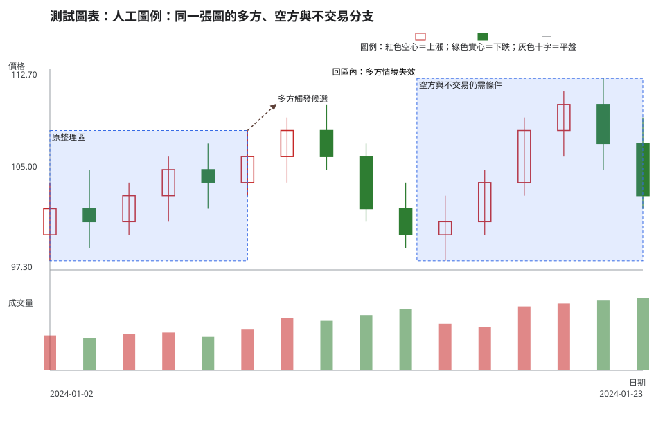
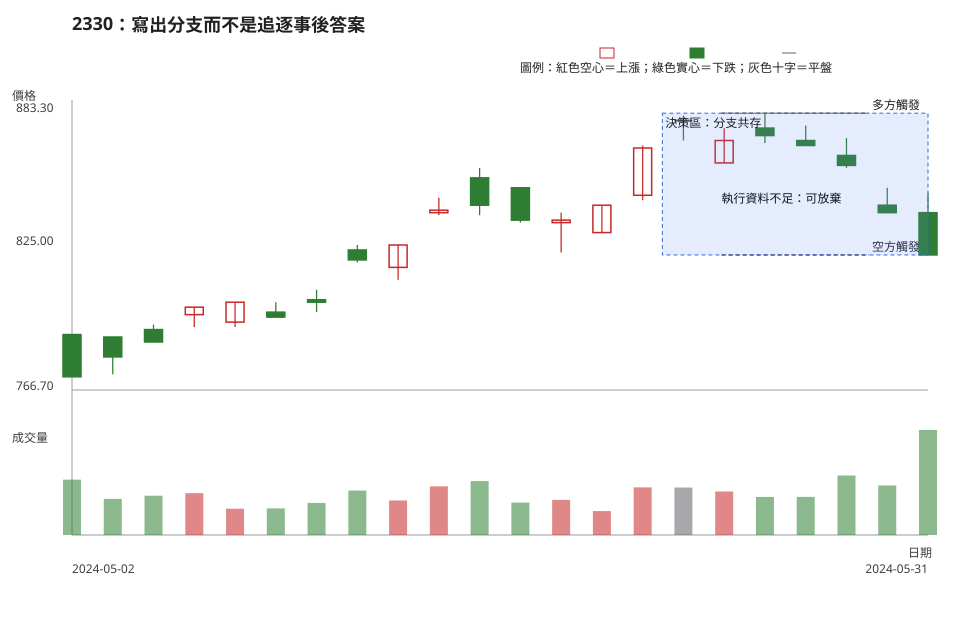

# 第 15 章：情境、觸發、失效與放棄交易

## 學習目標

新手常把「看起來會漲」當成交易計畫。本章改問：「在下一根 K 線尚未出現前，我能寫出哪些互相兼容的情境？什麼觀察才觸發、什麼觀察讓情境失效？」你會用同一張圖建立多方、空方與不交易分支，並把成本、流動性與指標分歧納入決策。

## 先說結論

- 情境是條件式假設，不是預測；觸發是可觀察且可執行的門檻，不是提前猜測。
- 失效是原先解讀不再成立；帳戶停損是執行動作，兩者不能混為一談。
- 觸發前多個分支可以同時有效；觸發後若失效，不可移動邊界來保留故事。
- 價格結構、成交量／流動性、指標分歧、成本與失效距離，任一項都能把設置降級成不交易。
- 不交易不是沒有分析，而是缺少足以承擔風險的證據或可執行空間。

## 精確定義與證據等級

### 六欄情境卡

每一個分支都寫六欄：

1. **可觀察假設**：例如價格仍在前一個整理區上緣之上。
2. **觸發**：例如日線收盤高於區域上緣，且成交量比較窗口沒有缺失。
3. **可選確認**：例如回測後收盤守住；確認不是預先把答案寫進圖上。
4. **失效**：例如收盤回到區域內，或出現已定義的結構破壞。
5. **可用空間**：到前高、區域或其他障礙的距離，扣除預估成本後是否仍足夠。
6. **缺少證據**：例如價差、深度、公司行動或未完成 K 線尚未查核。

### 觸發、失效與執行停損

觸發是條件被滿足的觀察時點；它不保證成交。失效是原假設被推翻的觀察；若需要離場，才依帳戶與委託規則執行停損。停損價格、滑價與可成交數量屬於第 16 章的風險問題，不能事後把停損點改到圖形之外。

### 證據分層

把資料事實、條件式解讀與風險決策分三層寫。指標讀值只能加強或削弱價格情境，不能把「多個指標同意」升格成因果證明。若成本或流動性未知，應在情境卡保留缺口，而不是補一個想像的成交價格。

## 人工圖例

<!-- figure-spec
{
  "id":"ch15-scenario-concept",
  "kind":"synthetic",
  "title":"人工圖例：同一張圖的多方、空方與不交易分支",
  "alt_text":"人工日 K 線圖以區域、箭頭與標籤示範突破前的多個兼容情境；觸發、失效與放棄條件分開標示，沒有把任何分支畫成預測答案。",
  "output":"assets/figures/ch15-concept.svg",
  "bars":[
    {"date":"2024-01-02","open":100,"high":104,"low":98,"close":102,"volume":1200},
    {"date":"2024-01-03","open":102,"high":105,"low":99,"close":101,"volume":1100},
    {"date":"2024-01-04","open":101,"high":104,"low":100,"close":103,"volume":1250},
    {"date":"2024-01-05","open":103,"high":106,"low":101,"close":105,"volume":1300},
    {"date":"2024-01-08","open":105,"high":107,"low":102,"close":104,"volume":1150},
    {"date":"2024-01-09","open":104,"high":108,"low":103,"close":106,"volume":1400},
    {"date":"2024-01-10","open":106,"high":109,"low":104,"close":108,"volume":1800},
    {"date":"2024-01-11","open":108,"high":110,"low":105,"close":106,"volume":1700},
    {"date":"2024-01-12","open":106,"high":107,"low":101,"close":102,"volume":1900},
    {"date":"2024-01-15","open":102,"high":104,"low":99,"close":100,"volume":2100},
    {"date":"2024-01-16","open":100,"high":103,"low":98,"close":101,"volume":1600},
    {"date":"2024-01-17","open":101,"high":105,"low":100,"close":104,"volume":1500},
    {"date":"2024-01-18","open":104,"high":109,"low":103,"close":108,"volume":2200},
    {"date":"2024-01-19","open":108,"high":111,"low":106,"close":110,"volume":2300},
    {"date":"2024-01-22","open":110,"high":112,"low":105,"close":107,"volume":2400},
    {"date":"2024-01-23","open":107,"high":109,"low":102,"close":103,"volume":2500}
  ],
  "annotations":[
    {"type":"zone","start":"2024-01-02","end":"2024-01-09","low":98,"high":108,"label":"原整理區"},
    {"type":"arrow","start":"2024-01-09","end":"2024-01-10","start_price":108,"end_price":110,"label":"多方觸發候選"},
    {"type":"label","date":"2024-01-12","price":112,"label":"回區內：多方情境失效"},
    {"type":"zone","start":"2024-01-15","end":"2024-01-23","low":98,"high":112,"label":"空方與不交易仍需條件"}
  ]
}
-->

## 歷史案例

以 TWSE 2330 的 2024-05-01 至 2024-05-31 原始日資料為案例，決策日是 5 月 31 日。歷史資料使用 [TWSE 每日收盤行情](https://www.twse.com.tw/rwd/zh/afterTrading/STOCK_DAY)；公司行動先透過 [TWSE 除權除息](https://www.twse.com.tw/rwd/zh/exRight/TWT49U) 與 [MOPS](https://mops.twse.com.tw/mops/web/t05st01) 查核，圖表只呈現決策日前的資料。

<!-- figure-spec
{
  "id":"ch15-scenario-2330",
  "kind":"historical",
  "title":"2330：寫出分支而不是追逐事後答案",
  "alt_text":"台積電 2330 於 2024 年 5 月 1 日至 5 月 31 日的官方原始日線，標出可能的突破區、失效邊界與未查明的流動性條件；圖表終點是決策日。",
  "output":"assets/figures/ch15-cases.svg",
  "market":"TWSE",
  "symbol":"2330",
  "start":"2024-05-01",
  "end":"2024-05-31",
  "timeframe":"1d",
  "price_mode":"raw",
  "source_url":"https://www.twse.com.tw/rwd/zh/afterTrading/STOCK_DAY?response=json&date=20240501&stockNo=2330",
  "checked_on":"2026-08-10",
  "corporate_actions":[],
  "annotations":[
    {"type":"zone","start":"2024-05-01","end":"2024-05-10","low":760,"high":800,"label":"觀察區：觸發前多分支共存"},
    {"type":"line","start":"2024-05-10","end":"2024-05-31","start_price":800,"end_price":800,"label":"多方觸發線：收盤需確認"},
    {"type":"line","start":"2024-05-10","end":"2024-05-31","start_price":760,"end_price":760,"label":"失效線：不可事後移動"},
    {"type":"label","date":"2024-05-24","price":840,"label":"價差或深度缺資料：可放棄"}
  ]
}
-->

### 有效、失敗與模稜兩可

- **多方分支**：假設收盤仍在區域上方；觸發是收盤突破並有可核對成交量；失效是收盤回區內。
- **空方分支**：假設突破失敗且收盤跌破區域下緣；觸發與失效對稱，但不能因為多方未觸發就提前放空。
- **不交易分支**：突破與失效都未發生、價差／深度未知，或扣成本後空間不足。這不是失敗，而是保留資本。

## 八步判讀

1. **資料有效性**：先確認決策日、原始價格、公司行動與資料完整。
2. **時間週期**：標記使用日線或其他週期，避免把未完成 K 線當觸發。
3. **市場狀態**：描述方向、波動、流動性，不先選多空故事。
4. **位置**：畫出區域上下緣、前高前低與可用空間。
5. **K 線／結構**：定義收盤、影線與相鄰高低點的可觀察條件。
6. **成交量／流動性**：列出量能比較窗口、價差與深度是否可得。
7. **情境、觸發、失效**：每個分支都寫六欄，觸發前允許並存。
8. **風險／放棄交易**：成本、滑價、距離或缺資料不利時，明確寫不交易。

## 練習

以 2024-05-31 為決策日，先不看任何後續資料：

1. 寫一張多方情境卡與一張空方情境卡，各列假設、觸發、確認、失效、空間、缺證據。
2. 寫一個不交易條件，並指出它是資料不足、風險過大還是觸發未發生。
3. 把「看起來要突破」改寫成可驗證句子，不得使用預測語氣。

參考答案與評分方向

每張情境卡六欄完整得 3 分；觸發與失效使用決策日前可觀察條件得 2 分；不交易理由能指出成本、流動性或空間得 2 分。答案不以後續勝負判定。

## 答案與評分

滿分 10 分：情境結構 4 分、可觀察觸發 2 分、失效邊界 2 分、不交易與缺資料 2 分。把情境寫成單一路徑預測，最多只能得 4 分。

## 重點、限制與來源

### 重點

交易計畫的核心是事先寫好條件與邊界。觸發前保留多個分支，觸發後遵守原先失效定義，不讓結果倒推理由。

### 限制

日線資料看不到盤中委託、即時深度、消息與執行品質；空間、成本與滑價都可能使理論上成立的分支不可交易。

### 來源

- 歷史原始資料：[TWSE 每日收盤行情](https://www.twse.com.tw/rwd/zh/afterTrading/STOCK_DAY)、[除權除息](https://www.twse.com.tw/rwd/zh/exRight/TWT49U)、[MOPS](https://mops.twse.com.tw/mops/web/t05st01)。
- 情境、觸發、失效與不交易是本教材的條件式判讀框架，並非交易所規則或績效承諾。
- 成本與現行交易規則請回看[附錄 C](appendix-c-taiwan-market-rules.md)，不要在本章複製會變動的費率。
