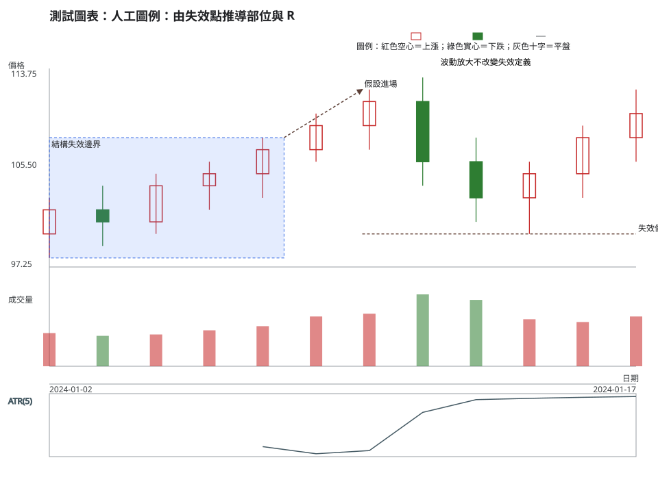
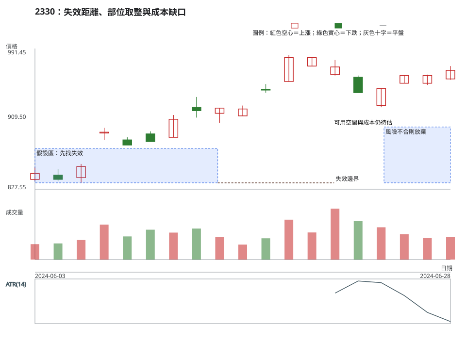

# 第 16 章：停損、部位、R 倍數、期望值與成本

## 學習目標

本章回答：「我知道進場價了，該買幾股、停損放哪裡，這筆交易值得做嗎？」答案必須從情境失效點與可執行限制推導，而不是先挑一個百分比再找圖形理由。你會計算每股風險、貨幣風險、整股取整、執行風險、未配置風險、R 倍數與期望值，並把費用、稅、價差、滑價與成交不確定性分開。

## 先說結論

- 停損位置先由「什麼觀察會推翻情境」決定，再檢查委託與滑價能否執行。
- 計畫每股風險是進場價與失效價的距離；計畫貨幣風險是它乘以股數，不能用帳戶百分比取代圖表理由。
- 股數必須依市場允許的單位向下取整；若最小可執行部位仍超過可承擔風險，行動是放棄或重新設計，不是偷偷放寬停損。
- R 倍數的分母要先寫清楚，且以實際成交、成本與滑價計算；圖表收盤不一定是成交價。
- 歷史正期望值是樣本的描述，不是未來預測；小樣本、規則改變與漏計成本都會讓結論失效。

## 精確定義與證據等級

### 停損與每股風險

多方計畫的失效價為 $P_{inv}$，計畫進場價為 $P_{entry}$，假設每股滑價與費用先不含在價格距離：

$$
r_{unit}=P_{entry}-P_{inv}\quad(多方)
$$

空方則為 $r_{unit}=P_{inv}-P_{entry}$。若結果不為正，情境與執行假設矛盾。停損委託未必能以 $P_{inv}$ 成交，實際離場價需另記滑價。

### 貨幣風險、取整、執行風險與未配置風險

計畫貨幣風險 $R_{plan}$ 與股數 $q$ 的關係：

$$
q_{raw}=\frac{R_{plan}}{r_{unit}},\qquad q_{exec}=floor(q_{raw}/u)\times u
$$

其中 $u$ 是市場允許的最小股數或交易單位；現行台股規則與整股／零股限制請回看[附錄 C](appendix-c-taiwan-market-rules.md)，不要把會變動的規則複製到本章。向下取整後，實際以計畫失效價計算的部位風險為：

$$
R_{exec}=q_{exec}\times r_{unit},\qquad R_{unused}=R_{plan}-R_{exec}
$$

$R_{exec}$ 是執行股數在計畫失效價的價格風險，不是「剩餘風險」；$R_{unused}$ 才是向下取整後未配置的風險額。兩者都尚未包含實際成交造成的成本與滑價。若 $q_{exec}=0$ 或 $R_{exec}>R_{plan}$（例如採四捨五入），就不執行；本章一律向下取整以免放大計畫風險。

### 毛損益、淨損益與 R 倍數

多方毛損益為：

$$
PnL_{gross}=(P_{exit}-P_{entry})\times q
$$

淨損益需分開列出買進與賣出成本、證交稅、價差與滑價。以費率符號 $f_{buy}, f_{sell}, t$ 表示，且不假設它們是現行全市場費率：

$$
PnL_{net}=PnL_{gross}-C_{buy}-C_{sell}-Tax-Slippage
$$

其中 $C_{buy}=P_{entry}qf_{buy}$、$C_{sell}=P_{exit}qf_{sell}$、$Tax=P_{exit}qt$（稅與費率須依實際商品與當日規則替換）。若以執行部位在計畫失效價的風險 $R_{exec}$ 作為 R 分母：

$$
R_{realized}=\frac{PnL_{net}}{R_{exec}}
$$

必須在紀錄上註明分母是計畫風險、實際風險或其他定義，否則不同交易不可比較。

### 勝率、平均損益、賺賠比與期望值

對 $N$ 筆同一規則的已完成交易：

$$
WinRate=\frac{N_{win}}{N},\quad AvgWin=\frac{\sum PnL_{net,win}}{N_{win}},\quad AvgLoss=\frac{\left|\sum PnL_{net,loss}\right|}{N_{loss}}
$$

$$
Payoff=\frac{AvgWin}{AvgLoss},\qquad Expectancy=WinRate\times AvgWin-(1-WinRate)\times AvgLoss
$$

所有金額必須同單位，平均損失取正值後再減。期望值是該樣本與規則的統計描述，不能承諾下一筆；樣本選擇、停損改動、倖存者偏誤與漏記成本都會破壞可比性。

### 可重算的假設例

以下只是單位與取整示範，不是風險比例建議：假設多方 $P_{entry}=100$ 元、情境失效 $P_{inv}=96.5$ 元、計畫貨幣風險 $R_{plan}=600$ 元、最小單位 $u=1$ 股。則 $r_{unit}=3.5$ 元，$q_{raw}=600/3.5=171.428571\ldots$，向下取整 $q_{exec}=171$ 股，$R_{exec}=171\times3.5=598.5$ 元，$R_{unused}=600-598.5=1.5$ 元。若實際出場 108 元，毛損益為 $(108-100)\times171=1,368$ 元；淨損益還要扣以符號表示的費用、稅與滑價。這個例子沒有宣稱任何人應承擔 600 元風險。

## 人工圖例

<!-- figure-spec
{
  "id":"ch16-risk-concept",
  "kind":"synthetic",
  "title":"人工圖例：由失效點推導部位與 R",
  "alt_text":"人工日 K 線圖標出多方進場、結構失效與可用空間；ATR 只作波動背景，箭頭與區域示範停損先於股數取整，沒有預設通用風險百分比。",
  "output":"assets/figures/ch16-concept.svg",
  "indicators":[{"type":"atr","period":5}],
  "bars":[
    {"date":"2024-01-02","open":100,"high":103,"low":98,"close":102,"volume":1200},
    {"date":"2024-01-03","open":102,"high":104,"low":99,"close":101,"volume":1100},
    {"date":"2024-01-04","open":101,"high":105,"low":100,"close":104,"volume":1150},
    {"date":"2024-01-05","open":104,"high":106,"low":102,"close":105,"volume":1300},
    {"date":"2024-01-08","open":105,"high":108,"low":103,"close":107,"volume":1450},
    {"date":"2024-01-09","open":107,"high":110,"low":106,"close":109,"volume":1800},
    {"date":"2024-01-10","open":109,"high":112,"low":107,"close":111,"volume":1900},
    {"date":"2024-01-11","open":111,"high":113,"low":104,"close":106,"volume":2600},
    {"date":"2024-01-12","open":106,"high":108,"low":101,"close":103,"volume":2400},
    {"date":"2024-01-15","open":103,"high":106,"low":100,"close":105,"volume":1700},
    {"date":"2024-01-16","open":105,"high":109,"low":103,"close":108,"volume":1600},
    {"date":"2024-01-17","open":108,"high":112,"low":106,"close":110,"volume":1800}
  ],
  "annotations":[
    {"type":"zone","start":"2024-01-02","end":"2024-01-08","low":98,"high":108,"label":"結構失效邊界"},
    {"type":"arrow","start":"2024-01-08","end":"2024-01-10","start_price":108,"end_price":112,"label":"假設進場"},
    {"type":"line","start":"2024-01-10","end":"2024-01-15","start_price":100,"end_price":100,"label":"失效價"},
    {"type":"label","date":"2024-01-12","price":114,"label":"波動放大不改變失效定義"}
  ]
}
-->

## 歷史案例

以 TWSE 2330 於 2024-06-03 至 2024-06-28 的官方原始日資料示範「風險太大就不交易」，決策日為 6 月 28 日。OHLCV 取自 TWSE [2024 年 6 月每日收盤行情](https://www.twse.com.tw/rwd/zh/afterTrading/STOCK_DAY?response=json&date=20240601&stockNo=2330)。再以 TWSE [除權除息計算結果](https://www.twse.com.tw/rwd/zh/exRight/TWT49U?response=json&startDate=20240601&endDate=20240628)確認 2024-06-13 為現金股利除息日：除息前收盤 909.00 元、參考價 905.50 元、息值 3.499789 元。圖與 ATR 使用原始價格，跨越事件時須保留參考價的機械調整註記；圖表不暗示成交或獲利。

<!-- figure-spec
{
  "id":"ch16-risk-2330",
  "kind":"historical",
  "title":"2330：失效距離、部位取整與成本缺口",
  "alt_text":"台積電 2330 於 2024 年 6 月 3 日至 6 月 28 日的官方原始日線，標出假設進場、結構失效距離與前方空間；決策日後資料未納入，實際成交與成本仍需另記。",
  "output":"assets/figures/ch16-cases.svg",
  "market":"TWSE",
  "symbol":"2330",
  "start":"2024-06-03",
  "end":"2024-06-28",
  "timeframe":"1d",
  "price_mode":"raw",
  "source_url":"https://www.twse.com.tw/rwd/zh/afterTrading/STOCK_DAY?response=json&date=20240601&stockNo=2330",
  "checked_on":"2026-08-10",
  "corporate_actions":["2024-06-13 現金股利除息；TWSE 除權息計算結果列示除息前收盤 909.00 元、參考價 905.50 元、息值 3.499789 元。"],
  "indicators":[{"type":"atr","period":14}],
  "annotations":[
    {"type":"zone","start":"2024-06-03","end":"2024-06-14","low":835,"high":875,"label":"假設區：先找失效"},
    {"type":"line","start":"2024-06-14","end":"2024-06-21","start_price":835,"end_price":835,"label":"失效邊界"},
    {"type":"label","date":"2024-06-21","price":900,"label":"可用空間與成本仍待估"},
    {"type":"zone","start":"2024-06-24","end":"2024-06-28","low":835,"high":900,"label":"風險不合則放棄"}
  ]
}
-->

### 有效、失敗與模稜兩可

- **可執行計畫**：失效點由結構定義，股數向下取整，並在紀錄中保留成本與滑價欄位。
- **風險太大**：即使方向假設合理，最小單位乘以失效距離仍超過計畫風險；結果是放棄，不是移動失效點。
- **模稜兩可**：圖表顯示空間，但成交深度、費率或實際出場價未知；只能保留條件，不能把毛損益當淨損益。

## 八步判讀

**八步前置核對。**核對原始價格、決策日、公司行動與成交資料，決定使用日線或其他週期，並記錄 ATR 是否有足夠暖機；公式不能補足缺失的價格或成交資料。

1. **大方向**：描述方向、波動與流動性，只把它們視為風險假設的背景，不讓公式取代市場證據。
2. **所在位置**：找結構失效、前方障礙與可用價格空間。
3. **量價反應**：定義進場與失效的收盤／高低點條件，確認交易單位、價差、深度與可能滑價。
4. **交易情境**：在停損、部位與成本可執行前，保留觀察或不交易情境，而不是先設定風險比例再找圖形理由。
5. **觸發條件**：只有進場價格、結構條件、交易單位與成本假設都已寫清楚，才觸發計畫。
6. **失效條件**：結構失效、實際可成交條件惡化、取整後超限或前方空間不足時，該計畫失效。
7. **風險計算**：以每股風險乘執行股數計算執行風險，另列未配置風險、費用、稅與滑價；不以毛損益假裝成淨損益。
8. **事後檢討**：保存原計畫、取整結果、實際成交與成本差異，回顧時分開檢查執行品質、R 倍數與期望值。

## 練習

使用本章假設例，完成以下工作表：

1. 列出 $P_{entry}$、$P_{inv}$、$r_{unit}$、$R_{plan}$、$q_{raw}$、$q_{exec}$、$R_{exec}$、$R_{unused}$ 與單位。
2. 假設實際出場 98 元，先算毛損益，再用符號 $f_{buy}, f_{sell}, t, Slippage$ 寫淨損益，不得偷填現行費率。
3. 若最小可交易單位先改為 100 股、再改為 200 股，分別判斷是否仍能把風險放在 600 元內，並寫出放棄條件。

## 答案與評分

展開參考答案與評分

假設進場 100 元、失效 96.5 元、計畫風險 600 元且 $u=1$ 股：每股風險 3.5 元，未取整股數約 171.428 股，執行 171 股，執行風險 598.5 元、未配置風險 1.5 元。若實際出場 98 元，毛損益為 $(98-100)\times171=-342$ 元；淨損益為 $-342-C_{buy}-C_{sell}-Tax-Slippage$，費率未知時不得代入現行數字。若 $u=100$ 股，執行 100 股、執行風險 350 元、未配置風險 250 元，仍在 600 元內；若 $u=200$ 股，最小部位的風險為 $200\times3.5=700$ 元，已超過計畫風險，依向下取整公式 $q_{exec}=0$，因此不交易。實務上還要把實際成交與成本補入紀錄。

滿分 10 分：風險公式 3 分、取整 2 分、成本與 R 2 分、期望值單位 1 分、不交易條件 2 分。把停損先定成固定百分比再找圖形理由，視為流程錯誤。

## 重點、限制與來源

### 重點

風險管理是可執行條件的延伸：失效點、股數、成本、滑價與實際成交都要能回溯。R 倍數與期望值是紀錄工具，不是保證。

### 限制

本章沒有提供現行費率、稅率或適用所有人的風險比例；這些會變動的規則在附錄 C 查核。日線無法保證盤中成交，故實際結果必須補記委託與執行。

### 來源

- 計算公式與工作表是本教材的可重現數學慣例；台股交易單位、價格跳動、費用與稅請以[附錄 C](appendix-c-taiwan-market-rules.md)及官方頁面為準。
- 歷史資料與公司行動：TWSE [每日收盤行情](https://www.twse.com.tw/rwd/zh/afterTrading/STOCK_DAY)、[除權除息計算結果](https://www.twse.com.tw/rwd/zh/exRight/TWT49U)。
- 期望值的解讀限於明確規則、樣本與成本定義；本章不提出績效統計或普遍適用建議。
