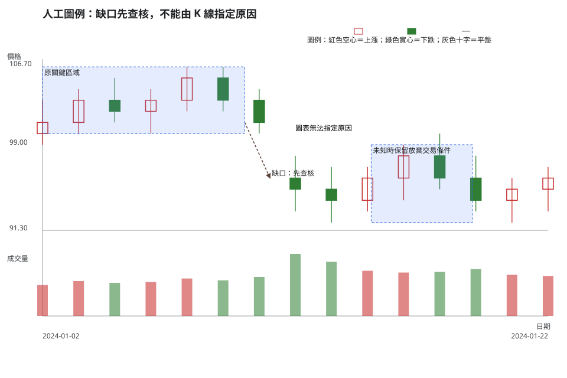
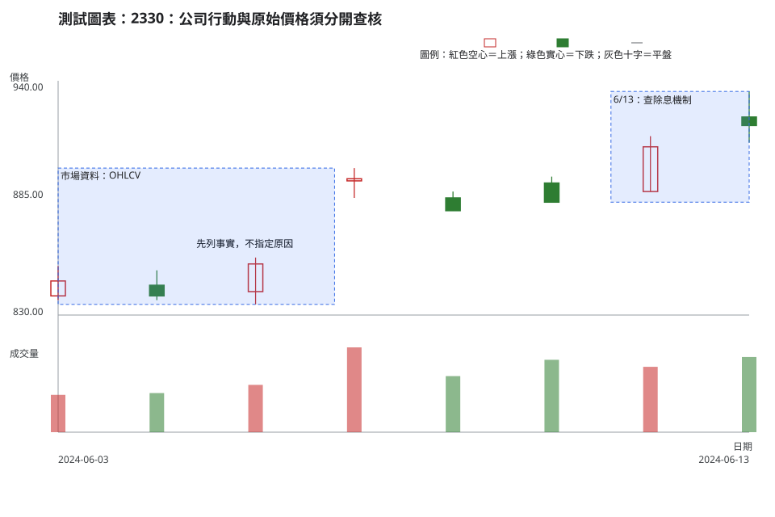

# 第 17 章：K 線看不到的財報、消息與制度事件

K 線是特定時間週期內成交價格的摘要，不是公司公告、交易制度或市場參與者想法的紀錄。本章把「圖上看見」與「必須另外查核」分開，讓未知資訊成為放棄交易條件，而不是事後補上的故事。

## 學習目標

- 分開記錄市場資料事實、公司公告／制度機制與可能解讀，不以圖表替代公告查核。
- 知道財報、營收、股利／除權息、減資／分割、重大訊息、停復牌、撮合限制、指數／產業背景與新聞事件各自要去哪裡查。
- 遇到公司行動或事件缺口時，能把交易情境降級為等待查核或放棄交易，而不是推論原因。

## 先說結論

- OHLCV 可以證明某一時間週期內的開、高、低、收與成交量；它不能單獨證明財報內容、消息原因、成交者身分或成交品質。
- 一個價格缺口可能與公司行動、公告、整體市場或流動性同時有關；未查核前只能寫成觀察，不能指定單一原因。
- 現行漲跌幅、撮合、暫停與恢復交易等制度會變動，請回看[附錄 C：台股規則、成本與官方查核](appendix-c-taiwan-market-rules.md)與官方頁面，不在本章複製數字。
- 若公司行動、停復牌、交易限制、指數／產業背景或事件時間仍未知，原本的交易情境必須降級；未知足以影響失效條件、部位大小或可成交性時，就寫入放棄交易條件。

## 精確定義與證據等級

### 三層資料不可混寫

| 層次 | 可以寫什麼 | 不可以寫什麼 |
| --- | --- | --- |
| 市場資料事實 | 決策日、原始價格、成交量、是否有缺口、官方結果頁列出的參考價 | 由 K 線推定消息原因、知情者心理或盤中成交品質 |
| 公司公告／制度機制 | 財報、月營收、股利、除權息、減資／分割、重大訊息、停復牌與官方制度說明 | 把公告或規則直接當成價格必漲必跌的因果承諾 |
| 可能解讀 | 「若某項事件改變了原交易情境，需重新定義觸發條件與失效條件」 | 「這根 K 線已證明市場一定如何解讀」 |

這三層正是本章的證據等級：第一層是可重現的市場資料，第二層是要由原始公告或官方制度頁確認的資料，第三層只是可被推翻的解釋。解釋不能回頭污染前兩層。

### 圖表外的查核清單

- **財報與營收**：財務報告與月營收有各自的期間、發布時間與修正可能；圖上的成交量不能代替內容閱讀。
- **股利／除權息與公司行動**：除權息、減資、分割等會影響原始價格序列的可比性。先查 [TWSE 除權息參考價計算說明](https://www.twse.com.tw/zh/announcement/ex-right/cal.html)與可重現的結果頁，再判讀缺口。
- **重大訊息、停復牌與制度限制**：暫停或恢復交易、撮合與資訊揭露有制度來源；價格資料未必足以顯示當時能否成交。現行制度請查 [TWSE 交易制度](https://www.twse.com.tw/zh/products/system/trading.html?hl=zh-TW)及附錄 C。
- **指數、產業與新聞事件**：可先用 [TWSE 指數系列](https://www.twse.com.tw/zh/indices/indices/series.html)確認指數名稱與適用市場，再依問題查找具時間戳的官方產業或公司公告；它們不是由單一個股 K 線推出的事實。若沒有可核對時間戳與來源，應保留為未知。

查公司資料時，使用 [公開資訊觀測站「公告快易查」](https://mopsov.twse.com.tw/mops/web/ezsearch)：先輸入公司代號並設定日期範圍，再依問題選擇「C00 財務資料」中的財報、「B00 營運概況」中的月營收、「D00 會議／表決」中的股利，或「M00 重大訊息」中的公告類別。把查到的發布日期與圖表交易日分欄記錄；兩者相同或不同，都不能只靠 K 線猜測。

## 人工圖例

<!-- figure-spec
{
  "id":"ch17-event-context-concept",
  "kind":"synthetic",
  "title":"人工圖例：缺口先查核，不能由 K 線指定原因",
  "alt_text":"人工日 K 線圖以關鍵區域、向下箭頭與文字標籤示範一個缺口。圖例區分可觀察的價格資料與尚待查核的公司公告或制度機制，沒有標示任何後續結果。",
  "output":"assets/figures/ch17-concept.svg",
  "bars":[
    {"date":"2024-01-02","open":100,"high":103,"low":99,"close":101,"volume":1200},
    {"date":"2024-01-03","open":101,"high":104,"low":100,"close":103,"volume":1350},
    {"date":"2024-01-04","open":103,"high":105,"low":101,"close":102,"volume":1280},
    {"date":"2024-01-05","open":102,"high":104,"low":100,"close":103,"volume":1320},
    {"date":"2024-01-08","open":103,"high":106,"low":102,"close":105,"volume":1450},
    {"date":"2024-01-09","open":105,"high":106,"low":102,"close":103,"volume":1380},
    {"date":"2024-01-10","open":103,"high":104,"low":100,"close":101,"volume":1510},
    {"date":"2024-01-11","open":96,"high":98,"low":93,"close":95,"volume":2400},
    {"date":"2024-01-12","open":95,"high":97,"low":92,"close":94,"volume":2100},
    {"date":"2024-01-15","open":94,"high":97,"low":93,"close":96,"volume":1750},
    {"date":"2024-01-16","open":96,"high":99,"low":94,"close":98,"volume":1680},
    {"date":"2024-01-17","open":98,"high":100,"low":95,"close":96,"volume":1710},
    {"date":"2024-01-18","open":96,"high":98,"low":93,"close":94,"volume":1820},
    {"date":"2024-01-19","open":94,"high":96,"low":92,"close":95,"volume":1600},
    {"date":"2024-01-22","open":95,"high":97,"low":93,"close":96,"volume":1550}
  ],
  "annotations":[
    {"type":"zone","start":"2024-01-02","end":"2024-01-10","low":100,"high":106,"label":"原關鍵區域"},
    {"type":"arrow","start":"2024-01-10","end":"2024-01-11","start_price":101,"end_price":96,"label":"缺口：先查核"},
    {"type":"label","date":"2024-01-12","price":100,"label":"圖表無法指定原因"},
    {"type":"zone","start":"2024-01-15","end":"2024-01-19","low":92,"high":99,"label":"未知時保留放棄交易條件"}
  ]
}
-->

圖中的缺口是市場資料事實；「除權息、公司公告、停復牌、指數或新聞」只是需要分別查核的可能背景。箭頭方向、空心／實心 K 線與圖例共同表示方向，並非只靠色彩。

## 歷史案例

本案例使用 TWSE 2330 在 2024-06-03 至 2024-06-13 的官方**原始價格**日資料，決策日為 2024-06-13，圖表不含其後交易日。OHLCV 來自 [TWSE 每日收盤行情](https://www.twse.com.tw/rwd/zh/afterTrading/STOCK_DAY)；以 [TWSE 除權除息計算結果（2024-06）](https://www.twse.com.tw/rwd/zh/exRight/TWT49U?response=json&startDate=20240601&endDate=20240630)查到 2330 在 6 月 13 日列有現金股利除息：除息前收盤 909.00 元、參考價 905.50 元、息值 3.499789 元。查核日為 2026-08-10。

| 分類 | 決策日前可核對的內容 |
| --- | --- |
| 市場資料事實 | 6 月 12 日收盤為 909 元；6 月 13 日開 923、高 935、低 911、收 919 元，成交量為 59,656,092。 |
| 公司公告／制度機制 | 官方結果頁把 6 月 13 日列為現金股利除息日，並列出參考價。結果頁的除息生效日不是重大訊息發布時間。 |
| 可能解讀 | 原始價格在公司行動附近的變化不能單獨證明「由除息造成」或「市場如何解讀」。若要建立交易情境，須先把公司行動、公告時間與可成交性查進交易紀錄。 |

<!-- figure-spec
{
  "id":"ch17-event-context-2330",
  "kind":"historical",
  "title":"2330：公司行動與原始價格須分開查核",
  "alt_text":"台積電 2330 於 2024 年 6 月 3 日至 6 月 13 日的官方原始日線。圖上標示資料區與 6 月 13 日除息機制查核區；圖表終點就是決策日，不含後續走勢。",
  "output":"assets/figures/ch17-cases.svg",
  "market":"TWSE",
  "symbol":"2330",
  "start":"2024-06-03",
  "end":"2024-06-13",
  "timeframe":"1d",
  "price_mode":"raw",
  "source_url":"https://www.twse.com.tw/rwd/zh/afterTrading/STOCK_DAY?response=json&date=20240601&stockNo=2330",
  "checked_on":"2026-08-10",
  "corporate_actions":["2024-06-13 現金股利除息；TWSE 除權除息計算結果列示除息前收盤 909.00 元、參考價 905.50 元、息值 3.499789 元。"],
  "annotations":[
    {"type":"zone","start":"2024-06-03","end":"2024-06-07","low":835,"high":899,"label":"市場資料：OHLCV"},
    {"type":"label","date":"2024-06-05","price":860,"label":"先列事實，不指定原因"},
    {"type":"zone","start":"2024-06-11","end":"2024-06-13","low":883,"high":935,"label":"6/13：查除息機制"}
  ]
}
-->

這是事件脈絡案例，不是報酬案例。若要找公司公告，需回到公開資訊觀測站，以代號、公告日期與類別查詢；不能把 6 月 13 日這個交易日直接當成某則公告的發布日，更不能用決策日以後價格為本案例背書。

## 八步判讀

1. **資料有效性**：核對市場、代號、原始價格、決策日、公司行動結果與資料完整性。
2. **時間週期**：寫明日 K，並區分交易日、公告發布時間與公司行動生效日。
3. **市場狀態**：另查整體指數、產業與流動性背景；未查到就列為未知。
4. **位置**：標出關鍵區域、前高前低與事件附近的價格範圍，不把它變成單一神奇線。
5. **K 線／結構**：只描述已完成 K 線的開、高、低、收與相鄰結構。
6. **量價關係／流動性**：把成交量與價格一起記錄；價差、深度與實際可成交數量未查核時不可補想像值。
7. **情境／觸發／失效**：公司行動或公告可能改變前提時，重寫交易情境、觸發條件與失效條件。
8. **風險／不交易條件**：事件時間、制度限制、成本或可成交性不明時，明確寫入放棄交易條件。

## 練習

以 2024-06-13 為決策日，不看其後資料，完成三層紀錄：

1. **觀察**：列出圖中兩個可由 OHLCV 或除權息結果頁直接核對的事實，並標明原始價格與日期。
2. **條件式解讀**：提出一個不把除息直接當原因的交易情境，並列出仍須到公開資訊觀測站或官方制度頁查核的項目。
3. **行動／風險**：寫出一項觸發條件、一項失效條件，以及至少一項放棄交易條件；若資料不完整，行動可以是等待或不交易。

## 答案與評分

展開參考答案與評分

可核對的觀察包括：6 月 12 日收 909 元，6 月 13 日的 OHLC 為 923／935／911／919 元；官方除權除息結果頁把 6 月 13 日列為現金股利除息，參考價為 905.50 元。這些都不等於原因。條件式解讀可寫成：「若下一個已完成日 K 的收盤仍高於事前定義的關鍵區域，且公開資訊觀測站的公告日期、公司行動與可成交性都完成查核，才評估新的交易情境；否則不把圖上變化歸因於單一事件。」失效條件必須是可觀察的收盤或結構條件；放棄交易條件可寫「事件時間未釐清、制度限制或價差／深度未知」。

滿分 10 分：資料事實 3 分、公告／制度機制分層 3 分、條件式解讀 2 分、放棄交易條件 2 分。將 K 線直接寫成消息原因、把除息生效日當公告日，或用後續漲跌判定答案，均不給該部分分數。

## 重點、限制與來源

### 重點

K 線提供的是成交摘要。財報、營收、公司行動、重大訊息、停復牌、制度限制、指數／產業與新聞背景要各自查核；查不到時，降低交易情境的證據等級或採取不交易。

### 限制

日線沒有盤中委託簿、即時價差、個別成交者資訊或消息傳遞過程。即使官方資料顯示同一日發生公司行動，也不能由此推出價格變化的唯一原因或獲利結論。

### 來源

- 市場資料與案例：TWSE [每日收盤行情](https://www.twse.com.tw/rwd/zh/afterTrading/STOCK_DAY)、[除權除息計算結果](https://www.twse.com.tw/rwd/zh/exRight/TWT49U)；本案例另保留 2024 年 6 月的可重現結果查詢連結。
- 公司公告：[公開資訊觀測站「公告快易查」](https://mopsov.twse.com.tw/mops/web/ezsearch)，依公司代號、日期與公告類別查詢。
- 現行制度、指數與計算說明：[TWSE 交易制度](https://www.twse.com.tw/zh/products/system/trading.html?hl=zh-TW)、[TWSE 指數系列](https://www.twse.com.tw/zh/indices/indices/series.html)、[TWSE 除權息參考價計算說明](https://www.twse.com.tw/zh/announcement/ex-right/cal.html)。可能變動的交易規則請以[附錄 C](appendix-c-taiwan-market-rules.md)與官方最新內容為準。
