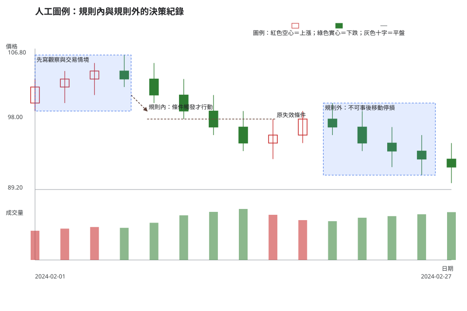
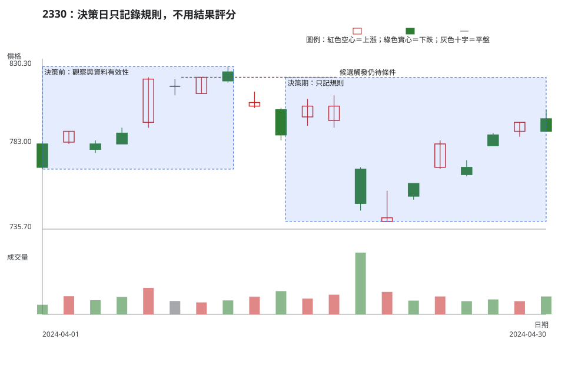

# 第 18 章：心理偏誤、交易紀錄與紙上交易

心理研究可以幫助讀者設計可檢查的流程，不能替任何人下診斷，也不能由一根 K 線判斷某位投資人的心態。本章把研究中的概念、教材上的操作風險與假設案例分開，並用交易紀錄與紙上交易練習過程品質。

## 學習目標

- 分辨 FOMO（Fear of Missing Out，錯失恐懼）、錨定、確認偏誤、損失趨避與結果偏誤的研究脈絡，和教材中可觀察的操作風險。
- 在交易紀錄中保留判讀、交易情境、觸發條件、失效條件、部位大小與結果，而非只留下損益。
- 知道紙上交易能練習什麼、不能驗證什麼，並建立固定回顧節奏。

## 先說結論

- 偏誤名詞不是對個人的診斷；它們只提醒讀者在不確定下容易遺漏哪些反證、規則或風險欄位。
- 先寫交易情境、觸發條件、失效條件與放棄交易條件，再看結果，才能降低用結果替決策打分數的風險。
- 移動停損、沒有規則的攤平與報復性交易不是「意志力不足」的標籤，而是交易紀錄中可被預先限制的流程偏離。
- 紙上交易不能驗證真實滑價、流動性、情緒壓力或可成交性；它只是一種練習與稽核工具，不能取代真實執行資料。

## 精確定義與證據等級

### 研究概念、操作風險與假設案例

| 名稱 | 原始研究或第一手材料的範圍 | 本教材的操作風險 | 假設案例，不是人物判斷 |
| --- | --- | --- | --- |
| 錨定 | Tversky 與 Kahneman 的啟發式研究討論判斷如何受起始值影響。 | 把買進價、前高或一個新聞數字當成唯一基準，卻不重查關鍵區域與失效條件。 | 「成本在 800 元」不是停損理由；需重新寫可觀察的失效條件。 |
| 確認偏誤 | Wason 的概念任務研究檢視只尋找支持假設證據的傾向；它不是證券市場實驗。 | 交易紀錄只收集支持交易情境的圖形，沒有列出可推翻它的資料。 | 每一個多方情境都要寫一個反證與放棄交易條件。 |
| 損失趨避 | Kahneman 與 Tversky 的展望理論是風險下選擇的描述模型，不預測特定個股。 | 為避免承認損失而事後移動停損，或在沒有規則下攤平。 | 若原失效條件成立，紀錄應保留原條件，不以成本價改寫它。 |
| FOMO | Przybylski 等人的原始研究討論一般性的錯失恐懼，不是投資人診斷量表。 | 因擔心錯過而跳過資料有效性、部位大小與可成交性檢查。 | 即使價格加速，也先完成八步判讀，未完成就不交易。 |
| 結果偏誤 | Baron 與 Hershey 的研究檢視結果資訊如何影響對決策品質的評價。 | 用後續漲跌替先前過程打分數，或因一次幸運結果取消風險規則。 | 先遮住決策日右側資料，再依當時可得證據評分。 |

「報復性交易」與「無規則攤平」是本教材的流程名稱：前者指在未完成新交易情境與風險檢查下，為了回補前一筆結果而下單；後者指沒有事前部位大小、觸發條件與失效條件便增加持有數量。兩者都不是醫療或人格判斷。

### 交易紀錄是可回顧的證據

交易紀錄至少保留決策日期與時間週期、資料來源、觀察、交易情境、觸發條件、失效條件、放棄交易條件、預計與實際部位大小、成本、滑價、是否成交與結果。欄位的完整定義、八步判讀、R 倍數與期望值請回看[附錄 B：公式與工作表](appendix-b-formulas-and-worksheets.md)，本章不複製整張表。

固定回顧可採兩個節奏：每一筆在決策當下先鎖定「當時可見資料」與規則；每週或每月再把同一規則的紀錄分組，檢查是否有漏記、事後改寫失效條件、成本／滑價缺口或把結果當理由。回顧的是流程是否一致，不是找出保證獲利的型態。

## 人工圖例

<!-- figure-spec
{
  "id":"ch18-discipline-concept",
  "kind":"synthetic",
  "title":"人工圖例：規則內與規則外的決策紀錄",
  "alt_text":"人工日 K 線圖以失效邊界、箭頭、區域與文字對照先寫規則的決策紀錄，和事後移動停損的流程偏離；沒有宣稱任何一種路徑的後續結果。",
  "output":"assets/figures/ch18-concept.svg",
  "bars":[
    {"date":"2024-02-01","open":100,"high":103,"low":99,"close":102,"volume":1100},
    {"date":"2024-02-02","open":102,"high":104,"low":100,"close":103,"volume":1180},
    {"date":"2024-02-05","open":103,"high":105,"low":101,"close":104,"volume":1240},
    {"date":"2024-02-06","open":104,"high":106,"low":102,"close":103,"volume":1210},
    {"date":"2024-02-07","open":103,"high":105,"low":100,"close":101,"volume":1400},
    {"date":"2024-02-08","open":101,"high":103,"low":98,"close":99,"volume":1680},
    {"date":"2024-02-15","open":99,"high":101,"low":96,"close":97,"volume":1810},
    {"date":"2024-02-16","open":97,"high":99,"low":94,"close":95,"volume":1920},
    {"date":"2024-02-19","open":95,"high":98,"low":93,"close":96,"volume":1700},
    {"date":"2024-02-20","open":96,"high":99,"low":95,"close":98,"volume":1500},
    {"date":"2024-02-21","open":98,"high":100,"low":96,"close":97,"volume":1460},
    {"date":"2024-02-22","open":97,"high":99,"low":94,"close":95,"volume":1590},
    {"date":"2024-02-23","open":95,"high":97,"low":92,"close":94,"volume":1650},
    {"date":"2024-02-26","open":94,"high":96,"low":91,"close":93,"volume":1720},
    {"date":"2024-02-27","open":93,"high":95,"low":90,"close":92,"volume":1800}
  ],
  "annotations":[
    {"type":"zone","start":"2024-02-01","end":"2024-02-07","low":99,"high":106,"label":"先寫觀察與交易情境"},
    {"type":"line","start":"2024-02-08","end":"2024-02-16","start_price":98,"end_price":98,"label":"原失效條件"},
    {"type":"arrow","start":"2024-02-07","end":"2024-02-08","start_price":101,"end_price":99,"label":"規則內：條件觸發才行動"},
    {"type":"zone","start":"2024-02-19","end":"2024-02-26","low":91,"high":100,"label":"規則外：不可事後移動停損"}
  ]
}
-->

這張人工圖例只比較紀錄流程：線條與文字保留原失效條件，空心／實心 K 線與圖例提供非色彩方向編碼。它沒有畫出「規則內必定更好」的結果，也不把任何人貼上偏誤標籤。

## 歷史案例

本案例使用 TWSE 2330 在 2024-04-01 至 2024-04-30 的官方原始價格日資料，決策日為 2024-04-30，圖表只畫到該日。OHLCV 來自 [TWSE 每日收盤行情](https://www.twse.com.tw/rwd/zh/afterTrading/STOCK_DAY)；[TWSE 除權除息計算結果（2024-04）](https://www.twse.com.tw/rwd/zh/exRight/TWT49U?response=json&startDate=20240401&endDate=20240430)在此日期範圍未列出 2330 的除權息結果，因此圖表規格中的 `corporate_actions` 為空陣列。這只表示該官方結果查詢未列結果，不代表未查其他公司公告；需要時仍須以[公開資訊觀測站「公告快易查」](https://mopsov.twse.com.tw/mops/web/ezsearch)另查。

<!-- figure-spec
{
  "id":"ch18-discipline-2330",
  "kind":"historical",
  "title":"2330：決策日只記錄規則，不用結果評分",
  "alt_text":"台積電 2330 於 2024 年 4 月 1 日至 4 月 30 日的官方原始日線。圖表標出決策前觀察區與決策期的規則紀錄區，終點是 4 月 30 日，不含後續資料。",
  "output":"assets/figures/ch18-cases.svg",
  "market":"TWSE",
  "symbol":"2330",
  "start":"2024-04-01",
  "end":"2024-04-30",
  "timeframe":"1d",
  "price_mode":"raw",
  "source_url":"https://www.twse.com.tw/rwd/zh/afterTrading/STOCK_DAY?response=json&date=20240401&stockNo=2330",
  "checked_on":"2026-08-10",
  "corporate_actions":[],
  "annotations":[
    {"type":"zone","start":"2024-04-01","end":"2024-04-12","low":769,"high":826,"label":"決策前：觀察與資料有效性"},
    {"type":"line","start":"2024-04-09","end":"2024-04-18","start_price":820,"end_price":820,"label":"候選觸發仍待條件"},
    {"type":"zone","start":"2024-04-15","end":"2024-04-30","low":740,"high":820,"label":"決策期：只記規則"}
  ]
}
-->

圖中沒有任何人的心理狀態。它只提供一個決策日資料載體：在 4 月 30 日，先保存觀察、交易情境、觸發條件、失效條件、部位大小、放棄交易條件與資料缺口；之後的資料不能回頭改寫當日紀錄。這是避免結果偏誤的回顧方式，而不是證明某筆交易好或壞。

## 八步判讀

**八步前置核對。**確認市場、代號、原始價格、決策日與公司行動結果，寫明使用日 K，並把決策當下可見資料與後續資料分開；缺資料就明確記錄缺口。

1. **大方向**：描述趨勢、波動與流動性，不用情緒詞替代市場背景。
2. **所在位置**：標出關鍵區域與可用空間，避免以成本價或單一數字當唯一錨點。
3. **量價反應**：記錄已完成 K 線與結構，查核成交量、價差、深度與可成交性；紙上交易不得假設都能成交。
4. **交易情境**：先寫可並存的交易情境，再判斷是否可採取行動，不把想贏或害怕錯過當成情境。
5. **觸發條件**：只有決策當下可見資料符合事前寫下的條件，才允許採取行動。
6. **失效條件**：原失效條件成立、資料缺口擴大或可成交性不符時，情境失效；不得事後移動停損或無規則攤平。
7. **風險計算**：依部位大小、滑價、成本與執行限制估最大損失，不能只因紙上交易就略過不交易條件。
8. **事後檢討**：保留決策日紀錄與後續結果的分界，回顧時檢查流程是否一致，而不是用幸運結果評斷原決策。

## 練習

以 2024-04-30 為決策日，不看後續資料，完成一張紙上交易紀錄：

1. **觀察**：寫三個只取自圖表或官方結果查詢的事實，並列出尚未查核的公司公告或流動性資訊。
2. **條件式解讀**：建立一個交易情境，分別寫出觸發條件、失效條件與一個反證；不得把成本價當成失效條件。
3. **行動／風險**：決定紙上交易、不交易或等待，填入預計部位大小、放棄交易條件與每週／每月回顧欄位；說明紙上結果不能驗證的四項限制。

## 答案與評分

展開參考答案與評分

可核對的觀察包括：4 月 1 日至 30 日使用的是 TWSE 2330 原始日資料；4 月 9 日高 820、4 月 19 日低 746、4 月 30 日收 790；4 月份除權除息結果查詢未列 2330。尚未查核的項目可包括重大訊息、其他公司公告、當時價差與深度。合格的條件式解讀會先寫「若下一個已完成日 K 符合事前定義的關鍵區域條件，且量價關係／流動性可核對，才進入紙上交易評估」；失效條件應是可觀察的結構或收盤條件，反證與資料缺口則保留在紀錄內。若無法確定可成交性、部位大小或滑價，答案選擇不交易或等待皆可。

紙上交易的限制至少要寫出：不能驗證真實滑價、流動性、情緒壓力與可成交性。滿分 10 分：觀察與來源 3 分、情境與反證 3 分、風險／不交易條件 2 分、紙上交易限制與回顧節奏 2 分。用後續價格替 4 月 30 日的決策打分數，或將偏誤名詞當成對人的診斷，該部分不得分。

## 重點、限制與來源

### 重點

偏誤研究提供的是對不確定決策的研究線索，不是交易預測器。交易紀錄把證據、規則、實際執行與結果分欄保存，才能在固定回顧時檢查流程，而不是只記住輸贏。

### 限制

紙上交易不會承受真實資金、滑價、流動性、情緒壓力與可成交性，因此不能驗證真實交易執行。原始研究也不等同於對特定投資人或單一 K 線的判斷；本章僅把它們轉成可觀察的紀錄問題。

### 來源

- 錨定與啟發式的原始研究線索：Tversky、Kahneman，1973，[Judgement Under Uncertainty: Heuristics and Biases](https://scholarsbank.uoregon.edu/items/1ddd6d87-bcc9-4a2b-b8f0-3ceaaeac8d70/full)（機構典藏）。
- 損失趨避的原始論文：[Kahneman、Tversky，1979，Prospect Theory: An Analysis of Decision under Risk](https://courses.washington.edu/pbafhall/514/514%20Readings/ProspectTheory.pdf)（大學課程保存的原文）；本章只將其作為風險下選擇的研究脈絡，不作個人或市場預測。
- 確認偏誤的概念任務來源：[Wason，1960，On the Failure to Eliminate Hypotheses in a Conceptual Task](https://pages.ucsd.edu/~cmckenzie/Wason1960QJEP.pdf)（大學保存的原文）。
- 結果偏誤的原始研究：[Baron、Hershey，1988，Outcome Bias in Decision Evaluation](https://www.sas.upenn.edu/~baron/papers/outcomebias.pdf)（作者學術頁保存的原文）。
- FOMO 的原始研究：[Przybylski 等人，2013，Motivational, Emotional, and Behavioral Correlates of Fear of Missing Out](https://selfdeterminationtheory.org/wp-content/uploads/2014/04/2013_PrzybylskiMurayamaDeHaanGladwell_CIHB.pdf)（研究團隊網站保存的原文）。
- 市場資料：TWSE [每日收盤行情](https://www.twse.com.tw/rwd/zh/afterTrading/STOCK_DAY)與[除權除息計算結果](https://www.twse.com.tw/rwd/zh/exRight/TWT49U)。交易紀錄欄位、部位大小、R 倍數與期望值請回看[附錄 B](appendix-b-formulas-and-worksheets.md)。
