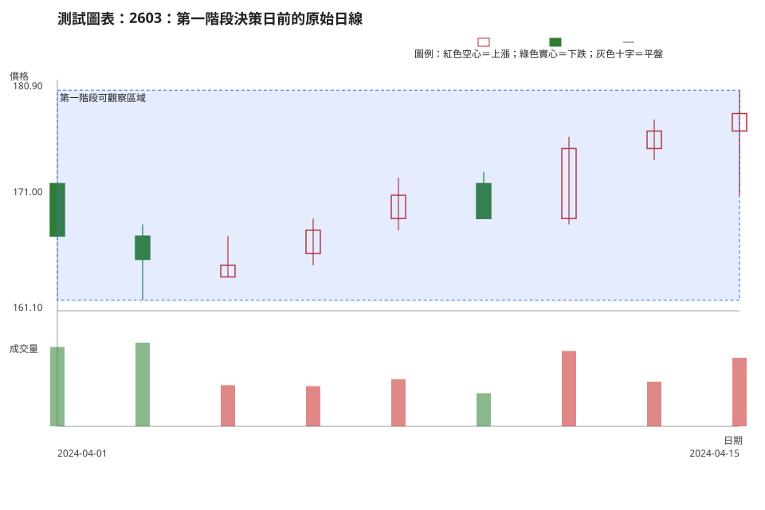
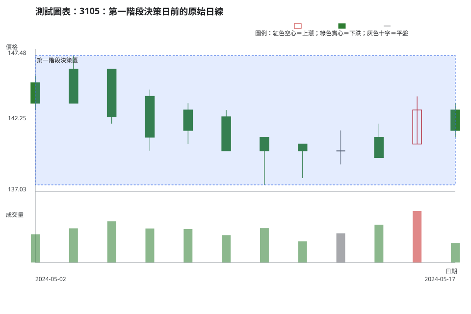
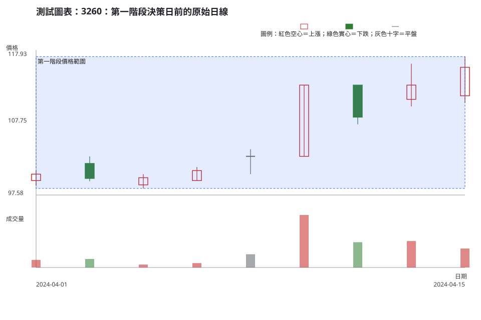
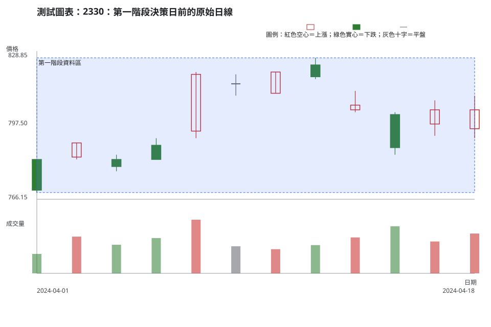
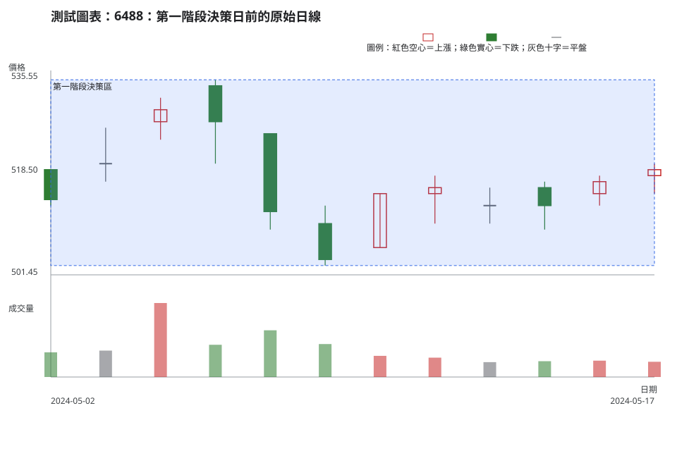

# 第 19 章：漸進式遮圖案例實驗室

## 學習指示

這五組練習只讓你在每一階段使用當時已揭露的官方原始日資料。先完成第一階段的八步判讀與交易計畫，再自行展開下一段資料；每次更新都要保留原計畫，另寫出「哪一項新觀察改變了什麼」，不能把後來價格倒灌成一開始早已知道的理由。

所有案例只作歷史練習，不是目前推薦；日資料沒有當時買賣價差、委託簿深度與實際成交衝擊時，這些缺口必須保留在答案裡。

## 八步判讀

**八步前置核對。**每一階段先核對市場、代號、原始價格、可見日期、公司行動與資料缺口，並確認只使用已完成日 K；較長週期必須另由完整日資料彙總，不另占八步。

1. **大方向**：以當階段可見資料分開描述方向、波動與流動性，不把日成交量當成流動性保證。
2. **所在位置**：以可回查的區域、波峰、波谷和收盤位置說明價格所在，而非指定一條必守單線。
3. **量價反應**：保留 OHLC、固定比較窗的成交量，以及價差、深度與成交衝擊等未知欄位。
4. **交易情境**：至少保留兩個可並存的條件式價格情境，另可有資料不足的不交易情境。
5. **觸發條件**：只以後續已完成日 K 的收盤、量價或可成交性條件觸發。
6. **失效條件**：每一情境都用可觀察的區域、結構或資料條件寫出失效。
7. **風險計算**：只有進場、失效、交易單位與成本資料足夠時才重算風險／部位；否則說明不能硬算。
8. **事後檢討**：保存每階段原計畫與新資料如何改變它，絕不讓後面資料改寫早期理由。

## 案例

### 第 1 組：2603 第一階段

**資料卡。**TWSE、2603、原始日線，圖表到 2024-04-15 為止。TWSE 2024 年 4 月除權息結果查詢未列出 2603，`corporate_actions` 因此為空陣列；仍須把重大訊息、價差與深度列為尚未取得的資料。

<!-- figure-spec
{
  "id": "ch19-replay-01",
  "kind": "historical",
  "title": "2603：第一階段決策日前的原始日線",
  "alt_text": "2603 於 2024 年 4 月 1 日至 4 月 15 日的官方原始日 K 線與成交量，圖表停在第一個決策日，不含右側資料。",
  "output": "assets/figures/ch19-replay-01.svg",
  "market": "TWSE",
  "symbol": "2603",
  "start": "2024-04-01",
  "end": "2024-04-15",
  "timeframe": "1d",
  "price_mode": "raw",
  "source_url": "https://www.twse.com.tw/rwd/zh/afterTrading/STOCK_DAY?response=json&date=20240401&stockNo=2603",
  "checked_on": "2026-08-10",
  "corporate_actions": [],
  "annotations": [
    {"type": "zone", "start": "2024-04-01", "end": "2024-04-15", "low": 162, "high": 180, "label": "第一階段可觀察區域"}
  ]
}
-->

完成第一階段作答後，展開參考計畫

**第一次完整計畫。**

**八步前置核對。**核對 TWSE、2603、原始價格、4/1–4/15 日期與空白公司行動欄位；公告、價差與深度尚未取得，且只用已完成日 K。

1. **大方向**：以一連串日內價格範圍描述方向與波動，不把日成交量直接當成流動性結論。
2. **所在位置**：把 162–180 元當待驗證價格範圍，不把任一數字寫成必守單線。
3. **量價反應**：記錄 4/15 OHLC 與前幾個波峰、波谷關係，先宣告比較窗再比較當日量；價差、深度與衝擊仍未知。
4. **交易情境**：保留「收盤守住近期區域」與「收盤回到較低區域」兩個分支。
5. **觸發條件**：各分支只在下一根完成日 K 符合預定收盤條件後觸發。
6. **失效條件**：收盤出現對應的反向區域條件，或資料缺口使前提不能確認時，該分支失效。
7. **風險計算**：未有失效距離、可用空間、成本與可成交性資料前，不計算部位。
8. **事後檢討**：保留第一階段原文，下一階段只記錄新 OHLC 與量價資料如何改變條件。

第二階段：展開 4/16–4/19 的官方增量資料後，再更新計畫

|日期|開|高|低|收|成交量（股）|
|---|---:|---:|---:|---:|---:|
|2024-04-16|176.50|177.50|170.00|170.50|36,614,682|
|2024-04-17|172.00|174.00|169.00|170.50|21,568,273|
|2024-04-18|170.50|172.00|168.00|168.00|19,546,370|
|2024-04-19|170.00|179.00|169.50|172.50|52,810,715|

保留第一次計畫原文，補寫新增 OHLC、量價比較與原觸發／失效是否仍成立；不要為任何方向給答案。

第三階段：展開 4/22–4/26 的官方增量資料後，第二次更新計畫

|日期|開|高|低|收|成交量（股）|
|---|---:|---:|---:|---:|---:|
|2024-04-22|175.00|183.00|174.00|174.00|65,454,817|
|2024-04-23|175.00|177.00|172.00|173.50|26,289,167|
|2024-04-24|176.00|180.50|173.50|180.00|37,500,744|
|2024-04-25|179.50|182.00|177.50|181.00|17,271,293|
|2024-04-26|182.00|190.00|180.50|187.00|62,830,211|

再次保留前兩版，明確指出哪些條件已觸發、失效或仍缺資料；不得用最後一列替第一階段改寫評語。

### 第 2 組：3105 第一階段

**資料卡。**TPEx、3105、原始日線，圖表到 2024-05-17。TPEx 2024 年 5 月除權息結果查詢未列出 3105；日成交量可供比較，但報價深度與成交衝擊仍未知。

<!-- figure-spec
{
  "id": "ch19-replay-02",
  "kind": "historical",
  "title": "3105：第一階段決策日前的原始日線",
  "alt_text": "3105 於 2024 年 5 月 2 日至 5 月 17 日的官方原始日 K 線與成交量，圖表停在第一個決策日，不含右側資料。",
  "output": "assets/figures/ch19-replay-02.svg",
  "market": "TPEX",
  "symbol": "3105",
  "start": "2024-05-02",
  "end": "2024-05-17",
  "timeframe": "1d",
  "price_mode": "raw",
  "source_url": "https://www.tpex.org.tw/www/zh-tw/afterTrading/tradingStock?date=2024%2F05%2F01&code=3105&response=json",
  "checked_on": "2026-08-10",
  "corporate_actions": [],
  "annotations": [
    {"type": "zone", "start": "2024-05-02", "end": "2024-05-17", "low": 137.5, "high": 147, "label": "第一階段決策區"}
  ]
}
-->

完成第一階段作答後，展開參考計畫

**第一次完整計畫。**

**八步前置核對。**確認 TPEx、3105、原始日線，4/30 以前不納入圖內；以日線寫觸發，較長週期須另由完整日資料彙總，公告與深度資料仍有缺口。

1. **大方向**：把方向、波動、流動性分開記錄，暫不給任何一面向保證式標籤。
2. **所在位置**：觀察 137.5–147 元內反覆反應，邊界是區域而非單價。
3. **量價反應**：列出 5/17 OHLC、近期高低點與收盤位置，以事前固定窗比較成交量；日資料不能回答價差與深度。
4. **交易情境**：保留收盤離開區域上側、收盤離開區域下側與仍留在區域的三個分支。
5. **觸發條件**：上、下側分支只在完成日線收盤離開對應區域，且量價比較完成後觸發。
6. **失效條件**：離開後收盤回到區內，或資料缺口使該分支無法執行時，對應分支失效。
7. **風險計算**：邊界太近、成本與流動性未知，或收盤仍在區內時不建立可計算部位。
8. **事後檢討**：保留三個分支，逐項對照新資料是觸發、失效或仍有缺口。

第二階段：展開 5/20–5/24 的官方增量資料後，再更新計畫

|日期|開|高|低|收|成交量（股）|
|---|---:|---:|---:|---:|---:|
|2024-05-20|142.50|143.50|141.50|142.50|1,512,000|
|2024-05-21|142.50|143.50|140.00|140.50|1,332,000|
|2024-05-22|142.00|145.00|141.00|142.50|2,451,000|
|2024-05-23|143.00|143.00|140.50|140.50|1,453,000|
|2024-05-24|139.50|140.50|138.00|140.00|964,000|

更新時要保留第一次的三個分支，逐項核對觸發、失效與資料缺口；不提供答案。

第三階段：展開 5/27–5/31 的官方增量資料後，第二次更新計畫

|日期|開|高|低|收|成交量（股）|
|---|---:|---:|---:|---:|---:|
|2024-05-27|140.50|142.00|140.00|141.50|1,144,000|
|2024-05-28|142.00|145.00|142.00|143.50|2,302,000|
|2024-05-29|144.00|145.50|143.50|144.50|1,588,000|
|2024-05-30|143.00|143.50|141.50|142.50|1,574,000|
|2024-05-31|143.00|144.00|141.50|141.50|1,493,000|

第二次更新只評估當時資料是否改變條件式計畫，仍不可假設可按圖上價格成交。

### 第 3 組：3260 第一階段

**資料卡。**TPEx、3260、原始日線，圖表到 2024-04-15。TPEx 2024 年 4 月除權息結果查詢未列出 3260；本題先以日線資料完成計畫，不替公司事件補原因。

<!-- figure-spec
{
  "id": "ch19-replay-03",
  "kind": "historical",
  "title": "3260：第一階段決策日前的原始日線",
  "alt_text": "3260 於 2024 年 4 月 1 日至 4 月 15 日的官方原始日 K 線與成交量，圖表停在第一個決策日，不含右側資料。",
  "output": "assets/figures/ch19-replay-03.svg",
  "market": "TPEX",
  "symbol": "3260",
  "start": "2024-04-01",
  "end": "2024-04-15",
  "timeframe": "1d",
  "price_mode": "raw",
  "source_url": "https://www.tpex.org.tw/www/zh-tw/afterTrading/tradingStock?date=2024%2F04%2F01&code=3260&response=json",
  "checked_on": "2026-08-10",
  "corporate_actions": [],
  "annotations": [
    {"type": "zone", "start": "2024-04-01", "end": "2024-04-15", "low": 98.5, "high": 117, "label": "第一階段價格範圍"}
  ]
}
-->

完成第一階段作答後，展開參考計畫

**第一次完整計畫。**

**八步前置核對。**確認 TPEx、3260、4/1–4/15 原始 OHLCV 與空白公司行動欄位；只用完成日 K，不把盤中觸及當收盤確認。

1. **大方向**：分開寫價格結構、日內範圍與量能；流動性仍少價差、深度與衝擊資料。
2. **所在位置**：用 98.5–117 元資料範圍做候選關鍵區域，仍要等收盤驗證。
3. **量價反應**：逐一寫 4/10、4/11、4/12、4/15 的 OHLC 與實體／影線，把 4/10–4/15 成交量放進先定義比較窗，不把高量直接翻譯成意圖。
4. **交易情境**：保留守住近期區域與收盤回到區域內兩種情境。
5. **觸發條件**：兩種情境都用下一根完成日 K 的可觀察收盤條件觸發。
6. **失效條件**：收盤出現反向區域條件，或事件資料推翻原前提時，該情境失效。
7. **風險計算**：失效距離、成本、可成交性或事件資訊不足時，不能硬算部位。
8. **事後檢討**：保留第一階段觀察，標明新資料讓哪個條件需要重估，而非改寫成第一階段的預言。

第二階段：展開 4/16–4/19 的官方增量資料後，再更新計畫

|日期|開|高|低|收|成交量（股）|
|---|---:|---:|---:|---:|---:|
|2024-04-16|112.00|113.00|104.00|104.00|29,321,000|
|2024-04-17|105.50|106.00|102.50|103.50|14,641,000|
|2024-04-18|102.00|103.00|99.90|102.50|8,812,000|
|2024-04-19|100.00|101.50|94.00|96.20|16,273,000|

保留第一階段的原觸發與失效，寫出新資料讓哪個條件需要重估；不提供評語。

第三階段：展開 4/22–4/26 的官方增量資料後，第二次更新計畫

|日期|開|高|低|收|成交量（股）|
|---|---:|---:|---:|---:|---:|
|2024-04-22|96.30|97.60|93.10|93.10|9,035,000|
|2024-04-23|94.60|95.20|93.10|94.50|4,824,000|
|2024-04-24|96.00|101.00|96.00|99.50|12,067,000|
|2024-04-25|99.70|101.00|98.20|98.70|5,334,000|
|2024-04-26|99.90|100.50|99.00|99.10|4,052,000|

第二次更新應分開記錄觀察、可能解讀與不交易條件；不可把已揭露資料改寫成第一階段的預言。

### 第 4 組：2330 第一階段

**資料卡。**TWSE、2330、原始日線，圖表到 2024-04-18。TWSE 2024 年 4 月除權息結果查詢未列出 2330；圖表資料仍沒有價差、深度與實際成交衝擊。

<!-- figure-spec
{
  "id": "ch19-replay-04",
  "kind": "historical",
  "title": "2330：第一階段決策日前的原始日線",
  "alt_text": "2330 於 2024 年 4 月 1 日至 4 月 18 日的官方原始日 K 線與成交量，圖表停在第一個決策日，不含右側資料。",
  "output": "assets/figures/ch19-replay-04.svg",
  "market": "TWSE",
  "symbol": "2330",
  "start": "2024-04-01",
  "end": "2024-04-18",
  "timeframe": "1d",
  "price_mode": "raw",
  "source_url": "https://www.twse.com.tw/rwd/zh/afterTrading/STOCK_DAY?response=json&date=20240401&stockNo=2330",
  "checked_on": "2026-08-10",
  "corporate_actions": [],
  "annotations": [
    {"type": "zone", "start": "2024-04-01", "end": "2024-04-18", "low": 769, "high": 826, "label": "第一階段資料區"}
  ]
}
-->

完成第一階段作答後，展開參考計畫

**第一次完整計畫。**

**八步前置核對。**確認 TWSE、2330、原始日線、4/1–4/18 期間與未列出的公司行動；只以已完成日 K 設定條件，不把未完成週混入比較。

1. **大方向**：以方向、日內範圍與可取得成交量分別記錄，不把它們合成單一結論。
2. **所在位置**：把 769–826 元標成範圍，並記錄決策日靠近何處。
3. **量價反應**：列出 4/16、4/17、4/18 OHLC 與相對高低點，選定不含目標日的回看窗比較 4/18，並明示可成交性資訊仍缺。
4. **交易情境**：為收盤離開範圍上側、收盤離開範圍下側與範圍內等待各保留一組條件。
5. **觸發條件**：只有完成日 K 收盤離開對應範圍，且量價比較完成時，才觸發上側或下側分支。
6. **失效條件**：收盤回到區內、公司行動或資料品質推翻前提時，該離開分支失效。
7. **風險計算**：日內範圍、成本、滑價或深度無法納入時，不能可靠計算可執行部位。
8. **事後檢討**：第二階段先比較範圍、OHLC 與事前量能口徑，再記錄原失效與不交易條件是否改變。

第二階段：展開 4/19–4/22 的官方增量資料後，再更新計畫

|日期|開|高|低|收|成交量（股）|
|---|---:|---:|---:|---:|---:|
|2024-04-19|769.00|770.00|746.00|750.00|143,868,560|
|2024-04-22|740.00|757.00|740.00|742.00|52,354,944|

更新時先比較範圍、OHLC 與事前量能口徑，再重新判斷原本的失效與不交易條件；不提供答案。

第三階段：展開 4/23–4/26 的官方增量資料後，第二次更新計畫

|日期|開|高|低|收|成交量（股）|
|---|---:|---:|---:|---:|---:|
|2024-04-23|761.00|761.00|752.00|754.00|32,067,682|
|2024-04-24|770.00|785.00|769.00|783.00|41,652,749|
|2024-04-25|770.00|774.00|765.00|766.00|30,492,037|
|2024-04-26|788.00|789.00|782.00|782.00|34,721,905|

第二次更新必須保留先前版本與理由，只用這一階段可見資料評估新情境。

### 第 5 組：6488 第一階段

**資料卡。**TPEx、6488、原始日線，圖表到 2024-05-17。TPEx 2024 年 5 月除權息結果查詢未列出 6488；成交量資料不能替代買賣價差、深度、下單量與滑價資料。

<!-- figure-spec
{
  "id": "ch19-replay-05",
  "kind": "historical",
  "title": "6488：第一階段決策日前的原始日線",
  "alt_text": "6488 於 2024 年 5 月 2 日至 5 月 17 日的官方原始日 K 線與成交量，圖表停在第一個決策日，不含右側資料。",
  "output": "assets/figures/ch19-replay-05.svg",
  "market": "TPEX",
  "symbol": "6488",
  "start": "2024-05-02",
  "end": "2024-05-17",
  "timeframe": "1d",
  "price_mode": "raw",
  "source_url": "https://www.tpex.org.tw/www/zh-tw/afterTrading/tradingStock?date=2024%2F05%2F01&code=6488&response=json",
  "checked_on": "2026-08-10",
  "corporate_actions": [],
  "annotations": [
    {"type": "zone", "start": "2024-05-02", "end": "2024-05-17", "low": 503, "high": 534, "label": "第一階段決策區"}
  ]
}
-->

完成第一階段作答後，展開參考計畫

**第一次完整計畫。**

**八步前置核對。**核對 TPEx、6488、原始日線、公司行動查詢與未取得公告細節；本題使用日線，任何週線結論要先另做完整週彙總。

1. **大方向**：分開描述價格結構、波動與日資料可見成交量，流動性只可標示未知。
2. **所在位置**：以 503–534 元作為候選觀察範圍，並記錄 5/17 收盤所在位置。
3. **量價反應**：列出 5/6–5/17 波峰、波谷與實體／影線，以先定義回看窗描述量能；價差、深度、成交頻率與衝擊資料仍缺。
4. **交易情境**：寫出至少兩種價格分支及一個資料不足分支，不替波形命名成結果。
5. **觸發條件**：所有價格分支都只以可觀察的完成日 K 與量價條件觸發。
6. **失效條件**：每個分支都寫出反向區域、結構或資料品質條件，使其可觀察地失效。
7. **風險計算**：可成交性缺口、失效距離太大、成本未知或條件未觸發時，不建立可執行部位。
8. **事後檢討**：第二次更新只比較原計畫與新增事實，缺少可成交性資料時仍保留不交易。

第二階段：展開 5/20–5/24 的官方增量資料後，再更新計畫

|日期|開|高|低|收|成交量（股）|
|---|---:|---:|---:|---:|---:|
|2024-05-20|522.00|525.00|518.00|524.00|1,098,000|
|2024-05-21|523.00|523.00|513.00|517.00|1,051,000|
|2024-05-22|520.00|521.00|516.00|520.00|847,000|
|2024-05-23|521.00|521.00|516.00|520.00|791,000|
|2024-05-24|518.00|525.00|514.00|525.00|1,347,000|

保留第一次計畫，補上增量 OHLCV、已觸發或失效的條件與仍不能推論的流動性欄位；不提供答案。

第三階段：展開 5/27–5/31 的官方增量資料後，第二次更新計畫

|日期|開|高|低|收|成交量（股）|
|---|---:|---:|---:|---:|---:|
|2024-05-27|528.00|530.00|523.00|526.00|962,000|
|2024-05-28|526.00|532.00|525.00|530.00|1,377,000|
|2024-05-29|530.00|533.00|526.00|527.00|1,529,000|
|2024-05-30|524.00|525.00|518.00|521.00|1,212,000|
|2024-05-31|524.00|532.00|521.00|527.00|2,725,000|

第二次更新只比較原計畫與新增事實；即使價格條件變動，缺少可成交性資料時仍要能寫出不交易。

## 評分

每組各 10 分，每一項 1 分；評的是在該階段是否完成決策流程，不評後來方向、獲利、型態名稱或是否猜中。

1. 八步前置核對有可回查的 OHLCV、日期、原始價格、公司行動與時間週期。
2. **大方向**分開描述方向、波動與流動性，不作保證式標籤。
3. **所在位置**以可回查區域、波峰、波谷或收盤位置表示。
4. **量價反應**保留比較窗、OHLCV 與可成交性未知欄位。
5. **交易情境**至少列出兩個條件式分支。
6. **觸發條件**與**失效條件**各自可觀察，且不混為同一敘述。
7. **風險計算**依[附錄 B](appendix-b-formulas-and-worksheets.md)重算風險／部位，或明確指出缺少哪些欄位而不能硬算。
8. **事後檢討**保留第一階段計畫，清楚寫出新資料改變了什麼。
9. 分開市場資料、公告／制度、教材慣例與可能解讀，不以後見資料改寫早期計畫。
10. 八步內容彼此一致，更新理由能對回新揭露資料。

第二、三階段是對第一階段的**後見資料檢討**：它們只用來評估更新計畫的品質，不能改變第一階段原本的分數。

第 1 組的參考檢討

第一階段可描述 4/1–4/15 的可觀察價格範圍與已宣告量價比較，但不能把它當成單一路徑。第二階段讓原先「守住近期區域」分支需要重新檢查；第三階段可再次檢查收盤、比較窗與失效界線。滿分答案保留最初的失效條件、清楚寫出新資料如何改變條件，並在價差、深度與成本未補齊時不宣稱可執行。

第 2 組的參考檢討

第一階段應將 137.5–147 元寫成區域，並允許上側、下側與留在區內三個分支。第二、三階段資料可用來重做收盤與量能比較；合理答案可以始終選擇不交易，理由是收盤條件、可用空間或流動性欄位尚不足，而不是因為事後替資料命名。

第 3 組的參考檢討

第一階段不應把單一明顯日或成交量直接寫成結論。第二階段若發生與原計畫不同的收盤位置，應依事前失效口徑把舊分支降級；第三階段可以重建候選區域，但不能聲稱第一階段已知道後面的資料。風險距離與可成交性未明時，不交易可得滿分。

第 4 組的參考檢討

第一階段完整答案先把 769–826 元、日線、量價比較窗與流動性未知寫清楚。第二階段要求重新檢查日內範圍與事前失效；第三階段則再依新的完成日 K 更新情境。分數只看條件是否事先可檢查、是否保留成本與滑價限制，不看任何後見方向。

第 5 組的參考檢討

本組的第一階段合理答案可直接選擇不交易：日成交量不足以確認價差、深度、預計下單量與成交衝擊。後兩階段即使提供更多 OHLCV，也不能填補這些可成交性欄位；滿分重點是把資料不足寫成具體放棄交易條件，並保留兩種價格情境而不把其中一種包裝為保證。

## 來源

- **TWSE 日成交資料**：[2603 2024 年 4 月](https://www.twse.com.tw/rwd/zh/afterTrading/STOCK_DAY?response=json&date=20240401&stockNo=2603)、[2330 2024 年 4 月](https://www.twse.com.tw/rwd/zh/afterTrading/STOCK_DAY?response=json&date=20240401&stockNo=2330)。
- **TPEx 日成交資料**：[3105 2024 年 5 月](https://www.tpex.org.tw/www/zh-tw/afterTrading/tradingStock?date=2024%2F05%2F01&code=3105&response=json)、[3260 2024 年 4 月](https://www.tpex.org.tw/www/zh-tw/afterTrading/tradingStock?date=2024%2F04%2F01&code=3260&response=json)、[6488 2024 年 5 月](https://www.tpex.org.tw/www/zh-tw/afterTrading/tradingStock?date=2024%2F05%2F01&code=6488&response=json)。
- **公司行動查核**：[TWSE 2024 年 4 月除權息結果](https://www.twse.com.tw/rwd/zh/exRight/TWT49U?response=json&startDate=20240401&endDate=20240430)、[TPEx 2024 年 5 月除權息結果](https://www.tpex.org.tw/www/zh-tw/bulletin/exDailyQ?response=json&startDate=2024%2F05%2F01&endDate=2024%2F05%2F31)、[TPEx 2024 年 4 月除權息結果](https://www.tpex.org.tw/www/zh-tw/bulletin/exDailyQ?response=json&startDate=2024%2F04%2F01&endDate=2024%2F04%2F30)。
- **公告交叉查核**：[公開資訊觀測站「公告快易查」](https://mopsov.twse.com.tw/mops/web/ezsearch)。所有來源在 2026-08-10 查核；第二、三階段表格均由同一官方原始日資料重算。
