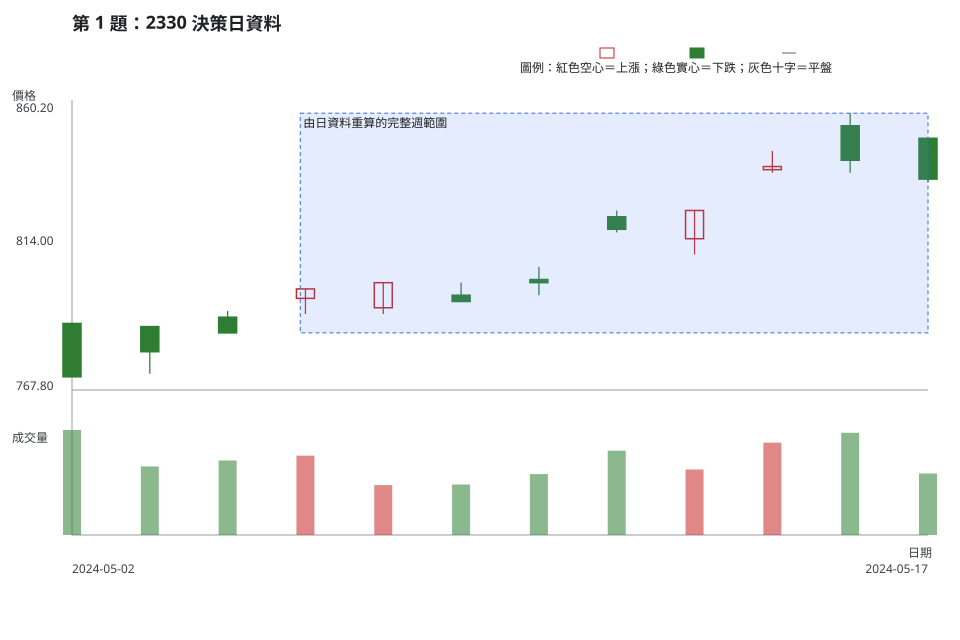
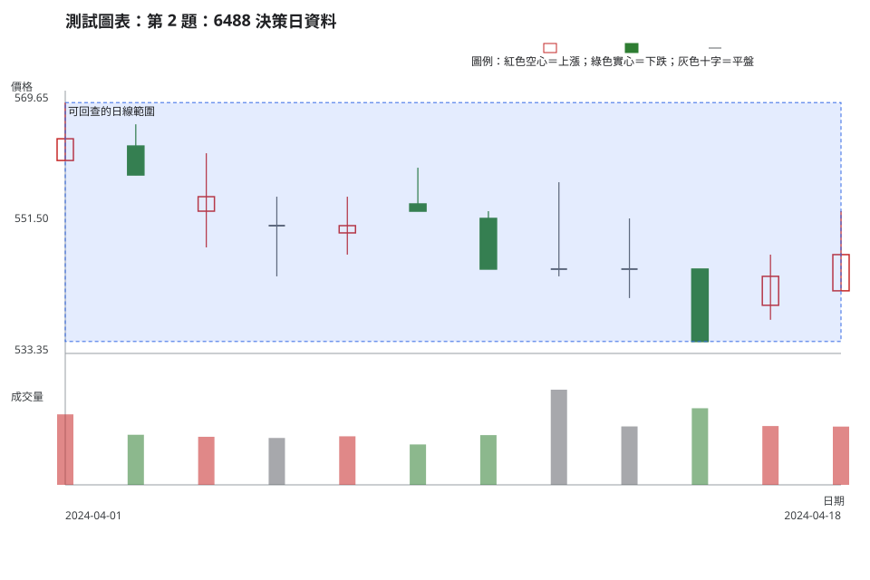
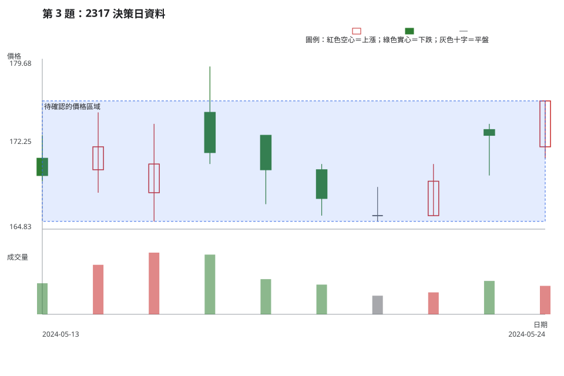
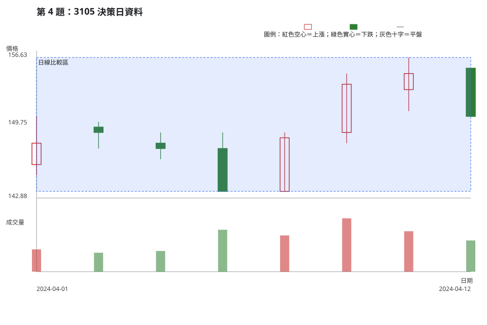
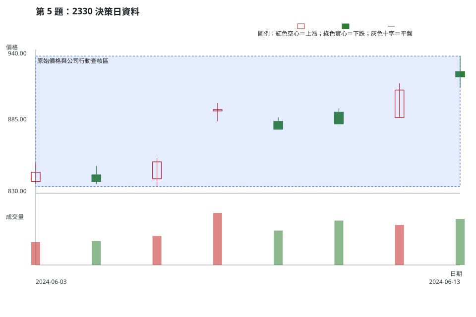
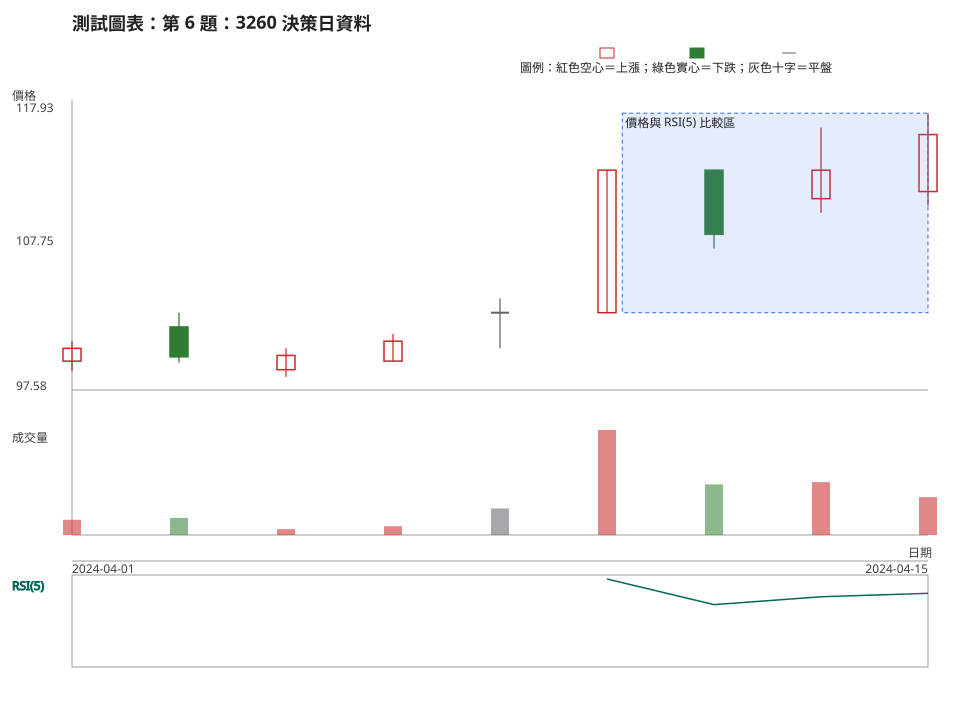
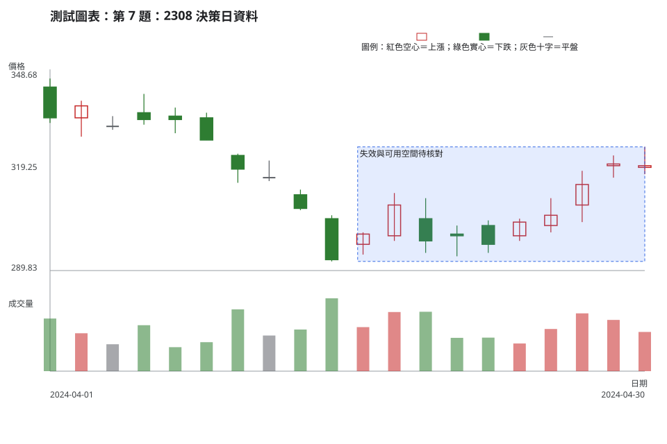
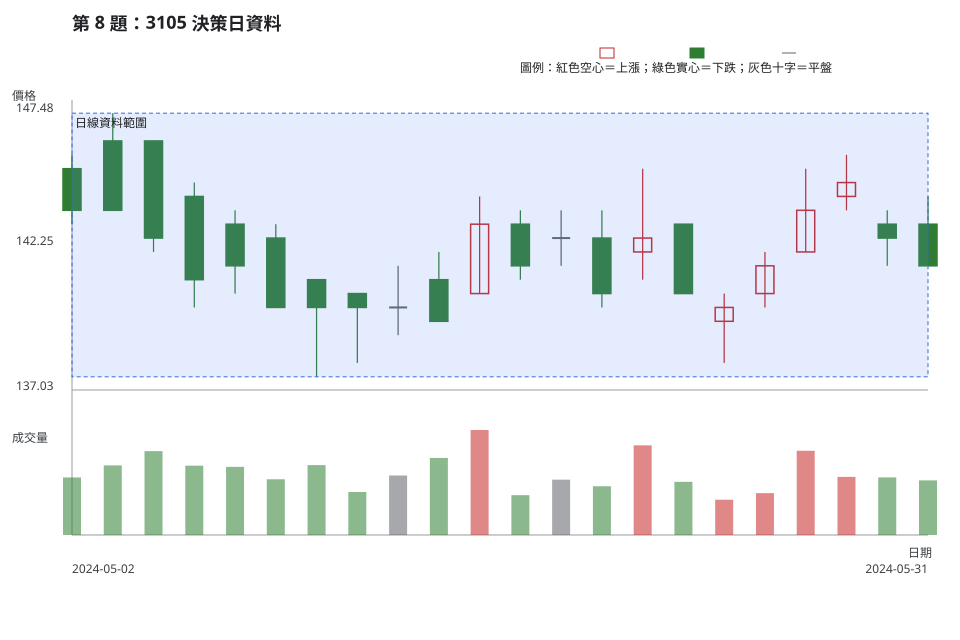
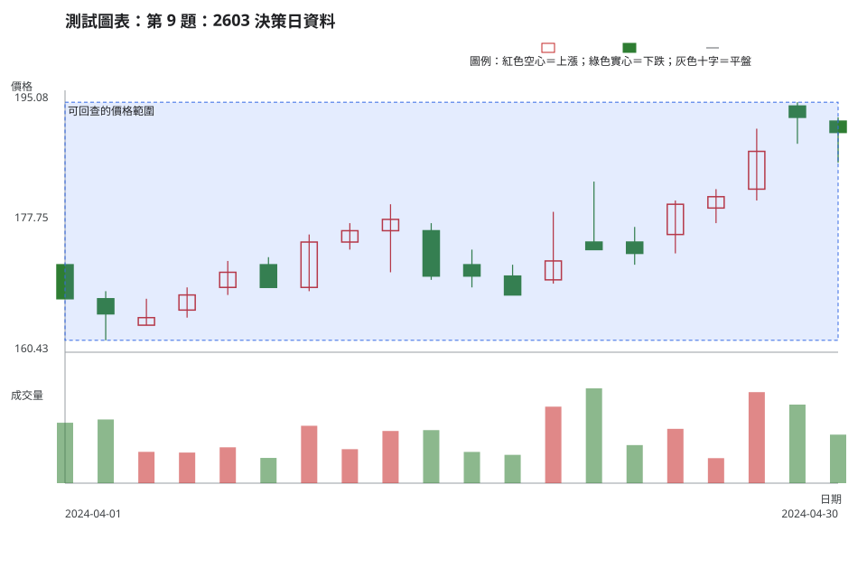
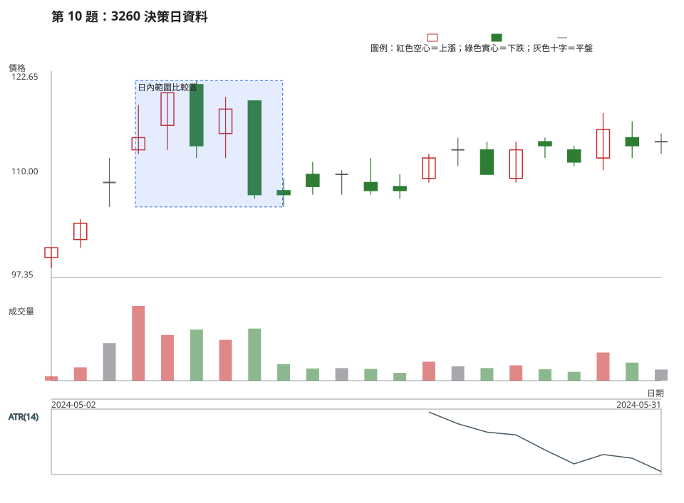

# 第 20 章：十組綜合案例與能力驗收

## 學習指示

先連續完成十題，再進入「評分」展開各題答案。每題都要走完八步：資料有效性、時間週期、市場狀態、位置、K 線／結構、量價關係／流動性、情境／觸發／失效、風險／放棄交易條件。

每一題交付時，請把市場資料、公司行動／制度查核、教材慣例與可能解讀分開寫。至少提出兩個條件式情境；觸發與失效都要能從後續已完成 K 線或可查資料辨識。需要計算時，使用[附錄 B](appendix-b-formulas-and-worksheets.md)的公式；題內的帳戶風險額、進場、失效價與最小單位都只是教材參數，並非推薦。正確答案可以是「不交易」或「資料不足，不能硬算」。

## 案例

### 第 1 題：2330 的日線執行與週線脈絡

**資料卡。**TWSE、2330、2024-05-02 至 2024-05-17、原始日線。TWSE 5 月除權息結果未列出 2330。以下兩個完整週必須由同一份日資料彙總，不可把日 K 直接叫週 K：5/6–5/10 的開／高／低／收／量為 791／807／786／802／142,661,210；5/13–5/17 為 823／856／811／835／183,748,952。規則是首個交易日開盤、區間最高／最低、最後交易日收盤、成交量加總。

<!-- figure-spec
{
  "id": "ch20-case-01",
  "kind": "historical",
  "title": "第 1 題：2330 決策日資料",
  "alt_text": "第 1 題的 2330 官方原始日 K 線與成交量，資料範圍為 2024 年 5 月 2 日至決策日 5 月 17 日，沒有右側資料。",
  "output": "assets/figures/ch20-case-01.svg",
  "market": "TWSE",
  "symbol": "2330",
  "start": "2024-05-02",
  "end": "2024-05-17",
  "timeframe": "1d",
  "price_mode": "raw",
  "source_url": "https://www.twse.com.tw/rwd/zh/afterTrading/STOCK_DAY?response=json&date=20240501&stockNo=2330",
  "checked_on": "2026-08-10",
  "corporate_actions": [],
  "annotations": [
    {"type": "zone", "start": "2024-05-06", "end": "2024-05-17", "low": 786, "high": 856, "label": "由日資料重算的完整週範圍"}
  ]
}
-->

依八步完成日線執行計畫，並把兩個完整週的彙總當較長週期背景。教材參數：計畫貨幣風險 1,000 元、假設進場 842 元、失效 821 元、最小單位 1 股；另寫出未取得的成本與可成交性資料。

### 第 2 題：6488 的結構與資料不足

**資料卡。**TPEx、6488、2024-04-01 至 2024-04-18、原始日線。TPEx 4 月除權息結果未列出 6488。圖表中可核對 OHLCV，但沒有公告內容、買賣價差、深度、預計下單量與成交衝擊。

<!-- figure-spec
{
  "id": "ch20-case-02",
  "kind": "historical",
  "title": "第 2 題：6488 決策日資料",
  "alt_text": "第 2 題的 6488 官方原始日 K 線與成交量，資料範圍為 2024 年 4 月 1 日至決策日 4 月 18 日，沒有右側資料。",
  "output": "assets/figures/ch20-case-02.svg",
  "market": "TPEX",
  "symbol": "6488",
  "start": "2024-04-01",
  "end": "2024-04-18",
  "timeframe": "1d",
  "price_mode": "raw",
  "source_url": "https://www.tpex.org.tw/www/zh-tw/afterTrading/tradingStock?date=2024%2F04%2F01&code=6488&response=json",
  "checked_on": "2026-08-10",
  "corporate_actions": [],
  "annotations": [
    {"type": "zone", "start": "2024-04-01", "end": "2024-04-18", "low": 535, "high": 568, "label": "可回查的日線範圍"}
  ]
}
-->

依八步描述日線結構與位置，提出一個等待收盤確認的分支及一個不交易分支。若要計算部位，先列出資料不足的欄位，不能自行假定成交品質。

### 第 3 題：2317 的區域判讀

**資料卡。**TWSE、2317、2024-05-13 至 2024-05-24、原始日線。TWSE 5 月除權息結果未列出 2317。請以至少兩次可辨識的上、下側反應檢查區域是否足夠成立，不要先假定離開區域的方向。

<!-- figure-spec
{
  "id": "ch20-case-03",
  "kind": "historical",
  "title": "第 3 題：2317 決策日資料",
  "alt_text": "第 3 題的 2317 官方原始日 K 線與成交量，資料範圍為 2024 年 5 月 13 日至決策日 5 月 24 日，沒有右側資料。",
  "output": "assets/figures/ch20-case-03.svg",
  "market": "TWSE",
  "symbol": "2317",
  "start": "2024-05-13",
  "end": "2024-05-24",
  "timeframe": "1d",
  "price_mode": "raw",
  "source_url": "https://www.twse.com.tw/rwd/zh/afterTrading/STOCK_DAY?response=json&date=20240501&stockNo=2317",
  "checked_on": "2026-08-10",
  "corporate_actions": [],
  "annotations": [
    {"type": "zone", "start": "2024-05-13", "end": "2024-05-24", "low": 165.5, "high": 176, "label": "待確認的價格區域"}
  ]
}
-->

依八步建立區域上側、區域下側與區域內等待三個分支。教材參數：計畫貨幣風險 800 元、假設進場 176.50 元、失效 165.50 元、最小單位 1 股；計算後仍要列出成本、滑價與流動性限制。

### 第 4 題：3105 的量價比較窗

**資料卡。**TPEx、3105、2024-04-01 至 2024-04-12、原始日線。TPEx 4 月除權息結果未列出 3105。若使用「量能增加」字樣，必須先固定一個不含目標日的同標的、同週期比較窗與統計量。

<!-- figure-spec
{
  "id": "ch20-case-04",
  "kind": "historical",
  "title": "第 4 題：3105 決策日資料",
  "alt_text": "第 4 題的 3105 官方原始日 K 線與成交量，資料範圍為 2024 年 4 月 1 日至決策日 4 月 12 日，沒有右側資料。",
  "output": "assets/figures/ch20-case-04.svg",
  "market": "TPEX",
  "symbol": "3105",
  "start": "2024-04-01",
  "end": "2024-04-12",
  "timeframe": "1d",
  "price_mode": "raw",
  "source_url": "https://www.tpex.org.tw/www/zh-tw/afterTrading/tradingStock?date=2024%2F04%2F01&code=3105&response=json",
  "checked_on": "2026-08-10",
  "corporate_actions": [],
  "annotations": [
    {"type": "zone", "start": "2024-04-01", "end": "2024-04-12", "low": 143.5, "high": 156, "label": "日線比較區"}
  ]
}
-->

依八步完成本題，特別寫出量價比較窗、兩個情境、觸發和失效。若沒有價差與深度，說明這會如何限制任何部位計算或交易決定。

### 第 5 題：2330 的公司行動查核

**資料卡。**TWSE、2330、2024-06-03 至 2024-06-13、原始日線。TWSE 除權息結果列示 2024-06-13 為現金股利除息日：除息前收盤 909.00 元、參考價 905.50 元、息值 3.499789 元。這是公司行動機制資料，不是價格變化的單一原因；公告發布時間仍要以 MOPS 查核。

<!-- figure-spec
{
  "id": "ch20-case-05",
  "kind": "historical",
  "title": "第 5 題：2330 決策日資料",
  "alt_text": "第 5 題的 2330 官方原始日 K 線與成交量，資料範圍為 2024 年 6 月 3 日至決策日 6 月 13 日，沒有右側資料。",
  "output": "assets/figures/ch20-case-05.svg",
  "market": "TWSE",
  "symbol": "2330",
  "start": "2024-06-03",
  "end": "2024-06-13",
  "timeframe": "1d",
  "price_mode": "raw",
  "source_url": "https://www.twse.com.tw/rwd/zh/afterTrading/STOCK_DAY?response=json&date=20240601&stockNo=2330",
  "checked_on": "2026-08-10",
  "corporate_actions": ["2024-06-13 現金股利除息；TWSE 結果列示除息前收盤 909.00 元、參考價 905.50 元、息值 3.499789 元。"],
  "annotations": [
    {"type": "zone", "start": "2024-06-03", "end": "2024-06-13", "low": 835, "high": 935, "label": "原始價格與公司行動查核區"}
  ]
}
-->

依八步完成本題，將 OHLCV、除息結果、MOPS 公告查核與可能解讀分欄。資料尚未提供可執行的事件時間、價差與深度時，滿分答案可以拒絕硬算部位並選擇等待。

### 第 6 題：3260 的 RSI 分歧候選

**資料卡。**TPEx、3260、2024-04-01 至 2024-04-15、原始日線，使用同一份原始資料計算 RSI(5)。4/10 收盤 113.00 元、RSI(5) 約 95.6204；4/15 收盤 115.50 元、RSI(5) 約 80.0730。這是可重算的指標與價格關係候選，不是方向保證。TPEx 4 月除權息結果未列出 3260。

<!-- figure-spec
{
  "id": "ch20-case-06",
  "kind": "historical",
  "title": "第 6 題：3260 決策日資料",
  "alt_text": "第 6 題的 3260 官方原始日 K 線、成交量與 RSI(5)，資料範圍為 2024 年 4 月 1 日至決策日 4 月 15 日，沒有右側資料。",
  "output": "assets/figures/ch20-case-06.svg",
  "market": "TPEX",
  "symbol": "3260",
  "start": "2024-04-01",
  "end": "2024-04-15",
  "timeframe": "1d",
  "price_mode": "raw",
  "source_url": "https://www.tpex.org.tw/www/zh-tw/afterTrading/tradingStock?date=2024%2F04%2F01&code=3260&response=json",
  "checked_on": "2026-08-10",
  "corporate_actions": [],
  "indicators": [{"type": "rsi", "period": 5}],
  "annotations": [
    {"type": "zone", "start": "2024-04-10", "end": "2024-04-15", "low": 103, "high": 117, "label": "價格與 RSI(5) 比較區"}
  ]
}
-->

依八步完成本題。教材參數：計畫貨幣風險 600 元、假設進場 116 元、失效 104 元、最小單位 1 股。說明 RSI(5) 如何只改變需要查核的條件，不能取代價格結構、觸發、失效與不交易條件。

### 第 7 題：2308 的風險距離

**資料卡。**TWSE、2308、2024-04-01 至 2024-04-30、原始日線。TWSE 4 月除權息結果未列出 2308。這一題把部位算式與結構失效分開：假設價格條件後才考慮進場，不能因為想買而移動失效點。

<!-- figure-spec
{
  "id": "ch20-case-07",
  "kind": "historical",
  "title": "第 7 題：2308 決策日資料",
  "alt_text": "第 7 題的 2308 官方原始日 K 線與成交量，資料範圍為 2024 年 4 月 1 日至決策日 4 月 30 日，沒有右側資料。",
  "output": "assets/figures/ch20-case-07.svg",
  "market": "TWSE",
  "symbol": "2308",
  "start": "2024-04-01",
  "end": "2024-04-30",
  "timeframe": "1d",
  "price_mode": "raw",
  "source_url": "https://www.twse.com.tw/rwd/zh/afterTrading/STOCK_DAY?response=json&date=20240401&stockNo=2308",
  "checked_on": "2026-08-10",
  "corporate_actions": [],
  "annotations": [
    {"type": "zone", "start": "2024-04-16", "end": "2024-04-30", "low": 292.5, "high": 326, "label": "失效與可用空間待核對"}
  ]
}
-->

依八步完成本題。教材參數：計畫貨幣風險 20 元、假設進場 321 元、失效 292.50 元、最小單位 1 股。按附錄 B 先計算每股風險、未取整股數、向下取整後股數與取整後風險；若連 1 股都超過題設風險額，寫出放棄交易原因。這是風險上限練習，不是在描述市場的委託單位。

### 第 8 題：3105 的可成交性缺口

**資料卡。**TPEx、3105、2024-05-02 至 2024-05-31、原始日線。TPEx 5 月除權息結果未列出 3105。圖中有日成交量，卻沒有買賣價差、深度、成交頻率、預計下單量與成交衝擊；不要把這些未知欄位用成交量補上。

<!-- figure-spec
{
  "id": "ch20-case-08",
  "kind": "historical",
  "title": "第 8 題：3105 決策日資料",
  "alt_text": "第 8 題的 3105 官方原始日 K 線與成交量，資料範圍為 2024 年 5 月 2 日至決策日 5 月 31 日，沒有右側資料。",
  "output": "assets/figures/ch20-case-08.svg",
  "market": "TPEX",
  "symbol": "3105",
  "start": "2024-05-02",
  "end": "2024-05-31",
  "timeframe": "1d",
  "price_mode": "raw",
  "source_url": "https://www.tpex.org.tw/www/zh-tw/afterTrading/tradingStock?date=2024%2F05%2F01&code=3105&response=json",
  "checked_on": "2026-08-10",
  "corporate_actions": [],
  "annotations": [
    {"type": "zone", "start": "2024-05-02", "end": "2024-05-31", "low": 137.5, "high": 147, "label": "日線資料範圍"}
  ]
}
-->

依八步完成本題。答案必須列出至少四個與可成交性有關、但題目未提供的欄位，並將資料不足寫成一個明確不交易條件。

### 第 9 題：2603 的條件式延續計畫

**資料卡。**TWSE、2603、2024-04-01 至 2024-04-30、原始日線。TWSE 4 月除權息結果未列出 2603。請用可回查的波峰、波谷、價格範圍和量價比較窗建立條件，不以單一型態名稱替代計畫。

<!-- figure-spec
{
  "id": "ch20-case-09",
  "kind": "historical",
  "title": "第 9 題：2603 決策日資料",
  "alt_text": "第 9 題的 2603 官方原始日 K 線與成交量，資料範圍為 2024 年 4 月 1 日至決策日 4 月 30 日，沒有右側資料。",
  "output": "assets/figures/ch20-case-09.svg",
  "market": "TWSE",
  "symbol": "2603",
  "start": "2024-04-01",
  "end": "2024-04-30",
  "timeframe": "1d",
  "price_mode": "raw",
  "source_url": "https://www.twse.com.tw/rwd/zh/afterTrading/STOCK_DAY?response=json&date=20240401&stockNo=2603",
  "checked_on": "2026-08-10",
  "corporate_actions": [],
  "annotations": [
    {"type": "zone", "start": "2024-04-01", "end": "2024-04-30", "low": 162, "high": 193.5, "label": "可回查的價格範圍"}
  ]
}
-->

依八步完成本題。教材參數：計畫貨幣風險 800 元、假設進場 193.50 元、失效 174 元、最小單位 1 股。除算式外，還要寫至少一個不交易條件與一個和量價比較窗有關的失效條件。

### 第 10 題：3260 的波動與 ATR

**資料卡。**TPEx、3260、2024-05-02 至 2024-05-31、原始日線，同一份資料計算 ATR(14)。第一個可繪製 ATR 值在 5/21，約為 5.8571；5/31 約為 4.9999。ATR 描述幅度，不提供方向。TPEx 5 月除權息結果未列出 3260。

<!-- figure-spec
{
  "id": "ch20-case-10",
  "kind": "historical",
  "title": "第 10 題：3260 決策日資料",
  "alt_text": "第 10 題的 3260 官方原始日 K 線、成交量與 ATR(14)，資料範圍為 2024 年 5 月 2 日至決策日 5 月 31 日，沒有右側資料。",
  "output": "assets/figures/ch20-case-10.svg",
  "market": "TPEX",
  "symbol": "3260",
  "start": "2024-05-02",
  "end": "2024-05-31",
  "timeframe": "1d",
  "price_mode": "raw",
  "source_url": "https://www.tpex.org.tw/www/zh-tw/afterTrading/tradingStock?date=2024%2F05%2F01&code=3260&response=json",
  "checked_on": "2026-08-10",
  "corporate_actions": [],
  "indicators": [{"type": "atr", "period": 14}],
  "annotations": [
    {"type": "zone", "start": "2024-05-06", "end": "2024-05-13", "low": 106, "high": 121.5, "label": "日內範圍比較區"}
  ]
}
-->

依八步完成本題。教材參數：計畫貨幣風險 700 元、假設進場 120.50 元、失效 107 元、最小單位 1 股。說明 ATR(14) 的暖機限制與它如何影響失效距離、部位或不交易條件，但不能把 ATR 當成方向指令。

## 評分

每題 10 分，每一項 1 分。評的是決策流程，不評後續方向、型態名稱或損益。

1. 可核對的市場資料觀察。
2. 明確的時間週期脈絡。
3. 關鍵區域與方向、波動、流動性市場狀態。
4. 至少兩個條件式情境。
5. 可觀察的觸發條件。
6. 可觀察的失效條件。
7. 依附錄 B 可重算的風險／部位，或明確缺少的計算欄位。
8. 放棄交易條件。
9. 市場資料、制度／公告、教材慣例與可能解讀分開，沒有後見之明。
10. 前述八步內容內部一致。

以下答案只用各題決策日以前的資料評估流程；沒有以右側價格或事後損益替答案加分。每份答案都按固定八步列出，方便逐項對照，不代表只有這一組價格條件才合理。

第 1 題參考答案

1. **資料有效性**：確認 TWSE、2330、原始日資料與 5 月除權息結果未列 2330；週資料是由題示日資料彙總，不是另一份官方週 K。成本、價差與深度未提供。
2. **時間週期**：用 5/6–5/10、5/13–5/17 兩個完整週作背景，只用完成日 K 執行；不把未完成週或盤中價當確認。
3. **市場狀態**：第二週高低區間與成交量都高於第一週，但這只描述方向與活動程度；缺少價差與深度，流動性仍不能判定。
4. **位置**：5/17 收 835 元，位於第二週 811–856 元範圍內；856 元與 811 元是本題候選邊界，不是保證支撐壓力。
5. **K 線／結構**：記錄 5/17 完成日 K 與前一週高低點的相對位置，不用單根名稱代替結構。
6. **量價關係／流動性**：兩週量為 142,661,210 與 183,748,952 股；量增加不能證明買方意圖或可成交品質。
7. **情境／觸發／失效**：上側分支等完成日線收盤高於 856 元，且量價口徑與可成交性查核通過；收盤回到 811 元下方使其失效。下側分支以收盤低於 811 元為觸發、重新站回區域為失效；區間內則等待。
8. **風險／放棄交易條件**：每股風險 842−821＝21 元；1,000÷21＝47.619… 股，向下取整 47 股，風險 987 元。觸發未發生，或成本、滑價、價差、深度仍未知時，不交易。

第 2 題參考答案

1. **資料有效性**：確認 TPEx、6488、4/1–4/18 原始日資料與 4 月除權息結果未列 6488；公告內容、價差、深度、預計下單量與衝擊未知。
2. **時間週期**：只以完成日 K 描述本題，沒有週線或盤中資料，不自行補成較長週期結論。
3. **市場狀態**：圖上可描述價格逐步移到早期範圍較低處及日內波動；日成交量不能單獨證明流動性良好。
4. **位置**：535–568 元是從題示期間整理出的候選範圍，需以收盤而非盤中觸及檢查。
5. **K 線／結構**：逐根比較後段高低點與收盤，描述下降或整理結構，不猜公告原因。
6. **量價關係／流動性**：固定同標的、同週期回看窗後才能比較成交量；價差、深度與衝擊仍為未知。
7. **情境／觸發／失效**：一個分支等完成日線收回事前關鍵區域，回落區域下方則失效；另一分支以收盤跌離區域為觸發、重新收回為失效。沒有確認就等待。
8. **風險／放棄交易條件**：題目沒有可執行進場、失效與單位，不能硬算部位；公告與可成交性缺口未補齊時，直接不交易也可得滿分。

第 3 題參考答案

1. **資料有效性**：確認 TWSE、2317、5/13–5/24 原始日資料與 5 月除權息結果未列 2317；成本、滑價與可成交性未提供。
2. **時間週期**：本題只判讀完成日 K；未提供週線背景，不用日線替代。
3. **市場狀態**：價格在候選範圍內來回，方向暫不明確；日內範圍可描述波動，流動性仍缺價差與深度。
4. **位置**：先核對上、下側是否各有至少兩次反應，再把 165.5–176 元視為區域，而非兩條必守精確價。
5. **K 線／結構**：記錄各次靠近區域邊緣時的 OHLC 與收盤位置，不以單根名稱決定方向。
6. **量價關係／流動性**：量能比較必須使用事前固定窗；量增加不等於突破有效，也不補足滑價資料。
7. **情境／觸發／失效**：上側分支等完成日線收盤離開 176 元且量價條件通過，收回區內為失效；下側分支等收盤跌離 165.5 元，收回區內為失效；區域內維持等待。
8. **風險／放棄交易條件**：每股風險 176.50−165.50＝11 元；800÷11＝72.727… 股，執行 72 股，風險 792 元。成本、滑價、可成交性或觸發未完成時不交易。

第 4 題參考答案

1. **資料有效性**：確認 TPEx、3105、4/1–4/12 原始日資料與 4 月除權息結果未列 3105；公告細節與可成交性資料未提供。
2. **時間週期**：只使用完成日 K；比較窗與目標日必須同標的、同週期。
3. **市場狀態**：價格在 143.5–156 元候選範圍內擺動，方向未確認；日內範圍與成交量只能分別描述波動和活動程度。
4. **位置**：4/12 的收盤位置要和候選區域上、下側比較，盤中觸及不等於收盤離開。
5. **K 線／結構**：列出 4/12 OHLC 與先前高低點關係，不以紅黑 K 或單根名稱直接給結論。
6. **量價關係／流動性**：可事前選 4/1–4/11 已完成日線作比較窗，排除 4/12 自己；統計量須明示。價差、深度與衝擊仍未知。
7. **情境／觸發／失效**：上側分支等完成日線收盤離開區域且量價條件符合，收回區內失效；下側分支以收盤離開下側為觸發、收回區內失效；否則等待。
8. **風險／放棄交易條件**：未給可執行進場、結構失效與成交品質，不能硬算部位；任一資料缺口未補或比較窗不成立時不交易。

第 5 題參考答案

1. **資料有效性**：市場資料是 6/3–6/13 原始 OHLCV；公司行動資料是 6/13 現金股利除息結果。MOPS 公告發布時間、價差與深度仍待查。
2. **時間週期**：只使用完成日 K；不把除息日、公告日與盤中時間混成同一時間點。
3. **市場狀態**：可描述原始價格的方向與日內範圍，不能由除息或成交量推出參與者動機；流動性仍未知。
4. **位置**：6/12 收 909 元，6/13 OHLC 為 923／935／911／919；另把 905.50 元標成制度參考價，不把它當一般技術支撐。
5. **K 線／結構**：描述 6/13 完成日 K 與前期高低點關係；不能因同日除息就把整根 K 的變化歸因於單一事件。
6. **量價關係／流動性**：成交量可與固定回看窗比較，但不能代替公告時間、價差、深度或成交衝擊。
7. **情境／觸發／失效**：一個分支等下一根完成日線守住事前區域且事件時間查核完成，收回失效區則取消；另一分支在事件或價格條件不清時維持等待。
8. **風險／放棄交易條件**：題目未給可執行進場與失效，也缺事件時間、價差和深度，不能硬算部位；先不交易是完整答案。

第 6 題參考答案

1. **資料有效性**：確認 TPEx、3260、4/1–4/15 原始日資料、RSI(5) 由同一資料重算，且 4 月除權息結果未列 3260。
2. **時間週期**：價格與 RSI 都是完成日線；不把盤中值或不同週期指標混入比較。
3. **市場狀態**：價格位於前段範圍較高處，RSI 仍在高值但回落；這是狀態描述，不是反轉保證。流動性缺價差與深度。
4. **位置**：比較 4/10 收盤 113 元與 4/15 收盤 115.50 元所在的 103–117 元候選區域。
5. **K 線／結構**：價格較高而 RSI 較低可記為分歧候選，仍要由完成日 K 結構確認。
6. **量價關係／流動性**：量能需用固定窗比較；RSI 與日成交量都不能補足可成交性。
7. **情境／觸發／失效**：一個分支等收盤、區域與量價條件共同確認，回到事前失效區取消；另一分支在分歧未被價格確認時等待或不交易。
8. **風險／放棄交易條件**：每股風險 116−104＝12 元；600÷12＝50 股，執行 50 股，風險 600 元。成本、可成交性未知或觸發未完成時不交易。

第 7 題參考答案

1. **資料有效性**：確認 TWSE、2308、4/1–4/30 原始日資料與 4 月除權息結果未列 2308；題內價格與風險額只是教材參數。
2. **時間週期**：使用完成日 K 判斷結構；不因盤中觸價移動失效。
3. **市場狀態**：價格在前段回落後進入較低區域，方向與波動可由日線描述；流動性仍缺價差與深度。
4. **位置**：292.50 元是題設結構失效，321 元是假設進場；兩者先由結構決定，再算部位。
5. **K 線／結構**：記錄 4/16–4/30 的高低點與收盤，不能為了買到 1 股而把失效拉近。
6. **量價關係／流動性**：成交量只能按固定窗比較，不能保證 321 元可成交或滑價可忽略。
7. **情境／觸發／失效**：上側情境仍要等事前價格條件觸發，收盤破壞 292.50 元失效；未觸發或可用空間不足則等待。
8. **風險／放棄交易條件**：每股風險 321−292.50＝28.50 元；20÷28.50＝0.701… 股，以 1 股為題設單位向下取整為 0，取整後風險 0。因此連 1 股都不符合風險上限，放棄交易；這與市場是否提供零股委託無關。

第 8 題參考答案

1. **資料有效性**：確認 TPEx、3105、5/2–5/31 原始日資料與 5 月除權息結果未列 3105；買賣價差、深度、成交頻率、預計下單量與衝擊未提供。
2. **時間週期**：本題只使用完成日 K；沒有週線與盤中委託簿資料。
3. **市場狀態**：價格大致在候選範圍內反覆，日內波動可觀察；流動性不能由日總量單獨判定。
4. **位置**：137.5–147 元只作日線候選範圍，需用完成日線檢查離開或回到區內。
5. **K 線／結構**：逐根描述高低點與收盤，保留區間、離開上側、離開下側三種可能。
6. **量價關係／流動性**：日成交量可用同口徑窗比較，卻不能補上價差、深度、成交頻率、預計下單量與成交衝擊。
7. **情境／觸發／失效**：價格分支可用收盤離開區域觸發、收回區內失效；另一完整分支是可成交性資料未補前不採取行動。
8. **風險／放棄交易條件**：沒有可執行進場、失效與成交品質，不能硬算部位；任一關鍵流動性欄位缺失時不交易。

第 9 題參考答案

1. **資料有效性**：確認 TWSE、2603、4/1–4/30 原始日資料與 4 月除權息結果未列 2603；成本與深度未提供。
2. **時間週期**：使用完成日 K 建立執行條件；沒有另行彙總週線時，不宣稱有週線確認。
3. **市場狀態**：價格高低區間向上移動且日內範圍可觀察，但方向描述不是延續保證；流動性仍未知。
4. **位置**：162–193.5 元是本題可回查範圍；193.5 元假設進場須先等事前觸發，不是看見圖就成交。
5. **K 線／結構**：用可回查波峰、波谷與收盤關係描述結構，不以單一型態名稱取代。
6. **量價關係／流動性**：先定義不含目標日的比較窗，再判斷量能是否符合；量增加不代表一定延續。
7. **情境／觸發／失效**：上側分支等完成日線依事前條件守住近期區域且量價條件達成，收回 174 元失效區取消；未確認或量價不支持時等待。
8. **風險／放棄交易條件**：每股風險 193.50−174＝19.50 元；800÷19.50＝41.025… 股，執行 41 股，風險 799.50 元。成本、深度、量價條件或觸發任一不足時不交易。

第 10 題參考答案

1. **資料有效性**：確認 TPEx、3260、5/2–5/31 原始日資料、ATR(14) 由同一資料重算，且 5 月除權息結果未列 3260。
2. **時間週期**：價格與 ATR 都是完成日線；ATR 前 13 根為暖機不足，第一個可繪值在 5/21。
3. **市場狀態**：5/31 ATR 約 4.9999，只描述近期真實波幅的平滑值，不提供方向；流動性仍缺價差與深度。
4. **位置**：先用價格區域判斷 120.50 元假設進場與 107 元失效是否有結構依據，不能只用 ATR 倍數取代位置。
5. **K 線／結構**：描述完成日 K 的高低點與收盤，ATR 只補充波動幅度。
6. **量價關係／流動性**：量能需用固定窗比較；ATR 與日成交量都不能保證成交品質。
7. **情境／觸發／失效**：一個分支等完成日線符合事前區域與量價條件，再用 ATR 檢查失效距離；若收盤破壞 107 元失效或波動使部位不可承擔，取消分支。
8. **風險／放棄交易條件**：每股風險 120.50−107＝13.50 元；700÷13.50＝51.851… 股，執行 51 股，風險 688.50 元。暖機不足、觸發未發生、成本或可成交性未知時不交易。

## 來源

- **TWSE 日成交資料**：[2330 2024 年 5 月](https://www.twse.com.tw/rwd/zh/afterTrading/STOCK_DAY?response=json&date=20240501&stockNo=2330)、[2330 2024 年 6 月](https://www.twse.com.tw/rwd/zh/afterTrading/STOCK_DAY?response=json&date=20240601&stockNo=2330)、[2317 2024 年 5 月](https://www.twse.com.tw/rwd/zh/afterTrading/STOCK_DAY?response=json&date=20240501&stockNo=2317)、[2308 2024 年 4 月](https://www.twse.com.tw/rwd/zh/afterTrading/STOCK_DAY?response=json&date=20240401&stockNo=2308)、[2603 2024 年 4 月](https://www.twse.com.tw/rwd/zh/afterTrading/STOCK_DAY?response=json&date=20240401&stockNo=2603)。
- **TPEx 日成交資料**：[6488 2024 年 4 月](https://www.tpex.org.tw/www/zh-tw/afterTrading/tradingStock?date=2024%2F04%2F01&code=6488&response=json)、[3105 2024 年 4 月](https://www.tpex.org.tw/www/zh-tw/afterTrading/tradingStock?date=2024%2F04%2F01&code=3105&response=json)、[3105 2024 年 5 月](https://www.tpex.org.tw/www/zh-tw/afterTrading/tradingStock?date=2024%2F05%2F01&code=3105&response=json)、[3260 2024 年 4 月](https://www.tpex.org.tw/www/zh-tw/afterTrading/tradingStock?date=2024%2F04%2F01&code=3260&response=json)、[3260 2024 年 5 月](https://www.tpex.org.tw/www/zh-tw/afterTrading/tradingStock?date=2024%2F05%2F01&code=3260&response=json)。
- **公司行動查核**：[TWSE 2024 年 4 月除權息結果](https://www.twse.com.tw/rwd/zh/exRight/TWT49U?response=json&startDate=20240401&endDate=20240430)、[TWSE 2024 年 5 月除權息結果](https://www.twse.com.tw/rwd/zh/exRight/TWT49U?response=json&startDate=20240501&endDate=20240531)、[TWSE 2024 年 6 月除權息結果](https://www.twse.com.tw/rwd/zh/exRight/TWT49U?response=json&startDate=20240601&endDate=20240630)、[TPEx 2024 年 4 月除權息結果](https://www.tpex.org.tw/www/zh-tw/bulletin/exDailyQ?response=json&startDate=2024%2F04%2F01&endDate=2024%2F04%2F30)、[TPEx 2024 年 5 月除權息結果](https://www.tpex.org.tw/www/zh-tw/bulletin/exDailyQ?response=json&startDate=2024%2F05%2F01&endDate=2024%2F05%2F31)、[公開資訊觀測站「公告快易查」](https://mopsov.twse.com.tw/mops/web/ezsearch)。
- 所有資料、公司行動與連結在 2026-08-10 查核。指標由本專案 [`tools/indicators.py`](../tools/indicators.py) 以相同原始日資料重算；RSI 與 ATR 的暖機規則見[附錄 B](appendix-b-formulas-and-worksheets.md)。
